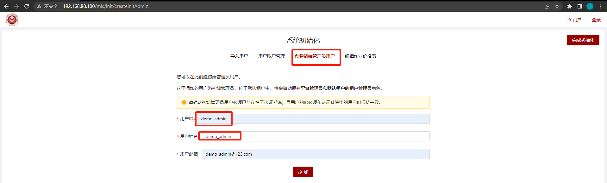
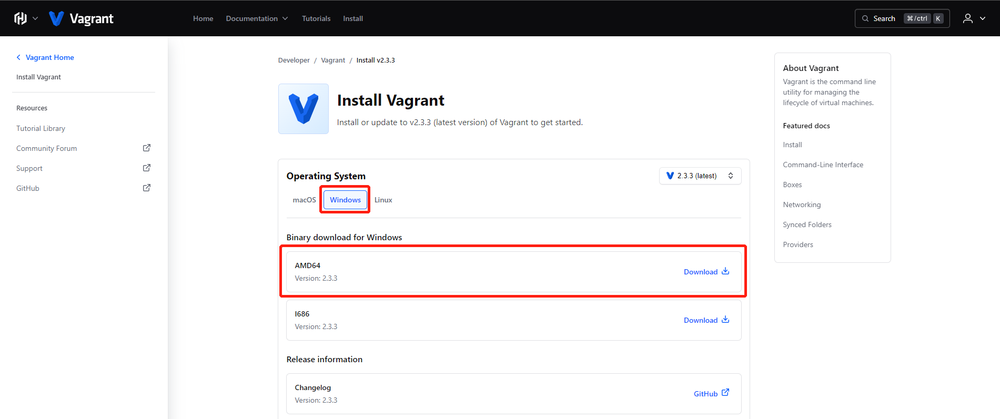

# scow-vagrant：slurm+SCOW集群一键部署


本项目面向<font color=red size=5>**开发**</font>和<font color='red' size=5>**测试**</font>人员，基于Vagrant，采用VirtualBox作为Provider，提供slurm+SCOW集群一键部署方案，极大简化了部署流程和部署门槛。部署slurm+SCOW四节点集群，节点角色及默认配置如下表所示：

| 节点名称/角色 |                           主要服务                           |     私网IP     | 配置 |
| :-----------: | :----------------------------------------------------------: | :------------: | :--: |
|     slurm     | slurmdbd、slurmctld、slurmd、mariadb、nfs-server、slapd、sssd | 192.168.88.101 | 2C4G |
|     login     |         slurmd、sssd、nfs、Xfce、KDE、MATE、cinnamon         | 192.168.88.102 | 2C4G |
|     cn01      |         slurmd、sssd、nfs、Xfce、KDE、MATE、cinnamon         | 192.168.88.103 | 4C4G |
|     scow      |         scow：portal、mis、auth、gateway、export job         | 192.168.88.100 | 4C8G |

> vagrant环境搭建可参考本文档第4部分

## 1. 使用

### 1.1 集群一键部署命令

```shell
vagrant up
```


> 第一次部署需要从vagrant clould拉取vagrant镜像，速度会比较慢，请耐心等待。

### 1.2 集群初始化

> 初始化地址：http://192.168.88.100/mis/init/  用户名/密码：demo_admin/demo_admin

进入初始化页面，选择创建初始管理员用户，将`demo_admin`设置为管理员用户。后续用户、账户设置请参考本项目操作手册。



### 1.3 SCOW镜像更新

由于SCOW的docker镜像是在构建Vagrant镜像时刻的master分支版本，若需最新功能，请更新SCOW最新镜像。

```shell
#登录到集群scow节点
vagrant ssh scow

# 切换root用户，密码为：vagrant
su root 

# 进入scow部署目录
/root/scow/scow-deployment

# 拉取最新镜像
./compose.sh pull

# 重启服务
./compose.sh down
./compose.sh up -d
```

### 1.4 集群一键销毁命令

```shell
vagrant destroy
```

## 2. 如何修改节点私网IP

本方案各节点IP使用的是`private_network`模式(Host-Only)，若不与其他虚机IP冲突，可不需要修改直接使用默认即可。如需要修改节点IP，可参照如下操作：

**(1) Vagrantfile修改：**

通过修改`Vagrantfile`文件`vm_list`下各节点的`eth1`属性，修改集群中各节点 使用的IP，需保证设置的各节点IP在同一局域网内。

**(2) slurm配置文件修改：**

- `slurm\slurm.conf`文件中的nodes配置部分，将各节点IP修改为与`vm_list`中配置的一致；
- `slurm\ldap_client.sh`文件中`ServHost`改为slurm节点IP；
- `slurm\nfs_client.sh`文件中的`192.168.88.101`改为slurm节点IP。

**(3) SCOW配置文件修改：**

- `scow\scow-deployment\config\auth.yml`文件中的`ldap.url`的IP改为slurm节点IP；
- `scow\scow-deployment\config\mis.yaml`文件中`fetchJobs.db.host`改为scow节点IP；
- `scow\scow-deployment\config\clusters\hpc01.yaml`文档中`slurm.mis.managerUrl`改为slurm节点IP。

**(4) export job配置文件修改：**

`scow\export-jobs\config.py`文件中的`cluster_db_conf.host`改为slurm节点IP，`mgt_db_conf.host`scow节点IP。

以上配置修改完成之后执行部署命令：

```shell
vagrant up
```

## 3. 如何新增计算节点

以添加计算节点`cn02`为例，`Vagrantfile`文件`vm_list`中复制一份`cn01`的配置，并做如下修改：

```shell
    {
        :name => "cn02",
        :eth1 => "192.168.88.104",
        :mem => "4096",
        :cpu => "4",
        :sshport => 22234,
        :box => "icode/slurm_compute",
		:role => "slurm",
        :is_service_node => false
    }
```

> 注意修改name，eth1，sshport的值，可不修改其他属性值。

`slurm\slurm.conf`文件中修改计算节点和分区配置信息部分：

```shell
# NODES 配置部分将cn02节点加入 
NodeName=cn0[1-2] NodeAddr=192.168.88.10[3-4]  CPUs=4 CoresPerSocket=2 ThreadsPerCore=1 RealMemory=3500 Procs=1 State=UNKNOWN

# PARTITIONS 配置部分将cn02节点加入              
PartitionName=compute Nodes=cn0[1-2] Default=YES MaxTime=INFINITE State=UP

```

`scow\scow-deployment\config\clusters\hpc01.yaml`修改节点和分区配置：

```yaml
# ...
slurm:
  loginNodes:
    - login
 
  computeNodes:
    - cn01
    - cn02 		# 增加cn02

  partitions:
    - name: compute
      # 分区内节点数修改为2
      nodes: 2

# ...
```

以上配置修改完成之后执行部署命令：

```shell
vagrant up
```

## 4 .vagrant环境搭建

vagrant支持的provider包括virtualbox、hyperv、libvirt等。virtualbox支持windows、linux、macos的安装，因此本教程以virtualbox作为provider。

### 4.1 安装virtualbox

点击进入[官网](https://www.virtualbox.org/wiki/Downloads)下载virtualbox


此处可选择操作系统版本，选择Windows版本下载、安装(其他操作系统类似)。

安装过程比较简单，跟着指引即可。

### 4.2 安装vagrant

点击进入[官网](https://developer.hashicorp.com/vagrant/downloads)下载vagrant



这里选择Windows 64位版本，安装过程跟着指引即可。

### 4.3 vagrant基本操作

```Bash
# 新建虚拟机，以创建一个centos7虚拟机为例

# 1. 初始化
vagrant init centos/7

# 2. 启动，初次启动会比较慢，需要拉镜像
vagrant up

# 3. 查看状态
vagrant status

# 4. ssh到虚机
vagrant ssh
 
# 5. 停止虚机
vagrant halt
 
# 6. 暂停虚机
vagrant suspend
 
# 7. 恢复虚机
vagrant resume
 
# 8. 删除虚机
vagrant destroy
```