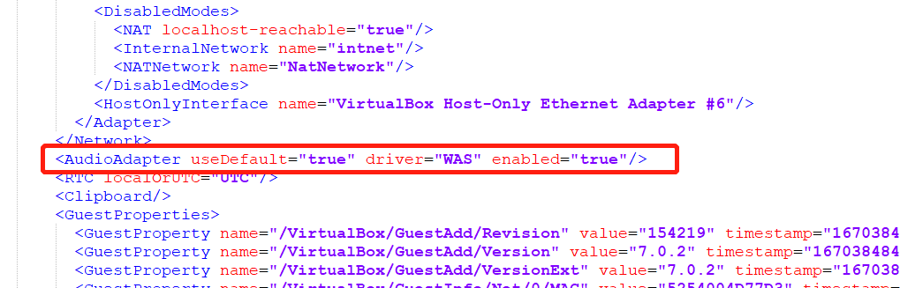

# scow-vagrant：slurm+SCOW集群一键部署

## 注意

此仓库的内容由[PKUHPC/SCOW](https://github.com/PKUHPC/SCOW)的`deploy/vagrant`的目录通过GitHub Actions自动生成。如果需要提交issue或者PR，请提交到SCOW仓库中。

## 介绍

本项目面向<font color=red size=5>**开发**</font>和<font color='red' size=5>**测试**</font>人员，基于Vagrant，采用VirtualBox作为Provider，提供slurm+SCOW集群一键部署方案，极大简化了部署流程和部署门槛。部署slurm+SCOW四节点集群，节点角色及默认配置如下表所示：

| 节点名称/角色 |                           主要服务                            |     私网IP     | 配置  |
| :-----------: | :-----------------------------------------------------------: | :------------: | :---: |
|     scow      |         scow：portal、mis、auth、gateway、export job          | 192.168.88.100 | 4C4G  |
|     slurm     | slurmdbd、slurmctld、slurmd、mariadb、nfs-server、slapd、sssd | 192.168.88.101 | 2C2G  |
|     login     |         slurmd、sssd、nfs、Xfce、KDE、MATE、cinnamon          | 192.168.88.102 | 2C2G  |
|     cn01      |         slurmd、sssd、nfs、Xfce、KDE、MATE、cinnamon          | 192.168.88.103 | 2C2G  |

> vagrant环境搭建可参考本文档第4部分

## 1. 使用

### 1.1 集群一键部署命令

```shell
vagrant up
```


> - 第一次部署需要从vagrant clould拉取vagrant镜像，速度会比较慢，请耐心等待。
>
> - 若镜像有更新，Vagrant不会自动重新下载，请先删除原来的镜像。

### 1.2 集群初始化

> 初始化地址：http://192.168.88.100/mis/init/  用户名/密码：demo_admin/demo_admin

进入初始化页面，选择创建初始管理员用户，将`demo_admin`设置为管理员用户。后续用户、账户设置请参考本项目操作手册。


### 1.3 SCOW运维操作

```shell
#登录到集群scow节点
vagrant ssh scow

# 输入root用户密码，密码为：vagrant

# 进入scow部署目录
/root/scow/scow-deployment

# 拉取最新镜像
./compose.sh pull

# 重启服务
./compose.sh down
./compose.sh up -d
```

### 1.4 集群一键销毁命令

```shell
vagrant destroy
```

## 2. 如何修改节点私网IP

本方案各节点IP使用的是`private_network`模式(Host-Only)，若不与其他虚机IP冲突，可不需要修改直接使用默认即可。如需要修改节点IP，可参照如下操作：

**(1) Vagrantfile修改：**

通过修改`Vagrantfile`文件`vm_list`下各节点的`eth1`属性，修改集群中各节点 使用的IP，需保证设置的各节点IP在同一局域网内。

**(2) slurm配置文件修改：**

- `slurm\slurm.conf`文件中的nodes配置部分，将各节点IP修改为与`vm_list`中配置的一致；
- `slurm\ldap_client.sh`文件中`ServHost`改为slurm节点IP；
- `slurm\nfs_client.sh`文件中的`192.168.88.101`改为slurm节点IP。

**(3) SCOW配置文件修改：**

- `scow\scow-deployment\config\auth.yml`文件中的`ldap.url`的IP改为slurm节点IP；
- `scow\scow-deployment\config\mis.yaml`文件中`fetchJobs.db.host`改为scow节点IP；
- `scow\scow-deployment\config\clusters\hpc01.yaml`文档中`slurm.mis.managerUrl`改为slurm节点IP。

**(4) export job配置文件修改：**

`scow\export-jobs\config.py`文件中的`cluster_db_conf.host`改为slurm节点IP，`mgt_db_conf.host`scow节点IP。

以上配置修改完成之后执行部署命令：

```shell
vagrant up
```

## 3. 如何新增计算节点

以添加计算节点`cn02`为例，`Vagrantfile`文件`vm_list`中复制一份`cn01`的配置，并做如下修改：

```shell
    {
        :name => "cn02",
        :eth1 => "192.168.88.104",
        :mem => "4096",
        :cpu => "4",
        :sshport => 22234,
        :box => "icode/slurm_compute",
		:role => "slurm",
        :is_service_node => false
    }
```

> 注意修改name，eth1，sshport的值，可不修改其他属性值。

`slurm\slurm.conf`文件中修改计算节点和分区配置信息部分：

```shell
# NODES 配置部分将cn02节点加入 
NodeName=cn0[1-2] NodeAddr=192.168.88.10[3-4]  CPUs=4 CoresPerSocket=2 ThreadsPerCore=1 RealMemory=3500 Procs=1 State=UNKNOWN

# PARTITIONS 配置部分将cn02节点加入              
PartitionName=compute Nodes=cn0[1-2] Default=YES MaxTime=INFINITE State=UP

```

`scow\scow-deployment\config\clusters\hpc01.yaml`修改节点和分区配置：

```yaml
# ...
slurm:
  loginNodes:
    - login
 
  computeNodes:
    - cn01
    - cn02 		# 增加cn02

  partitions:
    - name: compute
      # 分区内节点数修改为2
      nodes: 2

# ...
```

以上配置修改完成之后执行部署命令：

```shell
vagrant up
```

## 4 .vagrant环境搭建

vagrant支持的provider包括virtualbox、hyperv、libvirt等。virtualbox支持windows、linux、macos的安装，因此本教程以virtualbox作为provider。

### 4.1 安装virtualbox

点击进入[官网](https://www.virtualbox.org/wiki/Downloads)下载virtualbox


此处可选择操作系统版本，选择Windows版本下载、安装(其他操作系统类似)。

安装过程比较简单，跟着指引即可。

### 4.2 安装vagrant

点击进入[官网](https://developer.hashicorp.com/vagrant/downloads)下载vagrant


这里选择Windows 64位版本，安装过程跟着指引即可。

### 4.3 vagrant基本操作

```Bash
# 新建虚拟机，以创建一个centos7虚拟机为例

# 1. 初始化
vagrant init centos/7

# 2. 启动，初次启动会比较慢，需要拉镜像
vagrant up

# 3. 查看状态
vagrant status

# 4. ssh到虚机
vagrant ssh
 
# 5. 停止虚机
vagrant halt
 
# 6. 暂停虚机
vagrant suspend
 
# 7. 恢复虚机
vagrant resume
 
# 8. 删除虚机
vagrant destroy
```

## 5.  Vagrant镜像制作

### 5.1 login/compute节点镜像制作

基于vagrant官方centos/7镜像(7.8.2003)，执行的命令如下：

```Bash
# 1. 升级到centos7.9.2009
yum update -y 

# 2. 关闭firewalld、dnsmasq、NetworkManager
systemctl disable --now firewalld 
systemctl disable --now dnsmasq
systemctl disable --now NetworkManager

# 3. 关闭selinux
setenforce 0
sed -i 's#SELINUX=enforcing#SELINUX=disabled#g' /etc/sysconfig/selinux
sed -i 's#SELINUX=enforcing#SELINUX=disabled#g' /etc/selinux/config
getenforce

# 4. 关闭swap
swapoff -a && sysctl -w vm.swappiness=0enforcing
sed -ri '/^[^#]*swap/s@^@#@' /etc/fstab


# 5. 时间同步
rpm -ivh http://mirrors.wlnmp.com/centos/wlnmp-release-centos.noarch.rpm
yum install ntpdate vim -y

# 同步时间。time2.aliyun.com外网，vineyard.pku.edu.cn内网
# 时间同步配置如下：
ln -sf /usr/share/zoneinfo/Asia/Shanghai /etc/localtime
echo 'Asia/Shanghai' >/etc/timezone
ntpdate time2.aliyun.com

cat >>/var/spool/cron/root <<EOF
*/5 * * * * /usr/sbin/ntpdate time2.aliyun.com
EOF

# 6. 安装epel-release
yum install epel-release -y

# 7. 安装emacs wget
yum install emacs wget -y

# 8. 安装turbovnc
wget https://turbovnc.org/pmwiki/uploads/Downloads/TurboVNC.repo --no-check-certificate
mv TurboVNC.repo /etc/yum.repos.d
# 安装最新版本
yum install turbovnc -y

# 9. 安装桌面
yum groupinstall "Xfce" -y
yum groupinstall "KDE Plasma Workspaces" -y
yum groupinstall "MATE Desktop" -y
yum install cinnamon -y

# 10. 安装rng-tools
yum install -y rng-tools
rngd -r /dev/urandom

# 11. 安装munge
yum install munge munge-libs munge-devel -y

# 12. 安装slurm
yum install gcc gcc-c++ readline-devel perl-ls-MakeMaker pam-devel rpm-build mysql-devel python3 -y
# 此处是拷贝的slurm的编译文件
cp -r /vagrant/slurm/rpmbuild/ /root/ 
cd /root/rpmbuild/RPMS/x86_64/ && yum localinstall slurm-* -y

# 13. 支持密码登录登录
sed -i 's#PasswordAuthentication no#PasswordAuthentication yes#g' /etc/ssh/sshd_config
systemctl restart sshd
```

此处slurm的编译请参见文档[slurm集群部署](https://pkuhpc.github.io/SCOW/docs/slurm) 中slurm编译相关内容

### 5.2 slurm节点镜像制作

在login/compute节点镜像的基础上，执行的命令如下：

```Bash
# 1.安装mariadb
yum -y install mariadb-server
systemctl start mariadb
systemctl enable mariadb

# 初始化
mysql << EOF
   set password=password('${db_passwd}');
   create database slurm_acct_db;
   create user slurm;
   grant all on slurm_acct_db.* TO 'slurm'@'localhost' identified by '123456' with grant option;
   grant select on slurm_acct_db.* to 'slurm'@'%' identified by '123456';
   flush privileges;
EOF

# 2. 拷贝vscode文件
cp code-server-4.7.1-linux-amd64.tar.gz /root/
```

1. 此处code-server的下载地址为：https://github.com/coder/code-server/releases/download/v4.7.1/code-server-4.7.1-linux-amd64.tar.gz
2. 也可选择其他版本下载：https://github.com/coder/code-server/releases

### 5.3 SCOW节点镜像制作

基于vagrant官方centos/7镜像(7.8.2003)，执行如下命令：

```Bash
# 1. 升级到centos7.9.2009
yum update -y 

# 2. 关闭firewalld、dnsmasq、NetworkManager
systemctl disable --now firewalld 
systemctl disable --now dnsmasq
systemctl disable --now NetworkManager

# 3. 关闭selinux
setenforce 0
sed -i 's#SELINUX=enforcing#SELINUX=disabled#g' /etc/sysconfig/selinux
sed -i 's#SELINUX=enforcing#SELINUX=disabled#g' /etc/selinux/config
getenforce

# 4. 关闭swap
swapoff -a && sysctl -w vm.swappiness=0enforcing
sed -ri '/^[^#]*swap/s@^@#@' /etc/fstab


# 5. 时间同步
rpm -ivh http://mirrors.wlnmp.com/centos/wlnmp-release-centos.noarch.rpm
yum install ntpdate vim -y

# 同步时间。time2.aliyun.com外网，vineyard.pku.edu.cn内网
# 时间同步配置如下：
ln -sf /usr/share/zoneinfo/Asia/Shanghai /etc/localtime
echo 'Asia/Shanghai' >/etc/timezone
ntpdate time2.aliyun.com

cat >>/var/spool/cron/root <<EOF
*/5 * * * * /usr/sbin/ntpdate time2.aliyun.com
EOF

# 6. 安装docker
yum install -y yum-utils \
  device-mapper-persistent-data \
  lvm2
  
# 设置稳定存储库
yum-config-manager \
    --add-repo \
    https://download.docker.com/linux/centos/docker-ce.repo 
    
# 安装Docker CE
yum install docker-ce -y

# 启动Docker CE并设置开机启动
systemctl start docker
systemctl enable docker


# 7. 安装docker-compose
curl -L "https://github.com/docker/compose/releases/download/v2.7.0/docker-compose-$(uname -s)-$(uname -m)" -o /usr/local/bin/docker-compose
# 赋权
chmod +x /usr/local/bin/docker-compose

# 验证安装成功
docker-compose --version

# 8. 创建scow目录
mkdir /root/scow/

yum install -y python3
pip3 install -r /root/scow/export-jobs/requirements.txt


# 9. 支持密码登录登录
sed -i 's#PasswordAuthentication no#PasswordAuthentication yes#g' /etc/ssh/sshd_config
systemctl restart sshd
```

## 6. FAQ

### 6.1 Invalid value 'WAS' in AudioAdapter/@driver attribute

在vagrant up时出现如下报错：


**解决方法：**

进入vagrant的box目录，找到对应box的box.ovf配置文件(默认在`{userhome}/.vagrant.d/boxes/`下进入对应的box目录查找)，删除`AudioAdapter`配置。



### 6.2 镜像地址

代码和镜像托管在github，由于网络原因，可能导致下载失败，可将代码仓库和docker镜像仓库替换为国内地址。

- 北大镜像仓库已同步SCOW的docker镜像，仓库可修改为：`mirrors.pku.edu.cn/pkuhpc/scow`，对应文件为`deploy\vagrant\scow\scow-deployment\config.py`的`COMMON.IMAGE_BASE`。

- 可将scow-deployment和export-jobs项目代码同步至国内仓库，例如码云，对应文件为`deploy\vagrant\scripts\scow.sh`


## 授权协议

SCOW 使用 [木兰宽松许可证, 第2版](http://license.coscl.org.cn/MulanPSL2) 开源协议。