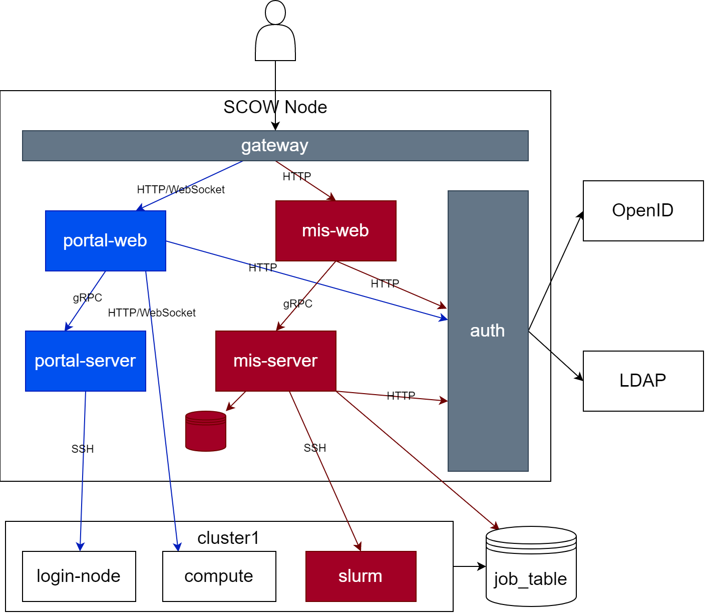

系统各个组件的关系如下图。此部分简要介绍各个组件的功能，具体部署请参考各个组件的页面。

本系统大部分组件可部署在超算集群之外。下文称部署这些组件的节点为**服务节点**。

图中白色的组件为通用组件，必须部署。蓝色部分为门户系统的组成部分，红色部分为运营系统的组成部分，可根据需要部署。

| 组件        | 作用                                       | 通常部署于节点     |
| ----------- | ------------------------------------------ | ------------------ |
| gateway     | 系统的总网关，是用户访问本系统的入口       | 服务节点           |
| auth        | 认证系统，与外界认证系统对接               | 服务节点           |
| mis-web     | 运营系统的前端项目                         | 服务节点           |
| mis-server  | 运营系统的服务端                           | 服务节点           |
| clusterops  | 运营系统服务器端与实际集群调度器交互的组件 | 服务节点           |
| portal-web  | 门户部分的前端项目                         | 服务节点           |
| vnc-server  | 门户部分交互式应用的服务端                 | 服务节点           |
| file-server | 门户部分文件管理功能的服务端               | 各个集群的登录节点 |

