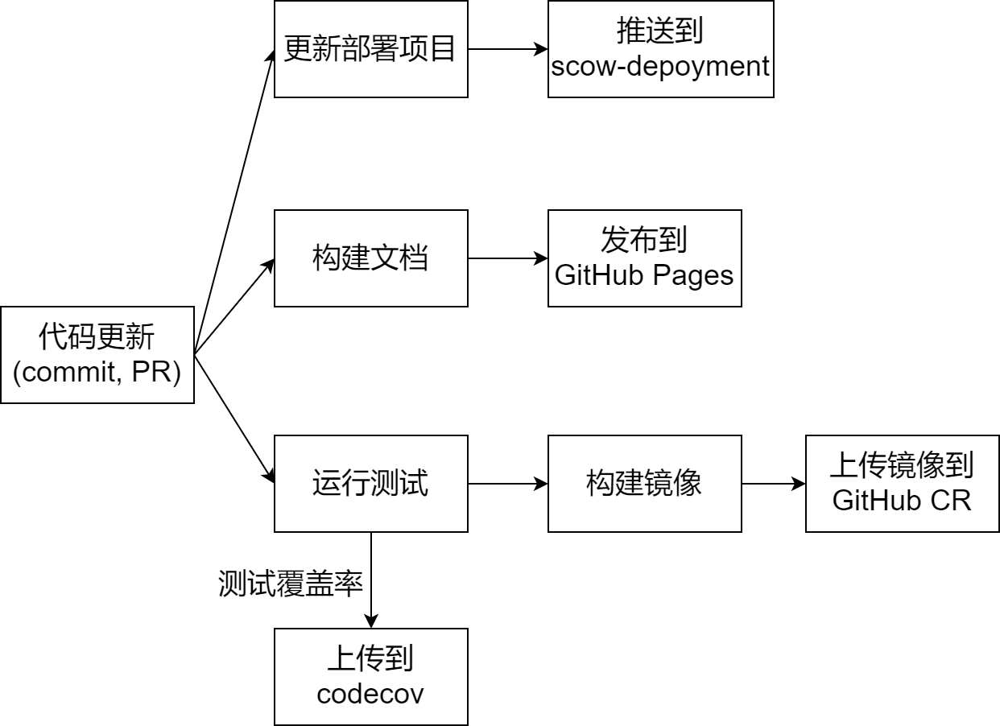

# 开发

本节介绍开发项目相关的资料。

## Repo结构

本项目采用monorepo结构，一个repo包含了整个系统的所有代码和文档。

其中：

- `protos`：包含了整个系统所有的proto文件
- `dockerfiles`：包含整个系统所有的dockerfile文件
- `dev`：开发相关文件
- `apps`：所有子系统
- `libs`：公共库
- `docs`：文档项目

## 开始开发

要开始开发，请确保安装了以下依赖：

- [docker](https://docs.docker.com/engine/install/)
- [docker compose](https://docs.docker.com/compose/install/)
- [volta](https://volta.sh/)：管理node环境
- [pnpm](https://pnpm.io/pnpm-cli)：推荐standalone安装

无需手动安装node。volta将会在第一次运行npm或者node命令时自动安装对应工具的对应版本。

要开始开发：

```bash
# clone仓库
git clone %REPO_URL%

cd %PROJECT_NAME%

# 如果是standalone安装，或者在pnpm i的时候遇到node-gyp ENOET错误，运行以下全局安装node-gyp。只用安装一次即可。
pnpm install -g node-gyp

# 在根目录下，安装依赖
pnpm i

# 准备开发需要的库和代码：构建依赖库，生成各种代码
pnpm prepareDev

```

apps下的所有项目均可以使用`dev`脚本以开发环境运行。

```bash
# 以开发环境运行门户前端
cd apps/portal-web
pnpm dev
```

以开发环境运行文档项目

```bash
cd docs
pnpm start
```

其他常用命令：

```bash
# 编译libs目录下的库
pnpm build:libs

# 在某一个具体项目下运行特定的脚本
# {项目名}请替换为项目package.json中name字段的@scow/后面的内容
# 项目可以运行什么脚本请查看项目package.json中的scripts
pnpm --filter {项目名} build

# 如运行@scow/config项目的build命令（编译），则运行
# 要想使用任何libs项目下的修改，必须先运行对应的build命令编译好
pnpm --filter config build

```


## 测试开发环境

我们使用docker搭建了一套简单的开发环境，可以用来跑一些项目的测试。具体开发环境请参考[docker-compose.dev.yml](../../../dev/docker-compose.dev.yml)。

开发环境包括

- 可以通过`3306`端口连接的的MySQL8数据库
    - root密码为[dev/.env.dev](../../dev/.env.dev)中的`MYSQL_ROOT_PASSWORD`
- 可以通过`6379`端口连接的redis:alpine
- 可以通过`3307`端口连接的mariadb:5.5作为job table
    - root密码为[dev/.env.dev](../../dev/.env.dev)中的`JOB_TABLE_PASSWORD`
- 可以通过`22222`端口连接的SSH服务器
    - 可以直接使用本地的`~/.ssh/id_rsa.pub`登录`root`和`test`用户，也可以通过用户名`test`、密码`test`登录`test`用户
- 可以通过`389`端口连接的LDAP服务器，详情参考[LDAP文档](./auth/ldap.md#LDAP镜像)

```bash
# 构建并启动开发环境
pnpm devenv

# 运行测试
# 测试环境必须在prepareDev运行后才能运行
pnpm test

# 对某一项目运行测试（此为对@scow/portal-web项目运行测试）
pnpm --filter portal-web test

# 停止开发环境
pnpm devenv:stop
```

## 容器构建说明

- 每个子系统的Dockerfile都应该放在dockerfiles目录下
- 每个Dockerfile的context都应该是项目根目录，记得复制proto目录和依赖的本地库
- 所有根据proto生成的文件都应该被gitignore和dockerignore，在容器中构建时需要现场生成
- 根目录的`docker-compose.yml`应该只用于容器构建

## 代码风格检查

项目使用[eslint](https://eslint.org)进行代码风格规范和检查。eslint的配置采用[`@ddadaal/eslint-config`](https://github.com/ddadaal/eslint-config)。项目使用[husky](https://github.com/typicode/husky)设置了一个`pre-commit`的git hook，在提交前运行`eslint`进行代码风格检查，如果代码风格检查没有通过则无法commit。

## 为什么不采用其他monorepo管理方案？

- npm workspace：
  - ~~这个会把所有依赖装在根目录，但是tsgrpc-cli会假设依赖装在项目目录，这样tsgrpc-cli就不能运行了~~（解决了）
  - npm workspace运行命令时不按依赖拓扑排序顺序运行（wtf!!!!），也不能手动在根package.json里指定所有包，因为每个子系统构建时，不存在其他子系统
- yarn workspace：新版本berry和volta的兼容性不好([issue](https://github.com/volta-cli/volta/issues/651))，yarn的workspaces的foreach命令需要单独装插件，而且foreach命令不会交互式地输出结果
- nx: 尝试迁移过去好几次了，但是感觉概念有点太复杂了……
- lerna: 很久没更新了，删除依赖需要删掉包的node_modules然后重新bootstrap，麻烦

## CI

项目CI配置如下：




