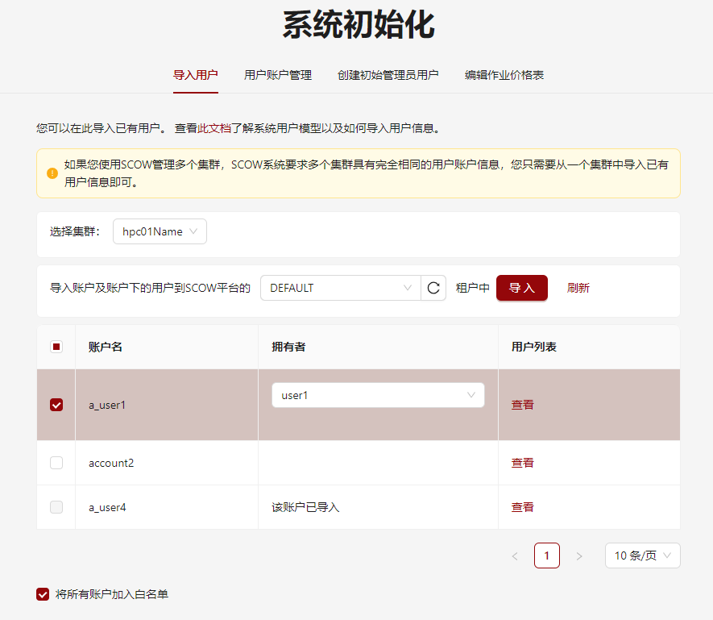

# 配置使用slurm的集群

## 选定slurm节点和部署slurm.sh

在集群中选定一个节点作为**slurm节点**。此节点需要满足以下条件：

- **服务节点**可以以root用户SSH免密登录到此节点
- 此节点上安装并配置好了slurm的客户端程序，如`sacctmgr`、`squeue`等
- 此节点上安装有`mysql`客户端，可以通过`mysql`直接执行
- 此节点上运行有slurm的mysql数据库，或者可以连接到其他机器上的数据库

我们建议在slurm集群的manager节点上同时配置客户端程序，并使用此节点为**slurm节点**。
在项目启动后，系统将自动给slurm节点上传一个slurm.sh脚本，用于进行一些slurm操作。具体上传的位置可以在集群配置中进行配置。

## 修改集群配置

在`config/clusters/{使用slurm的集群的ID}.yml`中，修改配置

```yaml title="config/clusters/{使用slurm的集群的集群ID}.yml"
# ...
slurm:
  #....
  mis:
    # 部署slurm.sh的机器的地址
    managerUrl: haha
    # slurm.sh在机器中的绝对地址,每次系统启动时，会自动将slurm.sh文件复制到scriptPath指定路径上
    scriptPath: /test/slurm.sh

    # 部署slurm.sh的机器通过什么地址访问slurm的mysql数据库
    # 不填写为下面的默认值
    # dbHost: localhost

    # 部署slurm.sh的机器通过什么端口访问slurm的mysql数据库
    # 不填写为下面的默认值
    # dbPort: 3306

    # slurmdbd的数据库密码
    dbPassword: password
    # slurm中这个集群的集群名
    clusterName: hpc01
```

## 导入已有用户信息

如果您已有一个slurm集群，在管理系统部署完成后，可以使用本功能将slurm中的用户信息导入本系统。



系统会从slurm集群中读取用户和账户信息，显示在表格中。不存在名字的用户的初始名字默认为自己的ID。

系统默认将`a_用户ID == 账户ID`的用户设置为拥有者。此外，您也可以在系统中选择拥有者，需要注意系统要求账户的拥有者字段不能为空。

在系统初始化时，或者系统初始化后使用平台管理员用户登录后选择**平台管理**->**导入用户**，即可使用导入用户功能。如果需要将新加入的账户都加入白名单中，请勾选`将所有账户加入白名单`。点击确定，即可将所有账户导入默认租户中。


