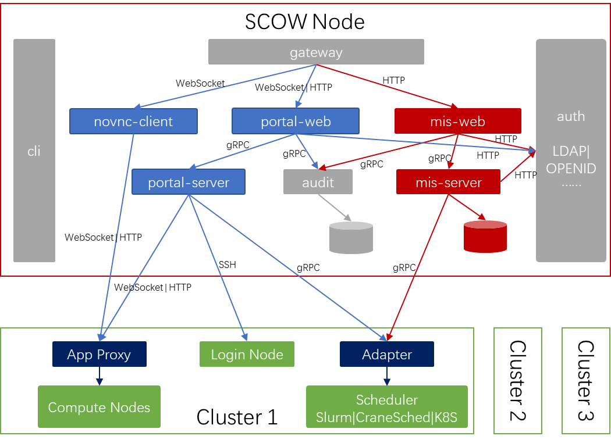

系统各个组件的关系如下图。此部分简要介绍各个组件的功能，具体部署请参考各个组件的页面。

OpenSCOW由多个容器模块组成，包括gateway、auth、audit等基本模块，作为门户系统的novnc-client、portal-web、portal-server模块，作为管理系统的mis-web、mis-server模块，执行OpenSCOW与计算集群交互的App Proxy、Adapter模块，以及作为部署工具的cli模块。

