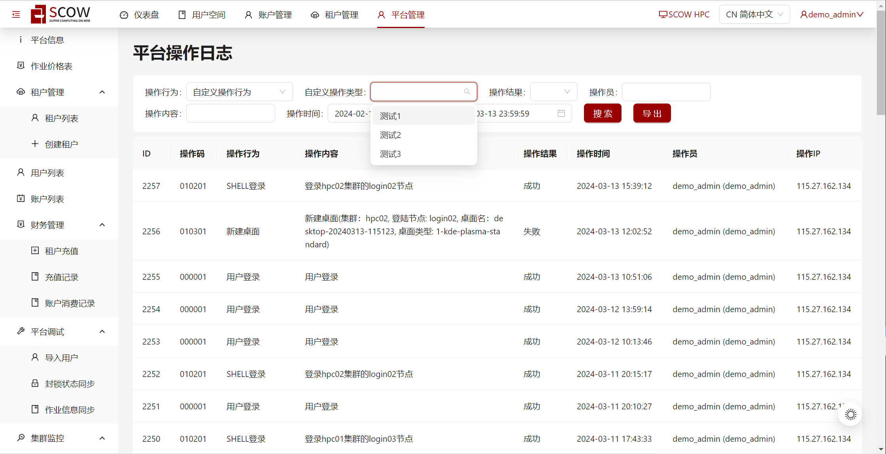

# 自定义操作行为日志

本节介绍如何使用自定义操作行为日志

## 功能介绍

OpenSCOW的审计系统内置了一些用户操作行为，例如登录、登出和修改密码等。这些内置操作行为在OpenSCOW的管理系统页面上，可以进行展示、搜索以及统计。

但是，有时候用户可能需要对自己的业务系统进行审计，这时候就需要自定义操作行为。该功能可以在不修改OpenSCOW源码的情况下，通过调用审计系统的 API 实现对操作行为类别的扩展以及对应的国际化展示,同时可以支持在管理系统的操作日志页面对该类别的操作行为进行搜索。

## 如何新增自定义操作行为

### 1. 调用CreateOperationLog API

在自己实现的业务系统中，调用审计系统的`CreateOperationLog`，新增自定义操作行为的类别。

定义的protobuf文件相关内容如下：

```proto
message I18nObject {
  message I18n {
    string default = 1;
    optional string en = 2;
    optional string zh_cn = 3;
  }
  I18n i18n = 1;
}

// 用户自定义操作类型，name和content将直接展示
message CustomEvent {
  string type = 1;
  common.I18nObject name = 2;
  common.I18nObject content = 3;
}

message CreateOperationLogRequest {
  string operator_user_id = 1;
  string operator_ip = 2;
  OperationResult operation_result = 3;
  oneof operation_event {
    Login login = 4;
    Logout logout = 5;
    SubmitJob submit_job = 6;
    EndJob end_job = 7;
    //...省略中间的内置操作行为

    // 表示该条操作日志记录为自定义操作行为
    CustomEvent custom_event = 61;
  }
}
```

#### CustomEvent参数定义

- `type`：自定义操作行为的类别，用于区分不同的自定义操作行为。
- `name`：自定义操作行为的名称，国际化对象，用于在管理系统的操作日志页面进行展示。
- `content`：自定义操作行为的内容，国际化对象，用于在管理系统的操作日志页面进行展示以及搜索。

### 2. 自定义操作行为日志查看及搜索

在管理系统的操作日志页面，可以查看到新增的自定义操作行为的类别，以及对应的操作日志记录。

表格中操作行为列将展示`custom_event`中`name`的国际化内容， 操作内容为`custom_event`中`content`的国际化内容

如果需要搜索特定自定义操作行为的操作日志，可在表单上方过滤操作行为选择自定义操作行为，之后在自定义操作类型的下拉框里选取具体的自定义操作类型（对应创建时的`type`参数）




### 注意

在新增自定义操作行为时，需要确保系统内已有数据是否有相同的`custom_event_type`, 如果创建操作日志时传参`custom_event`内的`type`已存在，需要确保此时`name`参数与已有数据中的`name`完全一致，否则将创建失败                                                                                                                                                                                                                                                                                                     