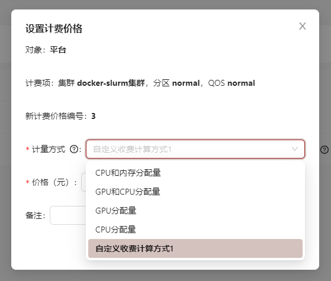

# 通过代码自定义收费规则

在管理系统中，您可以增加通过代码自定义收费规则，然后在配置文件中进行配置，就可以在创建新的计费项使用这个新的计量方式

## 增加配置目录及自定义规则js文件
增加配置目录：`config/scripts`，放置您编写计费规则函数的js文件，这些js文件可以是commonjs或者esm的。OpenSCOW通过require("路径")的方式读取这些脚本文件，并在计费的时候调用这个函数。例如，可以增加一个名为my-strategy.js的文件。文件应当默认导出一个如下的函数，返回一个数值：

```js title="config/scripts/my-strategy.js"
// 系统自带的计费规则请参考 apps/mis-server/src/bl/jobPrice.ts 文件中的 amountStrategyFuncs
// 本函数的计费模式：如果作业运行时间小于180s，则不扣费，如果使用了gpu，按照gpu分配量计费，
// 如果otherAsyncRules为true，返回10，其余的按照cpu分配量计费
function myStrategy(jobInfo) {
  const otherAsyncRules = false;
  if (jobInfo.timeUsed < 180) {
    return 0;
  } else if (jobInfo.gpu) {
    return jobInfo.gpu;
  } else if (otherAsyncRules) {
    return new Promise((resolve) => {
      setTimeout(() => {
        resolve(10);
      }, 1000); // 模拟异步操作，在 1 秒后返回数值 10
    });
  }

  return jobInfo.cpusAlloc;
}

module.exports = myStrategy;
```

上述js文件对应的ts类型如下：
```ts my-strategy.ts"

// 作业的用量信息
export interface JobInfo {
  // 集群作业id
  jobId: number;
  // scow中的集群id
  cluster: string;
  // 分区
  partition: string;
  qos: string;
  // 作业运行时间
  timeUsed: number;
  // 分配CPU数tres_alloc
  cpusAlloc: number;
  // 使用GPU数。来自gres_req字段
  gpu: number;
  // 申请的内存，来自tres_req
  memReq: number;
  // 分配的内存,来自tres_alloc
  memAlloc: number;
  // 账户
  account: string;
  // 租户
  tenant: string;
}

export function myStrategy(jobInfo: JobInfo): number | Promise<number> {
  const otherAsyncRules = false;
  if (jobInfo.timeUsed < 180) {
    return 0;
  } else if (jobInfo.gpu) {
    return jobInfo.gpu;
  } else if (otherAsyncRules) {
    return new Promise((resolve) => {
      setTimeout(() => {
        resolve(10);
      }, 1000); // 模拟异步操作，在 1 秒后返回数值 10
    });
  }

  return jobInfo.cpusAlloc;
}

```

## mis.yaml增加可选配置

```yaml title="config/mis.yaml"
# 新增自定义收费规则
customAmountStrategies:
  # 计费方式id，请勿重复，重复的话后面的计费方式将会覆盖前面的，
  # 定义后不能更改，自定义计费项会记录所使用的计费方式id，并存储到数据库里，
  # 其作用与"max-cpusAlloc-mem", "max-gpu-cpusAlloc", "gpu", "cpusAlloc"等同，
  # 若当前生效的自定义计费项使用了某自定义计费方式id，你不能删除它，否则系统将无法启动，如要删除，请先使该计费项失效
  - id: "strategy1"
      # 可选，新的计量方式的显示名称，如不填写将使用id的内容
    name: "自定义收费计算方式1"
      # 可选，计量方式描述
    comment: "自定义收费计算方式1，运行时间低于3分钟以下的作业不计费，大于或等于3分钟的按照gpu或cpu用量计算"
      # 脚本文件路径，不包含config/scripts前缀，如my-strategy.js即等于config/scripts/my-strategy.js
      # 支持commonjs或者esm，内容不支持动态修改，修改后需重启系统
      # 自定义计量方式的文件应该默认导出一个如下签名的函数:
      # type MyStrategy = (jobInfo: JobInfo) => number | Promise<number>;
      # JobInfo为apps/mis-server/src/bl/PriceMap.ts中的JobInfo类型，提供作业的用量信息
    script: "my-strategy.js"
```

## 创建新的计费项使用这个新的计量方式
配置完后，重启系统，然后在作业价格表页面进行配置，如下：



配置完成后，对应的平台/租户讲使用您的自定义计费方式来计算作业价格