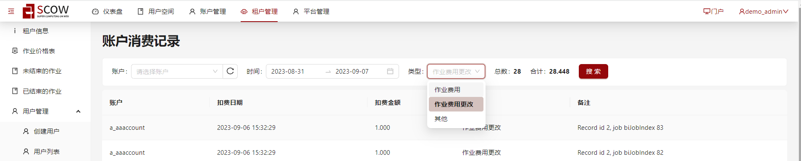
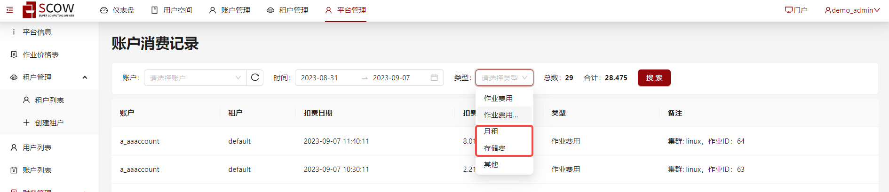

# 自定义可查询的消费类型

当管理员或财务人员在管理系统下查询消费列表时，系统支持按消费类型进行查询结果过滤。
当前管理系统下默认消费类型包括OpenSCOW已配置的[jobChargeType](../../../refs/config/mis/definition-properties-jobchargetype.md), [changeJobPriceType](../../../refs/config/mis/definition-properties-changejobpricetype.md)及附加类型"其他"。


如果您所部署的OpenSCOW实现了[通过代码自定义收费规则](./custom-amount-strategies.md)或接入第三方使用了OpenSCOW扣费系统的服务，那么可能您所使用的OpenSCOW包含上述以外的消费类型。
这种情况管理员可以通过在`config/mis.yaml`下增加管理系统可选配置`customChargeTypes`来自定义可查询的消费类型。

配置：

```yaml title="config/mis.yaml"

# 自定义可查询的消费类型，可选填
# 填写格式为字符串列表
customChargeTypes: ["月租"，"存储费"]

```

当管理员在config/mis.yaml下增加上述配置后，在消费列表中可查询的消费类型如下。

