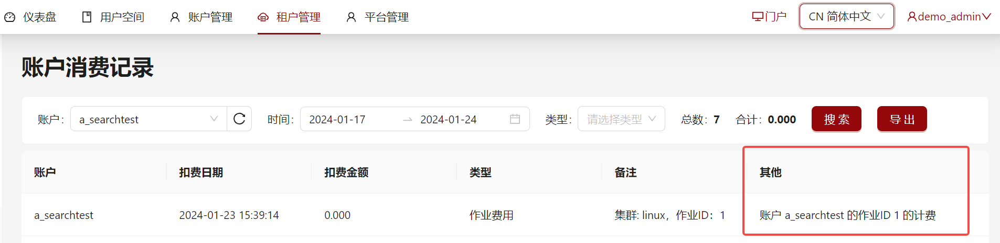
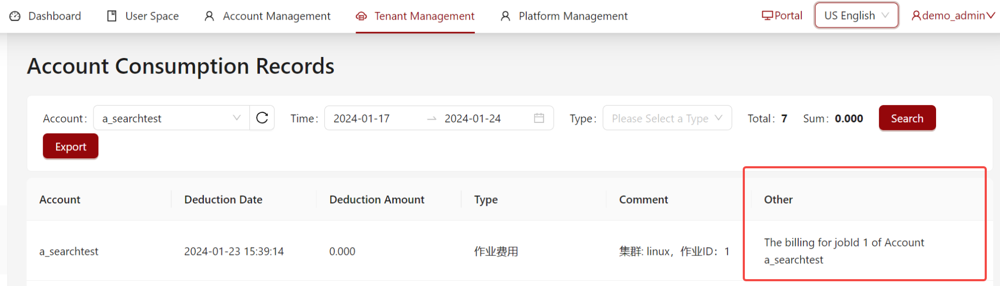
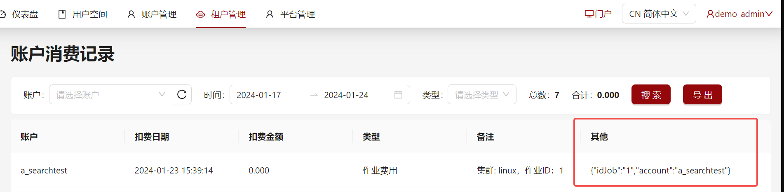

# 自定义在消费记录中保存作业相关字段

系统支持在`mis.yaml`中通过可选配置`jobChargeMetadata`将作业相关的字段以**Json**格式保存在消费记录中。
以便后续对此保存字段进行查询或在页面前端进行格式化显示。

## 配置示例

```yaml title="config/mis.yaml"

# 自定义消费记录中作业相关的存储内容
jobChargeMetadata:
  # 可选。需要保存的作业相关字段，字段参考[entities/JobInfo](#entitiesjobinfo)
  savedFields: ["idJob", "account"]

  # 可选。定义显示出来的格式。如果不配置，直接显示上面保存的Json字段的信息
  displayFormats:
    # i18n国际化类型，根据系统语言显示不同的信息
    # 或字符串格式，直接显示字符串
    # 利用 {{ 属性名 }} 使用上述savedFields中保存的属性值
    i18n:
      default: "账户 {{ account }} 的作业ID {{ idJob }} 的计费"
      en: "The billing for jobId {{ idJob }} of Account {{ account }}"
      zh_cn: "账户 {{ account }} 的作业ID {{ idJob }} 的计费"

```

## 配置说明

| 参数            | 类型                  | 是否必须                         |解释                                                          |
| --------------- | --------------------- | ---------------------------------|-------------------------------------------------------- |
| `savedFields`   | `string[]`            | 否                            |想要在数据库实体**ChargeRecord**中的**metadata**字段中保存的作业相关的信息，字段参考[entities/JobInfo](#entitiesjobinfo)， 保存的格式为**Json**格式  |
| `displayFormats` | `string \| i18n国际化类型` | 否                       |定义上述保存的字段显示出来的格式。如果不配置则直接显示上面保存的**Json**字段信息。如`{"jobId": 1, "account": "a_account"}`。`string \| i18n国际化类型`均可以利用 **\{\{ 属性名 \}\}** 使用上述`savedFields`中保存的属性值。|


## 配置效果展示

如果管理员按上述配置示例中的`jobChargeMetadata`配置，保存了`idJob`与`account`的字段信息，`displayFormats`类型为`i18n国际化类型`格式，那么当用户查询消费记录页面时，语言为简体中文时用户可以看到的消费记录显示为：


当用户进入系统后通过右上角语言切换器切换当前显示语言为英文时，用户可以看到的消费记录显示为：


如果管理员按上述配置示例中的`jobChargeMetadata`配置，保存了`idJob`与`account`的字段信息，但没有配置`displayFormats`时，用户可以看到的消费记录显示为：


如果管理员没有配置`jobChargeMetadata`，则用户在消费记录不能看到该列的显示。


### entities/JobInfo

:::note

当前标准部署的**OpenSCOW**数据库实体**JobInfo**中支持的字段为：

`idJob`，`account`，`user`，`partition`，`nodelist`，`jobName`，`cluster`，`timeSubmit`，`timeStart`，`timeEnd`，`gpu`，`cpusReq`，`memReq`，`nodesReq`，`cpusAlloc`，`memAlloc`，`nodesAlloc`，`timelimit`，`timeUsed`，`timeWait`，`qos`，`recordTime`，`tenant`，`accountBillingItemId`，`tenantBillingItemId`，`tenantPrice`，`accountPrice`

具体情况请参考实际部署**OpenSCOW**的数据库信息。

:::