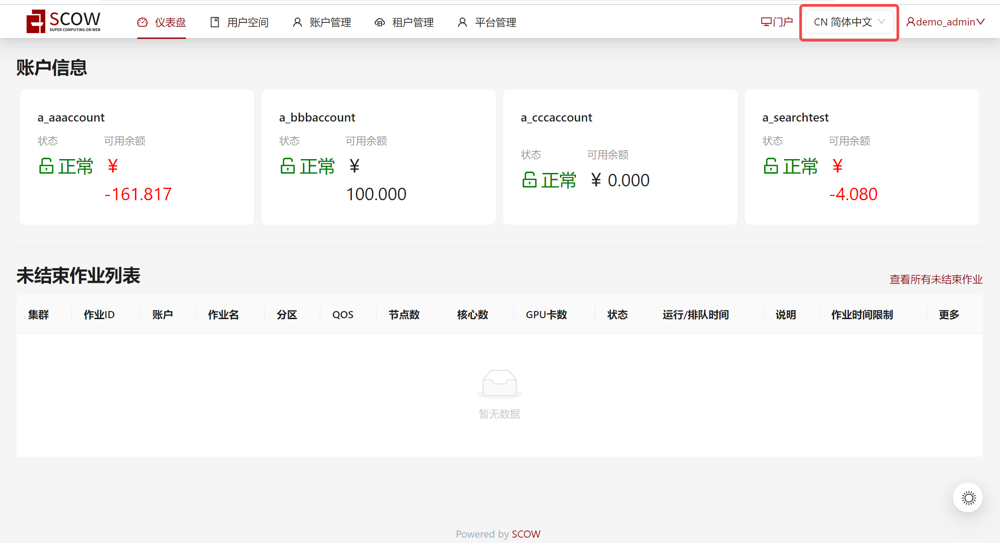
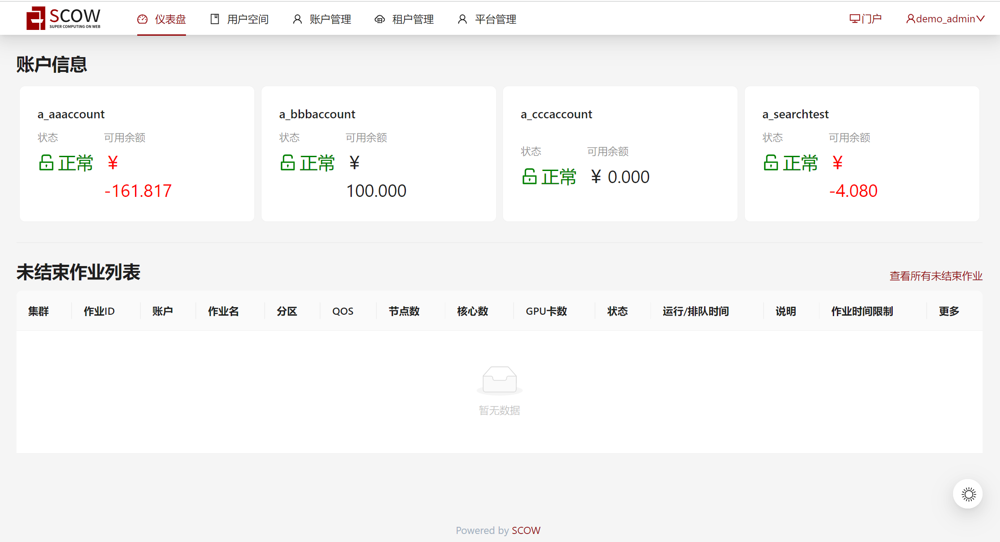

# 自定义系统语言

支持用户在`common.yml`文件中通过配置项`systemLanguage`自定义是否使用OpenSCOW的页面国际化功能。

如果不使用页面国际化功能，则允许管理员指定系统唯一语言。

如果使用，允许管理员手动设置是否在用户没有保存过语言信息时跟随系统语言的自动判断。

如果在用户没有保存过语言信息时跟随系统语言自动判断，那么进入系统的初始语言优先从`Cookies`中保存的语言信息进行判断，如果其中没有保存的语言信息或者保存的语言信息不是OpenSCOW系统的合法语言，则继续判断浏览器偏好语言。若二者均没有找到OpenSCOW系统的合法语言，则初始语言为管理员配置的默认语言。

如果在用户没有保存过语言信息时不跟随系统的语言判断，则进入系统的初始语言优先判断用户是否已经保存过语言信息，即`Cookies`中是否存在OpenSCOW系统的合法语言。如果存在，则使用`Cookies`中的语言为初始语言，如果不存在或者Cookies中的语言信息不是OpenSCOW系统的合法语言，则初始语言为管理员配置的默认语言。

:::note

当管理员通过配置项systemLanguage自定义系统语言时，无论是指定系统唯一语言或者是指定用户首次进入系统时的页面文本国际化的默认语言，
都需要确保配置的语言为当前系统的合法语言，否则系统无法启动。

目前OpenSCOW系统下支持的合法语言为简体中文与英文，字符串枚举值为`"zh_cn"`和`"en"`。

:::

## 配置示例

```yaml title="config/common.yml"

# 设置系统语言 可选配置 类型为对象或字符串，默认值为对象类型
# 1.systemLanguage对象类型
systemLanguage:
  # 可选，默认为true。
  # 如果true，则SCOW在用户未手动选择语言时，自动优先根据cookies, 其次根据浏览器header判断语言，判断失败使用下方配置的default语言。
  # 如果为false，则SCOW在首次进入系统用户未手动选择语言时使用下方配置的default语言，
  # 用户手动选择过语言之后优先从cookies中进行判断，cookies不存在合法语言信息则使用下方配置的默认语言。
  autoDetectWhenUserNotSet: true
  # 默认语言，可选填，默认值为"zh_cn"。
  # 类型必须为当前系统合法语言["zh_cn"，"en"]的字符串枚举值
  default: "zh_cn"

# 2.systemLanguage字符串类型
# 若systemLanguage配置为字符串，类型必须指定为当前系统合法语言["zh_cn"，"en"]的字符串枚举值
# SCOW直接使用此语言，不允许用户再进行语言切换
# systemLanguage: "zh_cn"

```

## 配置结果示例

1.如果没有配置`systemLanguage`，或配置为`systemLanguage: {}`，则等同于下方类似配置。

```yaml title="config/common.yml"

systemLanguage:
  autoDetectWhenUserNotSet: true 
  default: "zh_cn"

```

其含义为使用系统的页面国际化功能，允许用户在使用时手动切换语言。
初始语言跟随系统判断，即优先判断`Cookies`中保存的语言信息是否为OpenSCOW系统的合法语言，如果`Cookies`中获取的语言信息不存在或不合法，则继续从浏览器偏好语言中选择语言。如果上述二者均不符合OpenSCOW系统支持的合法语言，那么初始语言为配置的`default: "zh_cn"`。



2.如果`autoDetectWhenUserNotSet`配置为`false`。

```yaml title="config/common.yml"

systemLanguage:
  autoDetectWhenUserNotSet: false
  default: "zh_cn"

```

其含义为使用系统的页面国际化功能，允许用户在使用时手动切换语言。用户首次进入系统的初始语言不跟随系统判断。
即在`Cookies`中没有保存过语言信息或保存的语言信息不合法时，不再判断浏览器偏好语言，使用配置的`default: "zh_cn"`为初始语言。

3.如果不使用国际化功能。则需满足下方类似配置。

```yaml title="config/common.yml"

systemLanguage: "zh_cn"

```

其含义为指定系统唯一语言为简体中文。页面不再展示语言选择框。不再允许用户在使用OpenSCOW时进行语言切换。


