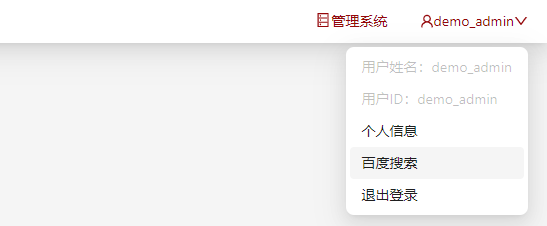

# 自定义导航栏右侧的用户下拉菜单链接

您可以在门户和管理系统导航栏右侧的用户下拉菜单中增加链接，点击这些链接会跳转到您指定的URL。

:::note

当您点击菜单链接时，我们会在当前链接后面加入查询参数`?token={用来跟踪登录用户的状态的token}`，您可以通过token查询当前操作用户。

:::

## 配置

您可以在`config/common.yaml`文件中，根据备注修改所需要的配置，您设置的配置将会在门户系统和管理系统同时生效。

```yaml title="config/common.yaml"
# 在导航栏右侧用户下拉菜单中增加链接相关配置
userLinks:
  # 链接名称，必填
  - text: ""
    # 链接地址，必填
    url: ""
    # 是否打开新的页面，可选填，默认值为false
    # openInNewPage: true
```

## 配置示例

```yaml title="config/common.yaml"
userLinks:
  # 链接名称，必填
  - text: "百度搜索"
    # 链接地址，必填
    url: "https://www.baidu.com"
    # 是否打开新的页面，可选填，默认值为false
    openInNewPage: true
```

用户可以阅览到的自定义用户下拉菜单配置示例如下：




## 配置解释

| 属性              | 类型             | 应用系统           | 是否必填    | 解释                                                                                     |
| ----------------- | -----------------| ----------------- | ---------- | ---------------------------------------------------------------------------------------- |
| `navLinks`        | /                | /                 |/           |/                                                                                          |
| `text`            | 字符串            | `portal`，`mis`   | 是         | 链接名称，OpenSCOW用户下拉菜单上显示的名称                                                            |
| `url`             | 字符串            | `portal`，`mis`   |  是        | 自定义链接地址，跳转时会在后面加入查询参数`?token={用来跟踪登录用户的状态的token}`。 |
| `openInNewPage`   | 布尔类型          | `portal`，`mis`   | 否         | 可以选填。如不设置，默认值为`false`，不打开新的页面。如果设置为`true`，则会在新的页面打开该链接。  |


:::note

关于链接地址`url`的跳转，与[自定义导航链接一致](./custom-navlinks.md)，与`HTML`标签的默认行为一致，以`http://`开头的`url`会自动被识别为外部路径。点击该菜单栏时，会按照与`url`中填写的完全一致的路径进行跳转。

如果`url`中配置的链接地址是以`/`开头，或者没有以`http://`开头，则会被系统识别为内部路径。这时点击该菜单栏跳转时，将根据已配置的[自定义相对路径](./basepath.md)自动添加相对路径前缀。

示例：

```yaml title="config/common.yaml"
  userLinks:
    - text: "菜单1"
      url: "http://www.navtest1.com"
    - text: "菜单2"
      url: "www.navtest2.com"
    - text: "菜单3"
      url: "/www.navtest3.com"
```

假设我们的系统部署在`https://scowtest.com`下,管理员配置的相对路径为`/scow`。

那么按照上述自定义菜单配置示例，点击`菜单1`时，会链接`http://www.navtest1.com?token={用来跟踪登录用户的状态的token}`进行跳转。

点击`菜单2`时，`url`会被识别为内部路径，将会拼接相对路径前缀和`/`，按照`https://scowtest.com/scow/www.navtest2.com?token={用来跟踪登录用户的状态的token}`进行跳转。

点击`菜单3`时，`url`同样会被识别为内部路径，将会拼接相对路径前缀，按照`https://scowtest.com/scow/www.navtest3.com?token={用来跟踪登录用户的状态的token}`进行跳转。

:::
