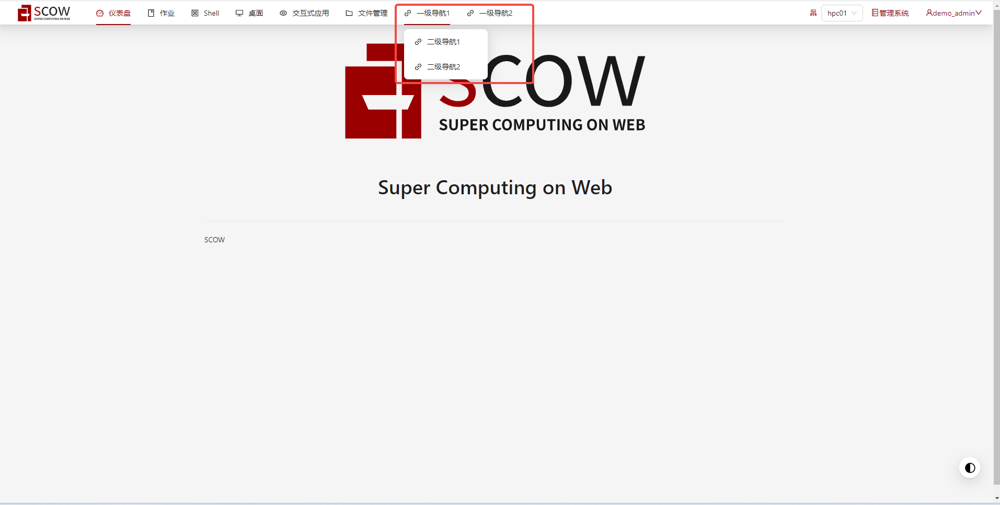
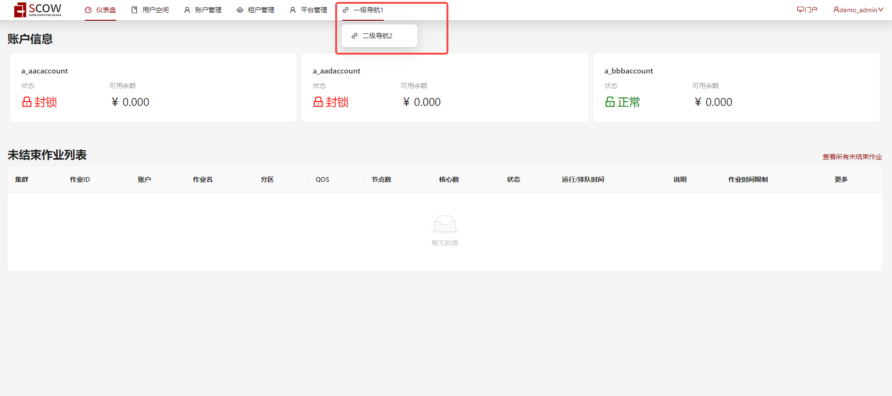

# 自定义导航链接功能

系统支持自定义门户系统和管理系统的导航链接功能。点击发生跳转。
同时支持自定义导航链接图标，并支持用户通过自己在[iconfont.cn](https://www.iconfont.cn/)上的项目中的图标仓库来灵活管理导航链接图标。

:::note

当您点击导航链接时，我们会在当前链接后面加入查询参数`?token={用来跟踪登录用户的状态的token}`，以此来保证您后续链接的安全验证。

:::

## 门户系统中的配置

在门户系统中，您可以在`config/portal.yaml`文件中，根据备注修改所需要的配置。

```yaml title="config/portal.yaml"
# 新增导航链接相关配置
navLinks:
  # 链接名称
  - text: ""
    # 链接地址
    url: ""
    # 导航图标名称
    icon: ""
    # 二级导航,可选填
    children:
      # 二级导航相关配置，与一级导航相同，但是不允许再设置children
      - text: ""
        url: ""
        icon: ""

# 用户灵活管理 iconfont.cn 图标的脚本地址配置,如果存在则替换默认脚本库地址
iconfontScriptUrls: []
```

## 管理系统中的配置

在管理系统中，您可以在`config/mis.yaml`文件中，根据备注修改所需要的配置。

```yaml title="config/mis.yaml"
# 新增导航链接相关配置
navLinks:
  # 链接名称
  - text: ""
    # 链接地址
    url: ""
    # 导航图标名称
    icon: ""
    # 可以看到这个链接的用户,可选填
    # 用户类型： user, accountAdmin, accountOwner, tenantFinance, tenantAdmin, platformAdmin, platformFinance
    allowedRoles: []
    # 二级导航,可选填
    children:
      # 二级导航相关配置，与一级导航相同，但是不允许再设置children
      - text: ""
        url: ""
        icon: ""
        allowedRoles: []

# 用户灵活管理 iconfont.cn 图标的脚本地址配置,如果存在则替换默认脚本库地址
iconfontScriptUrls: []
```

## 配置示例

### 门户系统自定义导航链接配置示例
```
navLinks:
  - text: "一级导航1"
    url: "https://hahahaha1.com/"
    icon: "icon-solution"
    children:
      - text: "二级导航1"
        url: "https://hahahaha1.1.com"
        icon: "icon-filesearch"
      - text: "二级导航2"
        url: "https://hahahaha1.2.com"
        icon: "icon-link"
  - text: "一级导航2"
    url: "https://hahahaha2.com"
    icon: "icon-tags"
    children: []
iconfontScriptUrls: []
```



### 管理系统自定义导航链接配置示例

```
navLinks:
  - text: "一级导航1"
    url: "https://hahahaha1.com/"
    icon: "icon-java"
    children:
      - text: "二级导航1"
        url: "https://hahahaha1.1.com"
        icon: "icon-javascript"
        allowedRoles: [tenantFinance]
      - text: "二级导航2"
        url: "https://hahahaha1.2.com"
        icon: "icon-javascript"
        allowedRoles: [tenantAdmin, platformAdmin]
  - text: "一级导航2"
    url: "https://hahahaha2.com"
    icon: "icon-python"
    allowedRoles: [platformFinance]

iconfontScriptUrls:
  # 包含icon-javascript, icon-java, icon-shoppingcart (overridden)的项目图标库脚本地址
  - "//at.alicdn.com/t/font_1788044_0dwu4guekcwr.js"
  # 包含icon-shoppingcart, icon-python的项目图标库脚本地址
  - "//at.alicdn.com/t/font_1788592_a5xf2bdic3u.js"
```

当前登录用户的用户角色为`accountOwner`，`tenantAdmin`，`platformAdmin`时,他可以阅览到的导航链接如下。



## 配置解释

| 属性                       | 类型                 | 应用系统           | 是否必填    | 解释                                                                                     |
| ------------------------- | -------------------- | ------------------ | ---------- | ---------------------------------------------------------------------------------------- |
| `navLinks`                | /                    | /                 |/           |/                                                                                          |
| `text`                    | 字符串                | `portal`，`mis`    | 是         | 链接名称，SCOW导航栏上显示的名称                                                            |
| `url`                     | 字符串                | `portal`，`mis`    | 是         | 链接地址，自定义导航链接地址，跳转时会在后面加入查询参数`?token={用来跟踪登录用户的状态的token}`  |
| `icon`                    |  字符串               | `portal`，`mis`   | 是          | 图标名称，填写格式为  `icon-iconId`,其中iconId为在[iconfont.cn](https://www.iconfont.cn/)的项目图标仓库中查找到图标名称。      |
| `allowedRoles`            |  用户角色字符串列表    | `mis`             |否           |管理系统指定可以看到该导航链接的角色列表，用户角色类型包括  `user`, `accountAdmin`, `accountOwner`, `tenantFinance`, `tenantAdmin`, `platformAdmin`, `platformFinance`   |
| `children`                |  导航内容的列表    | `portal`，`mis`   | 否          | 二级导航列表，内容包括该系统下一级导航的所有内容，内容类型以及是否必填与一级导航内容完全相同，但是不允许再继续设置chilidren，不允许继续添加三级导航。    |
| `iconfontScriptUrls`       |  字符串列表           | `portal`，`mis`   | 否         | [iconfont.cn](https://www.iconfont.cn/)下的项目图标库的脚本地址，支持复数添加。如果没有填入或者值为空，则按默认图标库下的图标进行查找。如果填入且不为空，则替换默认图标库，在您自己管理的[iconfont.cn](https://www.iconfont.cn/)的项目图标库下查找图标。    |

### 角色配置说明

在管理系统中进行配置自定义导航链接功能时，您可以通过在`allowedRoles`属性中添加角色字符串来自由配置能够看到该导航链接的角色。
在当前的SCOW系统中，我们支持以下角色：

| 角色名称            | 解释                          |
| ------------------ | ----------------------------- | 
| `user`             | 在账户中的角色：普通用户        |
| `accountAdmin`     | 在账户中的角色：账户管理员      |
| `accountOwner`     | 在账户中的角色：账户管理员      |
| `tenantAdmin`      | 在租户中的角色：租户管理员      |
| `tenantFinance`    | 在租户中的角色：租户财务人员    |
| `platformAdmin`    | 在平台中的角色：平台管理员      |
| `platformFinance`  | 在平台中的角色：平台财务人员     |

:::tip

如果您想更加详细的了解系统用户模型，请参考[用户模型](../../../info/mis/business/users.md)。

:::

### 图标配置说明

系统支持用户灵活管理自己自定义导航链接的显示图标。
您可以通过指定当前系统配置下的默认仓库的图标ID来进行图标管理，同时也可以提供自己在[iconfont.cn](https://www.iconfont.cn/)上的项目图标库的脚本地址来自由灵活的配置图标。

#### 1 默认图标仓库

在当前系统配置下，我们使用了**IconFont**组件来进行图标展示。
我们使用了[iconfont.cn](https://www.iconfont.cn/)上提供的公开免费的[Ant Design 官方图标库](https://www.iconfont.cn/collections/detail?cid=9402)来作为**默认图标库**。您可以通过在其中选择的图标ID来指定图标。

- 例如您想选择地球图案的图标来表示外部链接，它在[Ant Design 官方图标库](https://www.iconfont.cn/collections/detail?cid=9402)下的ID为`earth`，
您需要在配置文件中的`icon`中填入`icon-earth`来获取显示。

```
navLinks:
  - text: ""
    url: ""
    icon: "icon-earth"
```

#### 2 自定义图标仓库脚本

在使用默认图标仓库以外，您还可以通过配置`iconfontScriptUrls`来指定自己在[iconfont.cn](https://www.iconfont.cn/)上拥有的项目图标仓库的脚本地址使用自己的上传的图标。
我们在系统中使用的**IconFont**组件通过[iconfont.cn](https://www.iconfont.cn/)上项目下生成的symbol代码来实现图标库的选择。
- 例如您在[iconfont.cn](https://www.iconfont.cn/)上自己的项目下上传了图标，并生成了**symbol代码**，您会得到类似
`//at.alicdn.com/t/font_1788044_0dwu4guekcwr.js`的js文件代码。
您可以通过将他添加到配置文件中来替换默认图标库。

```
iconfontScriptUrls: ["//at.alicdn.com/t/font_1788044_0dwu4guekcwr.js"]
```

如果您在[iconfont.cn](https://www.iconfont.cn/)上拥有多个项目的图标库，您可以复数添加以使用全部的图标。


:::tip

注意事项：

1. 如果您配置了`iconfontScriptUrls`来添加自己的项目图标库，这将替换默认图标库。这个时候您配置的`icon`为当前您项目下上传图标的实际ID，它通常默认名称仍为`icon-iconId`的形式。
2. 如果您配置了复数项的项目图标库的脚本地址，当资源的图标出现重名时，会按照数组顺序进行覆盖。

:::


