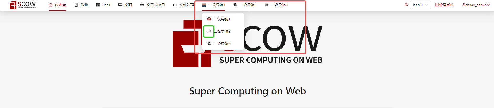

# 自定义导航链接

您可以增加门户和管理系统的导航链接，点击这些链接会跳转到您指定的URL。

:::note

当您点击导航链接时，我们会在当前链接后面加入查询参数`?token={用来跟踪登录用户的状态的token}`，您可以通过token查询当前操作用户。

:::

## 门户系统中的配置

在门户系统中，您可以在`config/portal.yaml`文件中，根据备注修改所需要的配置。

```yaml title="config/portal.yaml"
# 新增导航链接相关配置
navLinks:
  # 链接名称
  - text: ""
    # 链接地址
    url: ""
    # 图标路径，可选填
    iconPath: ""
    # 二级导航,可选填
    children:
      # 二级导航相关配置，与一级导航相同，但是不允许再设置children
      - text: ""
        url: ""
        iconPath: ""
```

## 管理系统中的配置

在管理系统中，您可以在`config/mis.yaml`文件中，根据备注修改所需要的配置。

```yaml title="config/mis.yaml"
# 新增导航链接相关配置
navLinks:
  # 链接名称
  - text: ""
    # 链接地址
    url: ""
    # 图标路径，可选填
    iconPath: ""
    # 可以看到这个链接的用户,可选填
    # 用户类型： user, accountUser, accountAdmin, accountOwner, tenantFinance, tenantAdmin, platformAdmin, platformFinance
    allowedRoles: []
    # 二级导航,可选填
    children:
      # 二级导航相关配置，与一级导航相同，但是不允许再设置children
      - text: ""
        url: ""
        iconPath: ""
        allowedRoles: []
```

## 配置示例

### 门户系统自定义导航链接配置示例

```yaml title="config/portal.yaml"
navLinks:
  - text: "一级导航1"
    url: "https://hahahaha1.com/"
    iconPath: "/desktop.jpg"
    children:
      - text: "二级导航1"
        url: "https://hahahaha1.1.com"
        iconPath: "/PKU_seal.svg"
      - text: "二级导航2"
        url: "https://hahahaha1.2.com"
      - text: "二级导航3"
        url: "https://hahahaha1.3.com"
        iconPath: "/earth.png"
  - text: "一级导航2"
    url: "https://hahahaha2.com"
    children: []
    iconPath: "/earth.svg"
  - text: "一级导航3"
    url: "https://hahahaha3.com"
    iconPath: "/icon-test.png"
    children: []
```

门户系统用户可以阅览到的导航链接如下,绿色框线中的图标为系统默认导航链接图标。



### 管理系统自定义导航链接配置示例

```yaml title="config/mis.yaml"
navLinks:
  - text: "一级导航1"
    url: "https://hahahaha1.com/"
    iconPath: "/icon-test.png"
    children:
      - text: "二级导航1"
        url: "https://hahahaha1.1.com"
        iconPath: "/earth.svg"
        allowedRoles: [tenantFinance]
      - text: "二级导航2"
        url: "https://hahahaha1.2.com"
        allowedRoles: [tenantAdmin, platformAdmin]
  - text: "一级导航2"
    url: "https://hahahaha2.com"
    iconPath: "/earth.png"
  - text: "一级导航3"
    url: "https://hahahaha3.com"
    allowedRoles: [user]
```

当前登录用户的用户角色为`accountOwner`，`tenantAdmin`，`platformAdmin`时,他可以阅览到的导航链接如下,绿色框线中的图标为系统默认导航链接图标。


## 配置解释

| 属性                       | 类型                 | 应用系统           | 是否必填    | 解释                                                                                     |
| ------------------------- | -------------------- | ------------------ | ---------- | ---------------------------------------------------------------------------------------- |
| `navLinks`                | /                    | /                 |/           |/                                                                                          |
| `text`                    | 字符串                | `portal`，`mis`    | 是         | 链接名称，SCOW导航栏上显示的名称                                                            |
| `url`                     | 字符串                | `portal`，`mis`    | 是         | 链接地址，自定义导航链接地址，跳转时会在后面加入查询参数`?token={用来跟踪登录用户的状态的token}`  |
| `iconPath`                     | 字符串           | `portal`，`mis`    | 否         | 图标路径，用户上传到[公共文件](./public-files.md)下的自定义导航链接图标路径。可选填，如未填写则显示系统默认导航链接图标。  |
| `allowedRoles`            |  用户角色字符串列表    | `mis`             |否           | 管理系统指定可以看到该导航链接的角色列表，用户角色类型包括  `user`, `accountUser`, `accountAdmin`, `accountOwner`, `tenantFinance`, `tenantAdmin`, `platformAdmin`, `platformFinance` 。如果没有指定，则不再限定用户角色，即所有用户都可以看到该导航链接。  |
| `children`                |  导航内容的列表    | `portal`，`mis`   | 否          | 二级导航列表，内容包括该系统下一级导航的所有内容，内容类型以及是否必填与一级导航内容完全相同，但是不允许再继续设置chilidren，不允许继续添加三级导航。如果没有指定，则没有可以显示的二级导航链接。    |

:::tip

如果您想更加详细的了解系统用户模型，请参考[用户模型](../../../info/mis/business/users.md)。

:::

### 自定义图标配置说明

系统支持自定义导航链接的灵活图标配置。

您可以通过把存放在和`install.yml`同级的`public`目录下图片文件的路径添加到`iconPath`来进行自定义图标配置。公共文件路径的使用详见[公共文件](./public-files.md)。

您所添加的图片文件后缀应为常用图片文件`.svg`，`.png`或者`.jpg`等。

如您将图片`icon.svg`上传到公共文件`public`目录下,则您在配置时需填写`iconPath:"/icon.svg"`。

`iconPath`可以选填，如不填写，则将统一显示系统默认导航链接图标。

### 角色配置说明

在管理系统中进行配置自定义导航链接功能时，您可以通过在`allowedRoles`属性中添加角色字符串来自由配置能够看到该导航链接的角色。
在当前的SCOW系统中，我们支持以下角色：

| 角色名称            | 解释                          |
| ------------------ | ----------------------------- |
| `user`             | 未加入账户的普通用户 |
| `accountUser`     | 在所有账户中均为普通用户      |
| `accountAdmin`     | 在某个账户中为账户管理员      |
| `accountOwner`     | 在某个账户中为账户拥有者     |
| `tenantAdmin`      | 在租户中的角色：租户管理员      |
| `tenantFinance`    | 在租户中的角色：租户财务人员    |
| `platformAdmin`    | 在平台中的角色：平台管理员      |
| `platformFinance`  | 在平台中的角色：平台财务人员     |

:::tip

如果您想更加详细的了解系统用户模型，请参考[用户模型](../../../info/mis/business/users.md)。

:::
