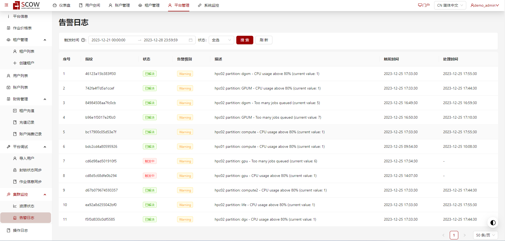

# 集群监控功能（可选）

## 资源状态


资源状态功能通过嵌入配置好的 Grafana 面板查看资源的状态。
grafana 版本推荐使用较新的版本，否则可能会出现数据无法获取或者样式异常的情况。OpenSCOW 在进行测试时使用的是 Grafana 10.2.2 版本，推荐使用该版本。

目前提供两种嵌入方式
### 1. 直接嵌入

直接嵌入指使用 iframe 将 grafana 的实际面板的 url 嵌入到 OpenSCOW 管理系统中。将在 OpenSCOW 管理系统的平台管理下添加【集群监控】-【资源状态】页面。

修改 grafana 配置文件 grafana.ini，添加 allow_embedding 配置如下，允许 grafana 能够嵌入页面。

```
...other config
[security]
allow_embedding = true
```

在 `mis.yaml` 文件中添加 clusterMonitor 相关配置

```yaml
# 集群监控配置
clusterMonitor:
  # 协议 + ip/域名 + 端口，默认为 http://127.0.0.1:4000
  grafanaUrl: "http://127.0.0.1:4000"
  # 资源状态相关配置
  resourceStatus:
    # 是否开启资源状态，默认不开启
    enabled: true
    # 是否使用代理的方式，默认为 false
    proxy: false
    # 默认面板 id,默认设置为 shZOtO4Sk
    dashboardUid: "shZOtO4Sk"

```

将 grafanaUrl 替换为实际的 grafana 地址,并将 dashboardUid 设置为你期望进入资源状态页面展示的面板 id 即可。

### 2. 代理

如果你不希望将 grafana 的地址公开，可以使用代理的方式嵌入 grafana 面板。开启代理后，对 grafana 的请求将发送到 OpenSCOW 的后端然后代理到 grafana。

修改 grafana 配置文件 grafana.ini，添加 root_url 和 allow_embedding 配置。将如下配置中的 OpenSCOW 地址替换为真实的地址。例如 `http://127.0.0.1/mis`

```
..other config
[server]
root_url=[OpenSCOW 管理系统地址]/api/admin/monitor/getResourceStatus
[security]
allow_embedding = true
```

在 `mis.yaml` 文件中添加 clusterMonitor 相关配置

```yaml
# 集群监控配置
clusterMonitor:
  # 协议 + ip/域名 + 端口，默认为 http://127.0.0.1:4000
  grafanaUrl: "http://127.0.0.1:4000"
  # 资源状态相关配置
  resourceStatus:
    # 是否开启资源状态，默认不开启
    enabled: true
    # 是否使用代理的方式，默认为 false
    proxy: true
    # 默认面板 id,默认设置为 shZOtO4Sk
    dashboardUid: "shZOtO4Sk"

```

同样你需要将 grafanaUrl 替换为实际的 grafana 地址,并将 dashboardUid 设置为你期望进入资源状态页面展示的面板 id。然后将 proxy 选项改为 true 即可开启代理模式嵌入 grafana。

:::note

注意：目前代理的模式暂不支持 websocket 连接，会影响 grafana 部分实时数据更新的功能

:::


## 告警日志



可以查看资源达到一定使用限额后触发的告警日志，目前仅支持 OpenSCOW 提供的告警规则查看。详细的配置信息可以查看[部署集群监控](../../../../hpccluster/cluster-monitor/index.md)。完成 grafana 数据源、Prometheus、Alertmanager、alert-db等配置后，修改 `mis.yaml` 文件，在 clusterMonior 下添加如下配置。

```yaml
# 集群监控配置
clusterMonitor:
  # 告警日志配置
  alarmLogs:
    # 是否开启告警日志，默认不开启
    enabled: true
```

开启后将添加【集群监控】-【告警日志】页面

## 参考配置
查看[部署集群监控](../../../../hpccluster/cluster-monitor/index.md)
