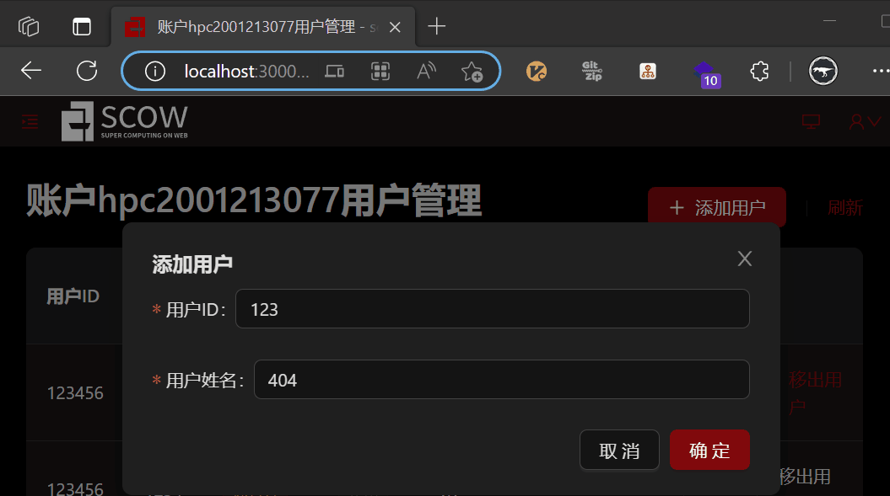

# 创建用户配置

在以下情况下，管理系统允许用户或者管理员在SCOW中创建用户。

- 初始化系统时，创建初始管理员账号
- 添加用户到账户时，用户不存在
- 租户管理员添加用户

由于不同机构创建用户的方式完全不同，为了兼容易用性和可扩展性，我们从SCOW中创建用户的方式具有**内置(builtin)**和**外置(external)**两种方式。

## 内置创建用户页面

当所使用的认证系统支持创建用户时，您可以使用管理系统内置的创建用户表单来完成创建用户的功能。

配置：

```yaml title="config/mis.yaml"
createUser:
  # 允许用户创建用户。默认为true
  enabled: true

  # 使用SCOW内置的创建用户功能。默认为builtin
  type: builtin

  # 内置创建用户功能配置
  builtin:
    # 新用户ID的格式
    userIdPattern:
      # 正则表达式
      regex: "[a-zA-Z0-9]+"
      # 出错时的消息，可选
      message: 用户ID应仅包含字母和数字
```

:::note

如果您的认证系统不支持创建用户，且使用了内置的创建用户功能，那SCOW将会在创建用户时并不会显示创建用户的界面，而会通过报错等方式发出一个通知，告知用户系统无法创建用户。

:::

## 外置创建用户界面

如果内置创建用户界面不合您的需求，您可以自己开发单独的创建用户界面。SCOW将会在用户从SCOW中创建用户时，跳转到您指定的地址中。

```yaml title="config/mis.yaml"
createUser:
  # 允许用户创建用户。默认为true
  enabled: true

  # 使用SCOW内置的创建用户功能 
  type: external

  # 外置创建用户界面
  external:
    url: http://your-create-user-page.com
```

SCOW在跳转时，还会给URL附上如下查询字符串（querystring），您的系统可以使用这些查询字符串获取用户的意图，并完成用户所指定的操作。

| 情形 | 增加的查询字符串 |
| -- | -- | 
| 添加用户到账户时用户不存在 | `?type=addUserToAccont&accountName=账户名&userId=用户ID&userName=用户姓名&token=操作用户的token` |
| 租户管理员创建用户 | `?type=createUser&token=操作用户的token` |

初始化系统时创建初始管理员不支持跳转到外置创建用户界面。

下图为当添加用户到账户但用户不存在时，UI交互的情况：



## 关闭SCOW中创建用户功能

要想关闭SCOW的创建用户的功能，可以在配置文件中配置

```yaml title="config/mis.yaml"
createUser:
  # 在SCOW中关闭创建用户功能
  enabled: false
```

当您关闭此功能时，UI上所有关于创建用户的功能的链接都会被隐藏。