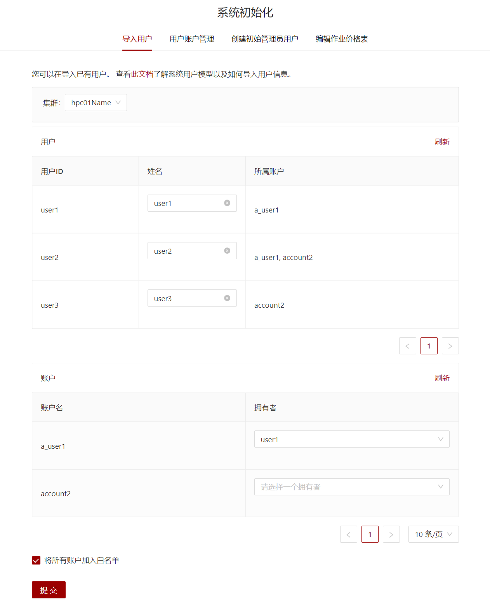

# 配置使用slurm的集群

## 选定slurm节点和部署slurm适配器

在集群中选定一个节点作为**slurm节点**。此节点需要部署slurm适配器并保证正确运行。

## 修改集群配置

在`config/clusters/{使用slurm的集群的ID}.yml`中，修改配置(使用适配器的ip地址和端口号)

```yaml title="config/clusters/{使用slurm的集群的集群ID}.yml"
# ...
adapterUrl: localhost:8972
```

## 导入已有用户信息

如果您已有一个slurm集群，在管理系统部署完成后，可以使用本功能将slurm中的用户信息导入本系统。



系统会从slurm集群中读取用户和账户信息，显示在表格中。不存在名字的用户的初始名字默认为自己的ID。

系统默认将`a_用户ID == 账户ID`的用户设置为拥有者。此外，您也可以在系统中选择拥有者，需要注意系统要求账户的拥有者字段不能为空。

在系统初始化时，或者系统初始化后使用平台管理员用户登录后选择**平台管理**->**导入用户**，即可使用导入用户功能。如果需要将新加入的账户都加入白名单中，请勾选`将所有账户加入白名单`。点击确定，即可将所有账户导入指定租户中。

## SCOW和slurm用户信息的关系

为了保存如计费收费等更多信息，SCOW自己维护一套用户账户信息，并在进行各种与用户信息有关的操作时自动将这个操作同步到slurm的用户账户信息中。

为了保证SCOW操作的正确性，我们要求**SCOW的用户信息为slurm用户信息的子集**。

以下情况是允许的：

- slurm中或者认证系统中存在的用户SCOW中不存在
    - 在SCOW创建这个用户时（用户ID和已有用户相同），SCOW将会提示认证系统中已存在此用户，并允许用户直接在SCOW中添加用户
- slurm中存在的账户SCOW中不存在
    - 在SCOW中创建这个账户时，如果slurm中已经存在，SCOW将直接添加到SCOW数据库中，并尝试把拥有者加入账户中
- slurm中一个用户存在于一个账户中，SCOW中没有
    - 在SCOW中将这个用户加入账户时，如果slurm中用户已经存在于账户中，SCOW将会直接在slurm的用户信息中添加这个用户账户关系

以下情况在进行和slurm有关的操作（如封锁解封）时会出错，在进行只和SCOW有关的操作（如设置限额、设置用户管理员权限等）时不会报错：

- SCOW中一个用户于一个账户中，slurm中没有
- SCOW中存在的用户或者账户时slurm中不存在

我们建议，部署好SCOW系统后，所有SCOW中支持的功能都从SCOW中操作。如果需要一些SCOW中不支持的操作，请完成操作后立即手动修改数据库，使SCOW和slurm的用户信息同步。

## 刷新调度器用户封锁状态

当运行slurm.sh节点和slurm管理节点并非同一节点时，已封锁的用户、账户和用户账户将会在slurm集群重启后被解封。

SCOW在启动时将会自动刷新一次slurm封锁状态，但是slurm集群可能在SCOW运行时重启，SCOW暂时不能对这种情况做出反应。

所以，如果运行slurm.sh节点和slurm管理节点并非同一节点时，您需要在slurm集群重启后，手动执行一下**平台调试**->**封锁状态同步**的**刷新调度器用户封锁状态**的功能。如果slurm.sh节点和slurm管理节点为同一节点，您可以忽略本功能。

如果您使用的是slurm之外的调度器，在调度器和SCOW间用户封锁状态不同步时，可以手动执行一下本页面的刷新调度器用户封锁状态的功能。