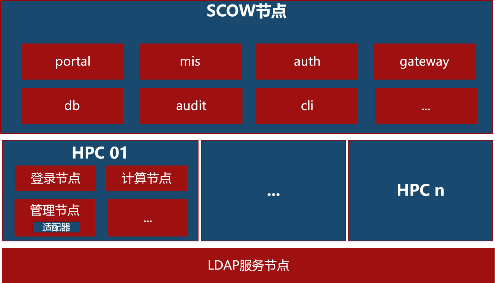

SCOW多集群部署架构如下图所示：



:::tip

SCOW主要服务包括portal、mis、auth、gateway、export job、数据库及源作业数据库，支持多HPC集群管理，待接入的HPC集群需满足如下条件：

1. 所有集群都必须使用同一个LDAP；

1. 每个HPC集群NFS路径需相同，例如用户Home目录都为`/data/home`，软件安装目录都为`/data/software`。

SCOW多集群管理设置：

1. 每个slurm集群启动一个export job服务；

1. 所有export job服务共用同一个源数据库；

1. 每个slurm集群有一个集群配置文件，即在`scow-deployment/config/clusters/`目录下每个集群有一个配置文件。

:::

SCOW接入多集群部署，与接入一个集群的区别主要在于：

(1) 因为每个slurm集群的数据库不同，每个集群配置一个export job，所有export job的源数据库都一样。主要修改export job的`config.py`文件

```Bash
# slurm集群名称
cluster_name = 'cluster'

# slurm数据库相关配置  
cluster_db_conf = {
    'host':'10.0.0.12',
    'port':3306,
    'user':'slurm',
    'passwd':'81SLURM@@rabGTjN7',
    'db':'slurm_acct_db',
    'gres_id' : 1001
}

# 源数据库相关配置
mgt_db_conf = {
    'host':'10.0.0.13',
    'port':3306,
    'user':'root',
    'passwd':'aUTx373~5pU@!&^6',
    'db':'hpc'
}
```

:::tip

注意为每个集群的export job配置对应的`cluster_name`和 `cluster_db_conf`

:::

(2) 每个slurm集群有一个集群配置文件，即在`scow-deployment/config/clusters/`目录下每个集群有一个配置文件，如下所示：

```Bash
# 集群显示名称
displayName: hpc01

# 指定slurm配置
slurm:
  # 各个登录节点的IP或者域名，服务节点必须可访问
  loginNodes:
    - login01

  # 集群的分区信息
  partitions:
    # 分区1的名字, 不能包含空格
    - name: compute
      # 分区内节点数
      nodes: 2
      # 单节点内存数量，单位M
      mem: 14000
      # 核心数
      cores: 4
      # GPU数
      gpus: 0
      # QOS
      qos:
        - low
        - normal
        - high
      # 这个分区的备注信息
      comment: "两个计算节点分区"

  # 如果这个集群要部署管理系统，请增加以下配置
  # 如果不需要，将整个mis块注释掉
  mis:
    # 部署slurm.sh的机器的地址
    managerUrl: 172.58.1.102
    # slurm.sh在机器中的绝对地址
    scriptPath: /test/slurm.sh
    # slurmdbd的数据库密码
    dbPassword: 81SLURM@@rabGTjN7
    # 这个集群在slurm中的集群名字
    clusterName: hpc01
```

:::tip

每个集群配置文件请按照该集群的实际情况修改配置，该配置文件的每个属性都需仔细核对

:::