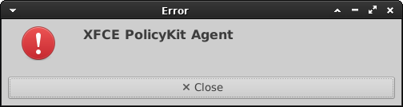

# Desktop

## 软件简介

Xfce Desktop是一款轻量级的桌面环境，它被设计为在资源受限的系统上运行。具有简洁、快速、可定制的特点，它的用户界面风格非常清爽、现代。与其他桌面环境相比，它占用的系统资源非常少，同时也提供了一些常见的工具和应用程序，例如文件管理器、终端模拟器、文本编辑器、图像查看器和音频播放器等。

KDE是一个开源的桌面环境，全称为K Desktop Environment（KDE）。它提供了一个功能丰富、可定制和用户友好的图形化桌面环境，旨在为Linux和类UNIX操作系统提供先进的用户体验。

MATE是一个基于传统GNOME 2桌面环境的轻量级桌面环境，旨在提供传统的桌面体验和用户友好的界面。

Cinnamon是一个现代化的桌面环境，最初由Linux Mint开发，旨在提供直观、易用且吸引人的用户体验。它的设计目标是为用户提供一个熟悉而高效的桌面环境，具有直观的界面和强大的功能。

## 前提条件

请确保在需要运行桌面类应用的机器上安装有：

- TurboVNC 3.0版本及以上

- 您需要运行的Xfce Desktop、K Desktop Environment（KDE）、MATE和cinnamon桌面环境

### 1、TurboVNC安装

```bash
wget https://turbovnc.org/pmwiki/uploads/Downloads/TurboVNC.repo --no-check-certificate
mv TurboVNC.repo /etc/yum.repos.d
# 安装最新版本
yum install turbovnc -y
```

### 3、Xfce安装

```bash
yum groupinstall "Xfce" -y
yum groupinstall "KDE Plasma Workspaces" -y
yum groupinstall "MATE Desktop" -y
yum install cinnamon -y
```

下面讲解如何配置使用Desktop。

## 配置文件

创建`config/apps`目录，在里面创建`desktop.yml`文件，其内容如下：

```yaml title="config/apps/desktop.yml"
# 这个应用的ID
id: desktop

# 这个应用的名字
name: desktop

# 指定应用类型为vnc
type: vnc

# VNC应用的配置
vnc:
  # 准备脚本
  beforeScript: |
    # 桌面会话临时数据存放位置
    export XDG_RUNTIME_DIR="$(mktemp -d)"
  # 此X Session的xstartup脚本
  xstartup: |
    unset SESSION_MANAGER
    unset DBUS_SESSION_BUS_ADDRESS
    
    case ${desktop_type} in
      "kde")
        cd ~
        startkde
        ;;
      "mate")
        cd ~
        mate-session
        ;;
      "cinnamon")
        cd ~
        cinnamon-session
        ;;
      *)
        # Disable startup services 
        xfconf-query -c xfce4-session -p /startup/ssh-agent/enabled -n -t bool -s false
        xfconf-query -c xfce4-session -p /startup/gpg-agent/enabled -n -t bool -s false
        xfconf-query --channel xfce4-desktop -p /desktop-icons/file-icons/show-filesystem -s false --create -t bool
        xfconf-query --channel xfce4-desktop -p /desktop-icons/file-icons/show-removable -s false --create -t bool
        # 配置默认面板
        if [ ! -d "${HOME}/.config/xfce4/panel/launcher-9" ] || [ ! -d "${HOME}/.config/xfce4/panel/launcher-10" ] || [ ! -d "${HOME}/.config/xfce4/panel/launcher-11" ] || [ ! -d "${HOME}/.config/xfce4/panel/launcher-12" ]; then
          cp -f /etc/xdg/xfce4/panel/default.xml ${HOME}/.config/xfce4/xfconf/xfce-perchannel-xml/xfce4-panel.xml
        fi
        # 桌面终端默认进入到家目录
        cd ~
        # 启动xfce桌面环境
        startxfce4
    esac
    
      
# 配置HTML表单   
attributes:
  - type: select
    name: desktop_type
    label: 请选择桌面环境
    select:
      - value: xfce
        label: Xfce Desktop
      - value: kde
        label: K Desktop Environment（KDE）
      - value: mate
        label: MATE
      - value: cinnamon
        label: Cinnamon
  - type: text
    name: sbatchOptions
    label: 其他sbatch参数
    required: false
    placeholder: "比如：--gpus gres:2 --time 10"
```

## FAQ

### Q1：首次连接进入到Xfce桌面时，会报XFCE PolicyKit Agent的弹窗错误



系统管理员可通过禁用Xfce PolicyKit验证代理解决：

```bash
# 将需要启动xfce桌面的节点上xfce-polkit.desktop文件重命名
mv /etc/xdg/autostart/xfce-polkit.desktop /etc/xdg/autostart/xfce-polkit.desktop.disabled
```
