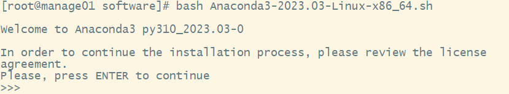
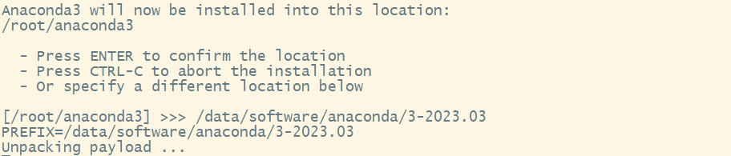
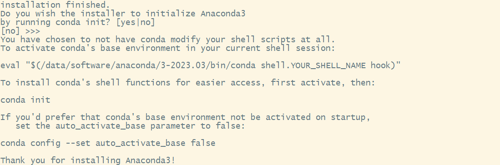
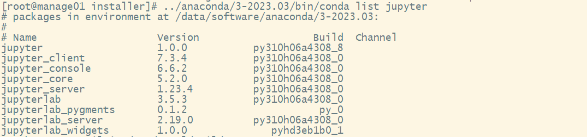

# Jupyter

## 软件简介

Jupyter Notebook是一个开源的Web应用程序，可用于创建和共享文档，其中包括代码、文本、数学方程式和可视化效果。

## 前提条件

请确保在需要运行应用的计算节点上安装有Jupyter Notebook。

Jupyter Notebook建议通过Anaconda进行安装（具体安装请参考附章中Anaconda安装章节），Anaconda集成了Jupyter Notebook，安装上Anaconda发行版后也就自动安装上了Jupyter Notebook，安装好Anaconda后如果Jupyter Notebook没有自动安装成功的话，在终端输入以下命令进行安装：

```bash
conda install jupyter notebook
```

Jupyter Notebook运行时依赖的Python环境，建议用户可自行使用conda创建所需的Python环境，并在该环境内安装ipykernel，环境创建好后，用户可以通过两种方式来使用：

- 在启动Jupyter应用时，用户可填入所创建的conda环境名来使用该Python环境；

- 在Jupyter启动后，在Kernel菜单切换到新创建的Python环境。

以下示例创建一个Python3.7的虚拟环境：

```bash
# 创建一个Python版本为3.7的conda虚拟环境，环境名字为python3.7
conda create -n python3.7 python=3.7 -y
# 激活进入到python3.7环境
conda activate python3.7
# 在新的环境安装ipykernel
conda install ipykernel
# 将新环境的ipykernel到base环境的jupyter中
python -m ipykernel install --user --name python3.7 --display-name "python3.7"
```

下面讲解如何配置使用Jupyter Notebook。

## 配置文件

创建`config/apps`目录，在里面创建`jupyter.yml`文件，其内容如下：

```yaml title="config/apps/jupyter.yml"
# 这个应用的ID
id: jupyter

# 这个应用的名字
name: jupyter

# 指定应用类型为web
type: web

# Web应用的配置
web:
  # 指定反向代理类型
  proxyType: absolute
  # 准备脚本
  beforeScript: |
    export PORT=$(get_port)
    export PASSWORD=$(get_password 12)
    export SALT=123
    export PASSWORD_SHA1="$(echo -n "${PASSWORD}${SALT}" | openssl dgst -sha1 | awk '{print $NF}')"
    export CONFIG_FILE="${PWD}/config.py"
    export SLURM_COMPUTE_NODE_IP=$(get_ip)
    export SHELL_NAME=$(echo ${SHELL} | awk -F'/' '{print $NF}')
    export CONDA_VERSION="anaconda/3-2023.03"

  # 运行任务的脚本。可以使用准备脚本定义的变量
  script: |
    for m in ${textModuleName}; do module switch ${m}; done

    conda -V &> /dev/null
    if [ $? -ne 0 ]; then
      module switch ${CONDA_VERSION}
    fi
    # init conda
    eval "$($(which conda) shell.${SHELL_NAME} hook)"

    if [[ "" == "${textCondaName}" ]]; then
      textCondaName="base"
    fi
    conda activate ${textCondaName}
    if [ $? -ne 0 ]; then
      exit 1
    fi

    (
    umask 077
    cat > "${CONFIG_FILE}" << EOL
    c.NotebookApp.ip = '0.0.0.0'
    c.NotebookApp.port = ${PORT}
    c.NotebookApp.port_retries = 0
    c.NotebookApp.password = u'sha1:${SALT}:${PASSWORD_SHA1}'
    c.NotebookApp.open_browser = False
    c.NotebookApp.base_url = "${PROXY_BASE_PATH}/${SLURM_COMPUTE_NODE_IP}/${PORT}/"
    c.NotebookApp.allow_origin = '*'
    c.NotebookApp.disable_check_xsrf = True
    EOL
    )
    cd ~
    jupyter notebook --config=${CONFIG_FILE} --notebook-dir=${HOME}

  # 如何连接应用
  connect:
    method: POST
    path: /login
    formData:
      password: "{{ PASSWORD }}"
      
# 配置HTML表单   
attributes:
  - type: text
    name: textModuleName
    label: Modules
    required: false  # 输入需要额外加载的环境模块列表
    placeholder: 输入需要额外加载的环境模块列表，模块之间用空格分开（比如：python/2.7.5 code-server/4.9.1）  # 提示信息
  - type: text
    name: textCondaName
    label: conda环境
    required: false  # 输入运行Jupyter的conda环境，默认使用base环境
    placeholder: 输入conda虚拟环境名称  # 提示信息
  - type: text
    name: sbatchOptions
    label: 其他sbatch参数
    required: false
    placeholder: "比如：--gpus gres:2 --time 10"
```

增加了此文件后，刷新WEB浏览器即可。

对于Jupyter，export以下变量的含义是：

- `SLURM_COMPUTE_NODE_IP`: 计算节点的IP地址
- `CONFIG_FILE`: 指定Jupyter的配置文件
- `SHELL_NAME`：当前会话的shell名称
- `CONDA_VERSION`：系统默认的conda版本

## 附章

### 1、Anaconda安装

Anaconda建议安装在共享存储上，集群各节点只需要挂载上共享存储，并配置好环境变量后便可以使用。安装Anaconda之前请先预留6GB存储空间。

- 下载Anaconda安装脚本：

  ```bash
  wget https://mirrors.tuna.tsinghua.edu.cn/anaconda/archive/Anaconda3-2023.03-Linux-x86_64.sh
  ```

- 脚本下载后，输入以下命令来验证下载的安装脚本文件是否完整：

  ```bash
  sha256sum Anaconda3-2023.03-Linux-x86_64.sh
  ```

- 执行安装：

  ```bash
  bash Anaconda3-2023.03-Linux-x86_64.sh
  ```

- 安装过程中，看到提示“In order to continue the installation process, please review the license agreement.”（“请浏览许可证协议以便继续安装。”），点击“Enter”查看“许可证协议”。

  

- 在“许可证协议”界面将屏幕滚动至底，输入“yes”表示同意许可证协议内容。然后进行下一步。

  

- 安装过程中，提示选择Anaconda的安装路径，这里指定安装到共享存储上：/data/software/anaconda/3-2023.03。

  

- 安装完成后，会提示是否通过安装程序运行conda init来初始化Anaconda。

  

- 如果安装时不进行初始化的话，用户后续可以执行以下命令手动进行初始化：

  ```bash
  # 命令中/data/software/anaconda/3-2023.03根据实际安装路径进行替换
  # 命令中shell.bash根据实际使用会话shell替换成相应的shell
  eval "$(/data/software/anaconda/3-2023.03/bin/conda shell.bash hook)"
  conda init
  ```

- 验证是否安装成功，执行以下命令，如果显示包名和版本号，说明Anaconda、Jupyter Notebook和JupyterLab都已经安装成功。

  

### 2、添加modulefile文件

配置已安装好的Anaconda的modulefile文件:

```bash
# ${MODULEPATH}为modulefile所在的路径
mkdir -p ${MODULEPATH}/anaconda
cat >> ${MODULEPATH}/anaconda/3-2023.03 << EOF
#%Module1.0#####################################################################
##
## Anaconda3-2023.03 modulefile
##

proc ModulesHelp { } {
    puts stderr "\tThis module defines environment variables, aliases and add PATH for Anaconda"
    puts stderr "\tVersion Anaconda3-2023.03"
    InfoOut
}

## Set module name and version
module-whatis "Anaconda3-2023.03"

## Set version
set version 3-2023.03

## Set the path to the installation directory
set anaconda_root /data/software/anaconda/3-2023.03

## Add anaconda bin directory to PATH
prepend-path PATH $anaconda_root/bin

## Add anaconda library directory to LD_LIBRARY_PATH
prepend-path LD_LIBRARY_PATH $anaconda_root/lib

## Add Anaconda include directory to CPATH
prepend-path CPATH $anaconda_root/include

## Set environment variables for Anaconda
setenv ANACONDA_HOME $anaconda_root
setenv CONDA_ENVS_PATH $anaconda_root/envs
setenv CONDA_PKGS_DIRS $anaconda_root/pkgs
EOF
```
