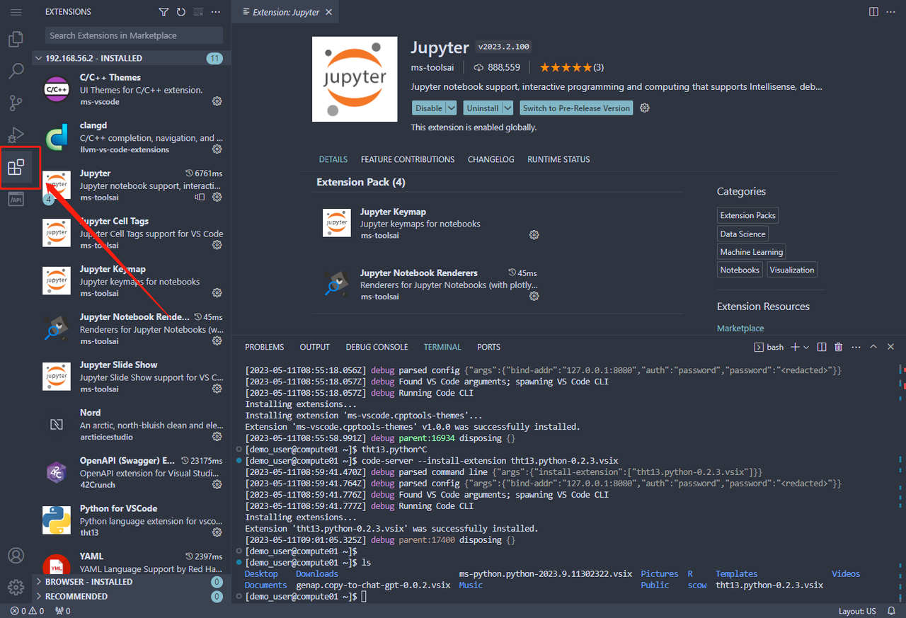
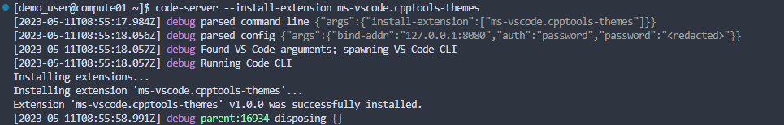
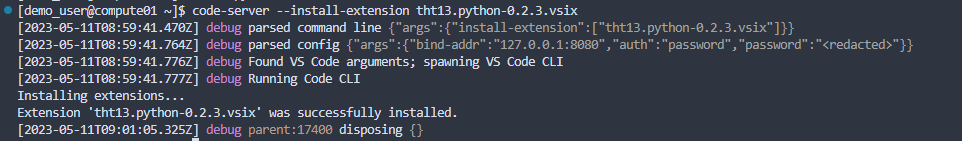

# VSCode

## 软件简介

code-server是一个基于VS Code的开源工具，它可以让你通过浏览器远程访问一个运行着VS Code的服务器。

## 前提条件

请确保在需要运行应用的计算节点上安装有[coder/code-server](https://github.com/coder/code-server)软件包。

### 1、code-server安装

```bash
# 下载所需版本的code-server二进制安装包
wget https://github.com/coder/code-server/releases/download/v4.11.0/code-server-4.11.0-linux-amd64.tar.gz

# 解压code-server二进制安装包
tar zxf code-server-4.11.0-linux-amd64.tar.gz

# 将code-server重命名至指定路径
mkdir -p /data/software/code-server
mv code-server-4.11.0-linux-amd64 /data/software/code-server/4.11.0
```

### 2、添加modulefile文件

配置已安装好的code-server的modulefile文件:

```bash
# ${MODULEPATH}为modulefile所在的路径
mkdir -p ${MODULEPATH}/code-server
cat >> ${MODULEPATH}/code-server/4.11.0 << EOF
#%Module1.0########################################################################
##
## code-server@4.11.0  modulefile
##
proc ModulesHelp { } {
    puts stderr "\tThis module defines environment variables, aliases and add PATH for code-server"
    puts stderr "\tVersion 4.11.0"
}

module-whatis   "code-server@4.11.0"
prepend-path    PATH                    "/data/software/code-server/4.11.0/bin"
EOF
```

下面讲解如何配置使用code-server。

## 配置文件

创建`config/apps`目录，在里面创建`vscode.yml`文件，其内容如下：

```yaml title="config/apps/vscode.yml"
# 这个应用的ID
id: vscode

# 这个应用的名字
name: VSCode

# 指定应用类型为web
type: web

# Web应用的配置
web:

  # 指定反向代理类型
  proxyType: relative
  
  # 准备脚本
  beforeScript: |
    export PORT=$(get_port)
    export PASSWORD=$(get_password 12)

  # 运行任务的脚本。可以使用准备脚本定义的变量
  script: |
    module switch code-server/${selectVersion}
    PASSWORD=$PASSWORD code-server -vvv --bind-addr 0.0.0.0:$PORT --auth password

  # 如何连接应用
  connect:
    method: POST
    path: /login
    formData:
      password: "{{ PASSWORD }}"

# 配置HTML表单，用户可以指定code-server版本      
attributes:
  - type: select
    name: selectVersion
    label: 选择版本
    required: true  # 用户必须选择一个版本
    placeholder: 选择code-server的版本  # 提示信息
    select:
      - value: 4.9.1
        label: version 4.9.1
      - value: 4.11.0
        label: version 4.11.0
  - type: text
    name: sbatchOptions
    label: 其他sbatch参数
    required: false
    placeholder: "比如：--gpus gres:2 --time 10"
```

## 注意事项

### VSCode扩展安装

VSCode扩展的安装需要互联网，当集群计算节点无法连入互联网时，会影响VSCode扩展的安装。Open VSX是一个开源的VSCode扩展市场，目前它的域名[open-vsx.org](https://open-vsx.org)解析地址为198.41.30.195，可通过增加路由的方式使得计算节点能访问198.41.30.195。

VSCode扩展安装有三种方式：

#### 1、通过扩展商店安装

- 在VSCode左侧的侧边栏中，点击底部的扩展图标（通常是一个正方形方块或拼图图标），以打开扩展面板。

  

- 在扩展面板中，你可以浏览并搜索可用的扩展。

- 找到你想要安装的扩展后，点击扩展卡片上的安装按钮。

- VSCode将开始下载和安装扩展，你可以在扩展面板中查看安装进度。

- 安装完成后，你会收到通知，并且扩展会出现在已安装的扩展列表中。

- 在扩展面板的已安装扩展列表中，你可以启用、禁用或卸载已安装的扩展。一些扩展可能需要进行一些额外的设置或配置。

#### 2、通过扩展名或者扩展ID安装

- 打开终端：在VSCode的界面上找到终端（命令行界面）的入口。通常，终端图标位于左侧的侧边栏中。

- 在终端中，使用以下命令安装扩展：

  ```bash
  # <extension-name>替换为你想安装的扩展的标识符或名称。扩展的标识符通常是类似于publisher.extension的格式。例如，要安装 "Python" 扩展，扩展标识符为ms-python.python
  code-server --install-extension <extension-name>
  ```

- 如果你不确定扩展的标识符，你可以在Visual Studio Code Marketplace上找到扩展页面，并从URL中获取标识符部分。

- 执行命令后，VSCode将开始下载并安装指定的扩展。安装完成后，你将在终端中看到相应的成功消息。

  

- 安装的扩展现在应该已经在VSCode中可用。你可以在左侧的侧边栏中点击扩展图标来查看已安装的扩展，并根据需要启用、禁用或配置它们。

#### 3、手动下载扩展包进行安装

- 准备扩展文件：首先下载你需要安装的扩展文件，并上传到服务器。扩展文件通常具有.vsix扩展名，并且是预先打包好的扩展文件。

- 打开终端：在VSCode的界面上找到终端（命令行界面）的入口。通常，终端图标位于左侧的侧边栏中。

- 在终端中使用--install-extension参数安装扩展，将/path/to/extension.vsix替换为你实际的扩展文件路径：

  ```bash
  code-server --install-extension /path/to/extension.vsix
  ```

  

- VSCode将开始安装指定的扩展。安装完成后，你将在终端中看到相应的成功消息。另外需要注意的是，在Visual Studio Code Marketplace上或者非官方下载的扩展包会存在和VSCode不兼容的情况。

  

- 安装的扩展现在应该已经在VSCode中可用。你可以在左侧的侧边栏中点击扩展图标来查看已安装的扩展，并根据需要启用、禁用或配置它们。
