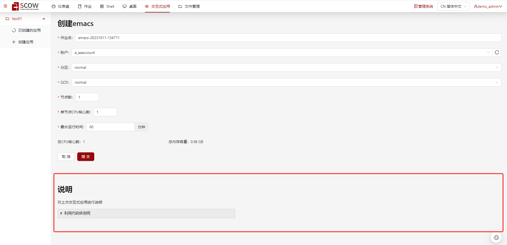

# 配置应用的说明文字

系统支持对不同的交互式应用配置说明文字进行描述。文本支持HTML的标签，将会被放在一个div中。

## 配置示例

```yaml title="config/apps/{app}.yml"
# 这个应用的ID
id: appId

# ...中间省略

# 交互式应用说明文字，选填。
# 支持文本国际化
appComment: "对上方交互式应用进行说明<pre style='width: 40%'><code># 利用代码块说明</code></pre>"
```

如果管理员配置了对应的交互式应用的说明文字，则展示效果如下：


## 配置解释

`appComment`的配置解释如下：

| 属性         | 类型                           | 是否必填 | 解释                                                                        |
|------------|---------------------------------|----------|----------------------------------------------------------------------------|
| `appComment` | 字符串 或 [i18n国际化类型](../../customization/custom-config-i18n.md)            | 否       | 自定义应用的说明文字，可选填。如未填写则不显示，填写后展示在对应的创建应用页面下方。支持HTML的标签。                                                                    |
