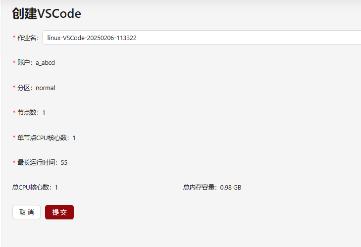

# 配置系统保留交互式应用表单项

支持通过配置`reservedAppAttributes`实现对系统保留交互式应用表单项进行自定义配置。通过此配置可以将页面中账户、分区等可修改的选项展示为固定值或在页面中隐藏。

## 系统保留交互式应用表单项

系统支持对当前创建交互式应用时页面中展示的保留表单项（**作业名**，**账户**，**分区**，**Qos**，**节点数**，**单节点CPU核心数**，**单节点GPU卡数**，**最长运行时间**）进行固定值配置。
其中**最长运行时间**配置的数值单位为分钟。如果没有配置则维持页面原始逻辑。

| 系统保留交互式应用表单项页面展示名称         | 配置字符串                  | 
|-------------------------------------------|---------------------------------|
| 作业名                                     | `appJobName`                  |       
| 账户                                       | `account`                     |  
| 分区                                       | `partition`                   |
| Qos                                        | `qos`                         |
| 节点数                                     | `nodeCount`                   |
| 单节点CPU核心数                             | `coreCount`                   |
| 单节点GPU卡数                               | `gpuCount`                    |
| 最长运行时间                                | `maxTime`                     |


## 配置解释

reservedAppAttributes配置解释如下：

| 属性         | 类型                           | 是否必填 | 解释                                                                        |
|------------|---------------------------------|----------|----------------------------------------------------------------------------|
| `name`     |  字符串 |   是    | HTML表单的name属性，填写的字符串需符合[系统保留交互式应用表单项](#系统保留交互式应用表单项)要求的配置字符串内容。出现重复配置，后方覆盖前方值。  |
| `fixedValue`  |  固定值对象 |   是    | 配置参考[fixedValue配置](../apps/configure-attributes.md#fixedvalue配置解释)  |


## 配置示例
```yaml title="config/apps/{app}.yml"

# 这个应用的ID
id: appId

# ...中间省略

# 系统保留交互式应用表单项配置，选填。
reversedAppAttributes:
  - name: account
    fixedValue:
      value: a_abcd
  - name: partition
    fixedValue:
      value: normal
  - name: qos
    fixedValue:
      value: normal
      hidden: true
  - name: nodeCount
    fixedValue:
      value: 1
  - name: coreCount
    fixedValue:
      value: 1
  - name: maxTime
    fixedValue:
      # 单位为分钟
      value: 55
```

如果管理员自定义系统保留交互式应用表单项为固定值的配置，则展示效果如下。
其中`Qos`会使用配置的值`normal`，但是页面不再展示。
另外需要注意的是，除`nodeCount`，`coreCount`，`gpuCount`及`maxTime`配置的`value`需要为数字以外，管理员可以自定义配置为任意固定值。但是实际上交互式应用提交时仍然会校验当前登录用户相关权限，如果配置的值不满足则无法提交交互式应用或已提交的交互式应用无法正确运行。


