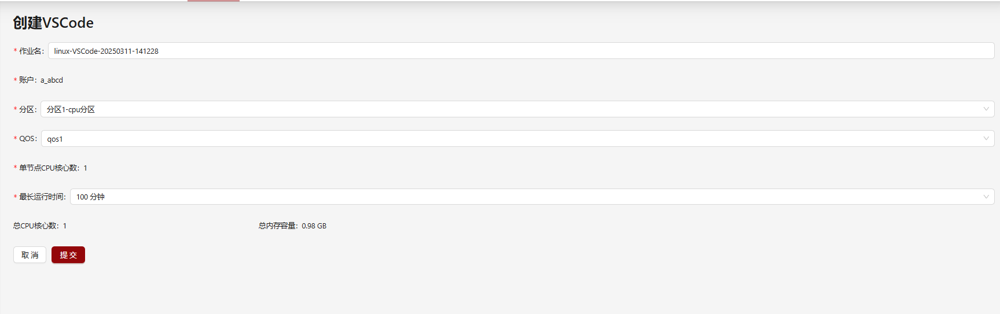

# 配置系统保留交互式应用表单项

我们之前支持在多集群下分别按照实际集群环境配置不同的交互式应用[多集群下的应用配置](../apps/configure-cluster-apps.md)。
现在我们在上述配置基础之上也支持通过配置`reservedAppAttributes`实现对系统保留交互式应用表单项进行自定义配置。

通过此配置可以将页面中账户、分区等可修改的选项展示为固定值并选择是否在页面中隐藏，也可以配置为管理员指定的固定值选项，在页面展示为下拉选择器。


## 系统保留交互式应用表单项

系统支持对当前创建交互式应用时页面中展示的保留表单项（**作业名**，**账户**，**分区**，**Qos**，**节点数**，**单节点CPU核心数**，**单节点GPU卡数**，**最长运行时间**）进行固定值配置。
其中**最长运行时间**配置的数值单位为分钟。如果没有配置则维持页面原始逻辑。

| 系统保留交互式应用表单项页面展示名称         | 配置字符串                  | 
|-------------------------------------------|---------------------------------|
| 作业名                                     | `appJobName`                  |       
| 账户                                       | `account`                     |  
| 分区                                       | `partition`                   |
| Qos                                        | `qos`                         |
| 节点数                                     | `nodeCount`                   |
| 单节点CPU核心数                             | `coreCount`                   |
| 单节点GPU卡数                               | `gpuCount`                    |
| 最长运行时间                                | `maxTime`                     |


## 配置解释

reservedAppAttributes配置解释如下：

| 属性         | 类型                           | 是否必填 | 解释                                                                        |
|------------|---------------------------------|----------|----------------------------------------------------------------------------|
| `name`     |  字符串 |   是    | HTML表单的name属性，填写的字符串需符合[系统保留交互式应用表单项](#系统保留交互式应用表单项)要求的配置字符串内容。出现重复配置，后方覆盖前方值。  |
| `config`   |  配置对象  |   是    | 配置参考[config配置解释](#config-配置解释)  |

## config 配置解释
现阶段`config`支持两种配置，一种为固定值配置，一种为包含固定选项的下拉选择器配置，详细配置解释如下：

### 固定值类型的配置解释
| 属性       | 类型                             | 是否必填 | 解释                                                                        |
|------------|---------------------------------|----------|----------------------------------------------------------------------------|
| `type`     |  字符串                          |   -      | 指定为"fixedValue"  |
| `value`    |  字符串或数字型   |   是    | 如果`type`为`fixedValue`则必填。固定值的值，当配置项为`coreCount`, `nodeCount`, `gpuCount`, `maxTime`时为需配置为正整数型，对于配置项`maxTime`，配置单位默认为分钟。在页面将显示为计算后的`xx天xx小时xx分钟`形式。详细配置参考[fixedValue配置的value](../apps/configure-attributes.md#fixedvalue配置解释)  |
| `hidden`   |  布尔值           |   否    | 配置的固定值是否在页面隐藏。配置参考[fixedValue配置的hidden](../apps/configure-attributes.md#fixedvalue配置解释)  |

### 包含固定值选项的下拉选择器类型的配置解释
| 属性       | 类型                            | 是否必填 | 解释                                                                        |
|------------|--------------------------------|----------|----------------------------------------------------------------------------|
| `type`     |  字符串                         |   -      | 指定为"select"  |
| `select`   |  下拉选项的对象数组                  |   是     | 如果`type`为`select`则必填。配置参考[下拉选择器类型的select项配置解释](#下拉选择器类型的-select-项配置解释)  |
| `defaultValue`   |  字符串或数字型            |   否     | 表单选项默认值，当配置项为`coreCount`, `nodeCount`, `gpuCount`, `maxTime`时为需配置为正整数型，对于配置项`maxTime`，配置单位默认为分钟。如果没有配置则默认为select选项的第一个  |

### 下拉选择器类型的 select 项配置解释
| 属性       | 类型                            | 是否必填 | 解释                                                                        |
|------------|--------------------------------|----------|----------------------------------------------------------------------------|
| `value`    |  字符串或数字型                  |   是     | 如果`type`为`select`则必填。下拉选项的值。当配置项为`coreCount`, `nodeCount`, `gpuCount`, `maxTime`时为需配置为正整数型，对于配置项`maxTime`，配置单位默认为分钟。在页面将显示为计算后的`xx天xx小时xx分钟`形式。|
| `label`    |  i18n国际化类型                  |   否     | 如果没有填写，在下拉选择器中显示的标签将为上述`value`。对于配置项`maxTime`，如果没有配置`label`，在页面将显示为计算后的`xx天xx小时xx分钟`形式。  |
| `requireGpu`   |  布尔值                     |   否     | 如果配置为`true`，则只有当前分区为`GPU`分区时才会显示该选项。  |


## 配置示例
```yaml title="config/apps/{app}.yml"

# 这个应用的ID
id: appId

# ...中间省略

# 系统保留交互式应用表单项配置，选填。
reservedAppAttributes:
  # 系统保留APP配置项字段
  - name: account
    # 固定值配置
    config:
      type: fixedValue
      value: a_admin
      
  - name: partition
    # 固定选项的下拉选择器配置
    config:
      type: select
      select:
        - value: compute
          label: 分区1-cpu分区
        - value: gpu
          label: 分区2-gpu分区
         
  - name: qos
    # 固定选项的下拉选择器配置
    config:
      type: select
      select:
        - value: qos1
        - value: qos2
        - value: qos3
          requireGpu: true
        - value: qos4
          requireGpu: true

  - name: nodeCount
    config:
      type: fixedValue
      value: 1
      hidden: true
  
  - name: coreCount
    config:
      type: fixedValue
      value: 1
      hidden: false
  
  - name: maxTime
    config:
      type: select
      select:
        # 配置单位为分钟。如果配置了label则在页面下拉框中显示label值
        - value: 100
          label: 100 分钟
        # 配置单位为分钟。如果没有配置label则页面下拉框中会自动计算显示为 xx天xx小时xx分钟
        - value: 200
        - value: 1000
```

如果管理员自定义系统保留交互式应用表单项为固定值的配置，则展示效果如下。
- `作业`没有配置展示为原始逻辑。
- `账户`展示为固定值`a_abcd`，不可修改。
- `分区`展示为包含固定选项的下拉选择器，选项为`分区1-cpu分区`，对应值为`compute`;`分区2-gpu分区`，对应值为`gpu`。
- `QOS`为包含固定选项的下拉选择器，当分区不为`gpu分区`时，对应选项为`qos1`,`qos2`。
- `节点数`为固定值`1`，且在页面隐藏。
- `单节点CPU核心数`为固定值`1`。
- `最长运行时间`为包含固定选项的下拉选择器，选项为配置了`label`的`100 分钟`，值为`100`，单位默认为分钟。没有配置`label`的选项计算后将显示为`3 小时 20 分钟`，`16 小时 40 分钟`，对应的值分别为`200`和`1000`。





另外需要注意的是，除`nodeCount`，`coreCount`，`gpuCount`及`maxTime`配置的`value`需要为数字以外，管理员可以自定义配置为任意固定值。但是实际上交互式应用提交时仍然会校验当前登录用户相关权限，如果配置的值不满足则无法提交交互式应用或已提交的交互式应用无法正确运行。

