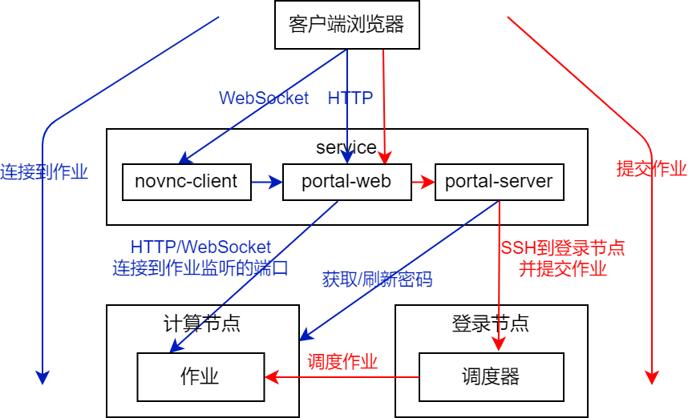

# 交互式作业

参考[文档](../../../../info/portal/app.md)简要了解交互式作业功能。

- [配置VNC类应用](./configure-vnc-app.md)
- [配置Web类应用](./configure-web-app.md)
- [配置表单](./configure-attributes.md)
- 已有交互式应用
  - [Baltamatica](./apps/baltamatica.md)
  - [Desktop](./apps/desktop.md)
  - [Emacs](./apps/emacs.md)
  - [IGV](./apps/igv.md)
  - [Jupyter](./apps/jupyter.md)
  - [JupyterLab](./apps/jupyterlab.md)
  - [Matlab](./apps/matlab.md)
  - [Octave](./apps/octave.md)
  - [Relion](./apps/relion.md)
  - [RStudio](./apps/rstudio.md)
  - [VSCode](./apps/vscode.md)

# 实现原理

