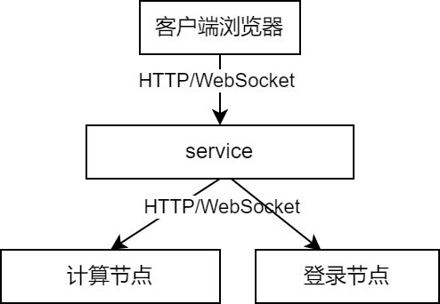
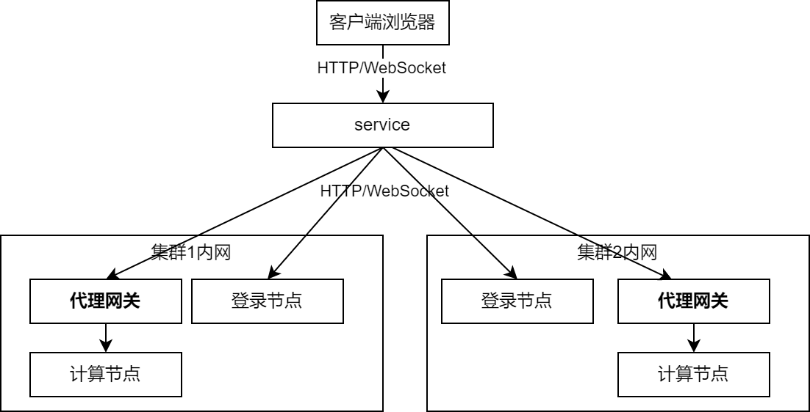

# 代理网关节点

门户系统的[桌面](../desktop.md)和交互式作业功能是通过HTTP代理，将用户的流量代理到了运行桌面的登录节点或者运行计算作业的计算节点上来实现的。这要求SCOW所在的服务节点能够直连所有登录和计算节点。



但是，在多集群环境中，各个集群之间的网络可能不连通，SCOW所在的服务节点可能不能直连所有集群的登录和计算节点。

对于这种情况，您可以给集群配置代理网关节点。在有代理网关的情况下，SCOW将会把交互式应用（包括VNC类型和Web类型）以及登录节点桌面的流量首先发给集群的代理网关节点。代理网关节点将会负责将流量进一步转发到具体的节点中去。



# 手动配置

您需要在您的需要代理网关节点的集群中选择一个节点作为**代理网关节点**。这个节点必须能被SCOW直接访问，也能访问自己集群中的所有机器。您需要给这个节点向SCOW所在的服务节点开放一个端口用作下文的监听端口。

当您选择好了节点后，您需要在网关节点上安装nginx，并创建`/etc/nginx/conf.d/scow-portal-proxy-gateway.conf`

```bash
touch /etc/nginx/conf.d/scow-portal-proxy-gateway.conf
```

然后将以下内容写入此文件，替换如下部分：

- `${PORT}`: 监听端口号
- `${PORTAL_BASE_PATH}`: [门户系统的base path](../../customization/basepath.md)，以`/`结尾

```conf title="/etc/nginx/conf.d/scow-portal-proxy-gateway.conf"
server {
  # 监听端口号，可修改
  listen 12031;

  proxy_set_header Host   $http_host;
  proxy_set_header X-Real-IP      $remote_addr;
  proxy_set_header X-Forwarded-For $proxy_add_x_forwarded_for;

  proxy_http_version 1.1;
  proxy_set_header Upgrade $http_upgrade;
  proxy_set_header Connection "upgrade";

  location ~ ^${PORTAL_BASE_PATH}api/proxy/(?<clusterId>.*)/relative/(?<node>[\d|\.]*)/(?<port>\d+)(?<rest>.*)$ {
    proxy_pass http://$node:$port$rest$is_args$args;
  }

  location ~ ^${PORTAL_BASE_PATH}api/proxy/(?<clusterId>.*)/absolute/(?<node>[\d|\.]*)/(?<port>\d+)(?<rest>.*)$ {
     proxy_pass http://$node:$port$request_uri;
  }
}
```

重新加载nginx配置

```bash
nginx -s reload
```

之后，您需要在SCOW的集群配置文件中，对需要开启这个功能的集群的配置文件增加以下配置：

```yaml title="config/clusters/hpc01/config.yaml"
proxyGateway: 
  url: {代理网关节点nginx监听地址}
```

例如，这个集群的代理网关节点为`192.168.88.100`，上面新增的文件中监听端口号为`12031`，则此处填写

```yaml title="config/clusters/hpc01/config.yaml"
proxyGateway:
  url: http://192.168.88.100:12031
```

重启portal-web即可生效。

```bash
./cli compose restart portal-web
```

注意，一旦修改了此配置，被修改了配置的集群在修改配置之间启动的交互式作业将会无法重新连接。

# 自动配置

您也可以让SCOW自动帮您做这个配置。要使用自动配置，您需要确保：

- SCOW节点可以使用公钥以root身份SSH登录到代理网关节点
- 代理网关节点上安装了nginx

您需要在集群配置文件中编写如下配置：

```yaml title="config/clusters/hpc01/config.yaml"
proxyGateway:
  url: {代理网关节点的nginx的监听地址}
  autoSetupNginx: true
```

这样之后，`portal-server`每次启动时，都会SSH登录到代理网关节点，并根据手动配置部分自动配置。

