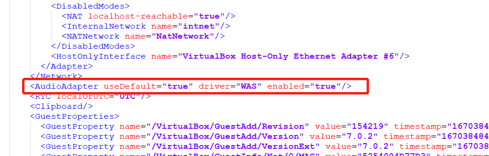

### 1.  Invalid value 'WAS' in AudioAdapter/@driver attribute

在vagrant up时出现如下报错：

**解决方法：**

进入vagrant的box目录，找到对应box的box.ovf配置文件(默认在`{userhome}/.vagrant.d/boxes/`下进入对应的box目录查找)，删除`AudioAdapter`配置。

