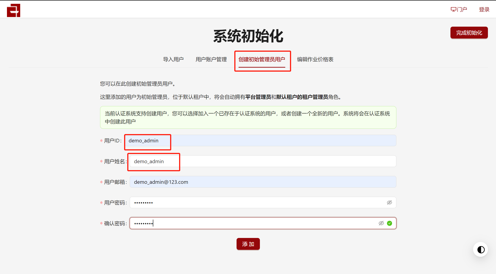

本项目面向**开发**和**测试**人员，基于Vagrant，采用VirtualBox作为Provider，提供slurm+OpenSCOW集群一键部署方案，极大简化了部署流程和部署门槛。

部署slurm+OpenSCOW四节点集群，节点角色及默认配置如下表所示：

| 节点名称/角色 |                           主要服务                            |     私网IP     | 配置  |
| :-----------: | :-----------------------------------------------------------: | :------------: | :---: |
|     scow      |         scow：portal、mis、auth、gateway                     | 192.168.88.100 | 4C4G  |
|     slurm     | slurmdbd、slurmctld、slurmd、mariadb、nfs-server、slapd、sssd | 192.168.88.101 | 2C2G  |
|     login     |         slurmd、sssd、nfs、Xfce、KDE、MATE、cinnamon          | 192.168.88.102 | 2C2G  |
|     cn01      |         slurmd、sssd、nfs、Xfce、KDE、MATE、cinnamon          | 192.168.88.103 | 2C2G  |

### 1. 集群一键部署

把[scow-vagrant](https://github.com/PKUHPC/scow-vagrant)项目clone下来，在这个项目根目录下执行以下命令：
```shell
git clone https://github.com/PKUHPC/scow-vagrant.git
```

部署前准备：

- 下载最新Release的openscow-cli，拷贝至`scow\scow-deployment`目录，并命名为`cli`;
- 编译生成最新的适配器可执行程序(CentOS7.9)，替换`adapter`目录下的`scow-slurm-adapter-amd64`(默认为与OpenSCOW`v1.2.3`匹配版本)，[编译参考文档](https://github.com/PKUHPC/scow-slurm-adapter/blob/master/docs/deploy.md#12-下载代码编译生成二进制文件自己编译生成二进制文件)；
- 修改配置文件`scow\scow-deployment\install.yaml`，`imageTag`修改为与`cli`匹配的版本，例如`v1.2.3`。

一键部署命令：

```shell
vagrant up
```


> - 第一次部署需要从vagrant clould拉取vagrant镜像，速度会比较慢，请耐心等待。
>

### 2. 集群初始化

> 初始化地址：http://192.168.88.100/mis/init/  用户名/密码：demo_admin/demo_admin

进入初始化页面，选择创建初始管理员用户，将`demo_admin`设置为管理员用户。后续用户、账户设置请参考本项目操作手册。



### 3. OpenSCOW运维操作

```shell
#登录到集群scow节点
vagrant ssh scow

# 输入root用户密码，密码为：vagrant

# 进入scow部署目录
/root/scow/scow-deployment

# 拉取最新镜像
./cli compose pull

# 重启服务
./cli compose down
./cli compose up -d
```

### 4. 集群一键销毁命令

```shell
vagrant destroy
```

### 5. 更多文档

- [vagrant环境搭建](./vagrant-env.md)
- [自定义部署](./customization.md)
- [vagrant镜像制作](./images.md)
- [FAQ](./faq.md)

