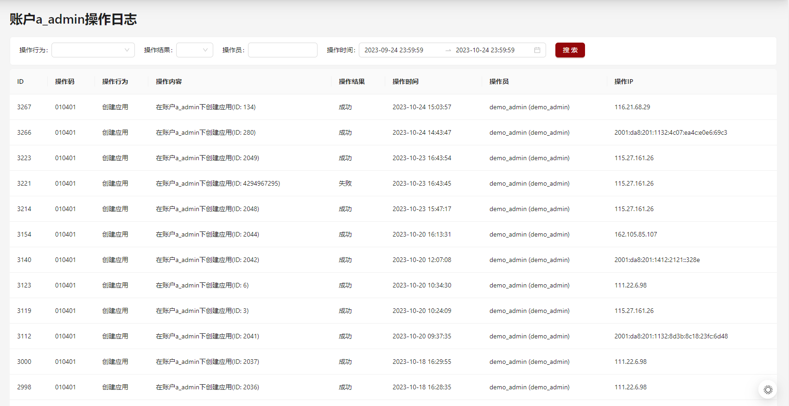

## 1. 系统报错：查看运行日志

:::tip

门户系统报错时，请查看portal-server(优先)和portal-web日志；管理系统报错时，请查看mis-server(优先)和mis-web日志。

:::

### 1.1 查看日志

各组件的实时日志是输出在`stdout`，可以通过`./cli compose logs -f `查看实时的日志输出：

```Bash
# 查看所有组件的日志
./cli compose logs -f 

# 查看认证系统的日志
./cli compose logs -f auth

# 查看门户系统服务器端的日志
./cli compose logs -f portal-server

# 查看管理系统服务器端的日志
./cli compose logs -f mis-server
```

若开启了日志收集工具fluentd(默认开启)，可以查看各组件的历史日志，历史日志的默认路径在`/var/log/fluentd/`，各组件的日志按组件名称分文件夹存储，每个组件的日志按照大小和日期分文件存储。

各组件日志：


mis-web日志：


### 1.2 设置日志级别

OpenSCOW日志输出支持日志等级设置，可选等级包括`trace`, `debug`, `info`, `warn`, `error`，默认等级为`info`，通过修改`install.yamll`日志配置部分来实现：

```YAML
log:
  # 可选trace, debug, info, warn, error, 默认info
  level: "info"
```

## 2. 作业/交互式应用执行失败：查看输出文档

### 2.1 作业执行失败

作业执行完成时，在该作业的工作目录会生成两个标准输出文件：`job.{job_id}.out`和`job.{job_id}.err`。

当作业执行失败(状态为`FAILED`)时，可以通过查看`job.{job_id}.err` 文件内容分析错误的原因：所有作业列表->该作业行->进入目录：


### 2.2 交互式应用执行失败

交互式应用分为web和vnc两类。

查看交互式应用执行的节点：

- web类应用：工作目录下的`server_session_info.json`文件中的`HOST`
- vnc类应用：工作目录下的`VNC_SESSION_INFO`文件

查看交互式应用输出日志及报错：

- web类应用：工作目录下的`slurm-{job_id}.out`文件
- vnc类应用：工作目录下的`output`和`vnc.log`文件

*截图略。*

## 3. 用户操作审计：查看操作日志

OpenSCOW支持可插拔的审计日志功能，配置审计日志的步骤如下：

- (1) 在install.yaml中添加
  - ```YAML
    # 可添加审计日志功能，并配置审计日志数据库密码
    audit:
      dbPassword: "must!chang3this"
    ```
- (2) 添加审计日志配置文件，在`./config`目录下添加`audit.yaml`
  - ```YAML
    # 审计系统数据库的信息。可以不修改
    db:
      host: audit-db
      port: 3306
      user: root
      dbName: scow_audit 
    ```

OpenSCOW支持用户、账户、租户、平台级别操作日志查看：




## 4. 解决特定环境问题：模仿用户登录

为解决只在某个用户下出现的错误，管理员可以通过模仿该用户，以该用户的身份登录到OpenSCOW重现问题。

- 内置认证系统：

在`config/auth.yml`文件添加如下内容：

```YAML
# 当登录用户的ID为fromUser1，实际上以toUser1登录
mockUsers:
  fromUserId1: toUserId1
```

- IAAA认证系统：

在`config`目录下创建`pkuauth.yaml`文件，内容如下：

```YAML
mockUsers: 
  fromUserId1: toUserId1
```

修改改配置文件后无需重启认证系统，只需要退出再重新登录一下即可。

## 5. 其他

### 5.1 用户从账户中移除失败

在OpenSCOW中可能会出现某个用户从账户中移除失败(slurm集群中该用户已与该账户取消关联)。该情况需要在OpenSCOW数据库中处理：

```PowerShell
# 进入OpenSCOW数据库
./cli db
use scow

# 通过用户名查找该用户的ID，注意user表中的user_id是指用户名，用户ID是表的id列
 select * from user where user_id="{user}";
 
# 通过账户名查找该账户的ID
select * from account where account_name="{account}";

# 基于查找到的用户ID和账户ID，在用户账户关系表中。
# 注意user_account表中的user_id对应user表中的id，account_id对应account表中的id
select * from user_account where user_id={user.id} and account_id={account.id};

#确认无误之后删除该记录
 delete from user_account where user_id={user.id} and account_id={account.id};
```

### 5.2 **将用户添加到某个账户失败**

在OpenSCOW中可能会出现将一个用户添加到某个账户中失败的情况(slurm集群中已存在该用户与该账户的关联)。该情况需要在OpenSCOW数据库中处理：

```PowerShell
# 进入OpenSCOW数据库、查找用户ID和账户ID请参考5.1小节
./cli db
use scow

# 将用户与账户关系记录插入
insert into user_account(user_id,account_id,status,role,used_job_charge,job_charge_limit) values({user.id} , {account.id}, "UNBLOCKED", "USER", NULL, NULL); 
```