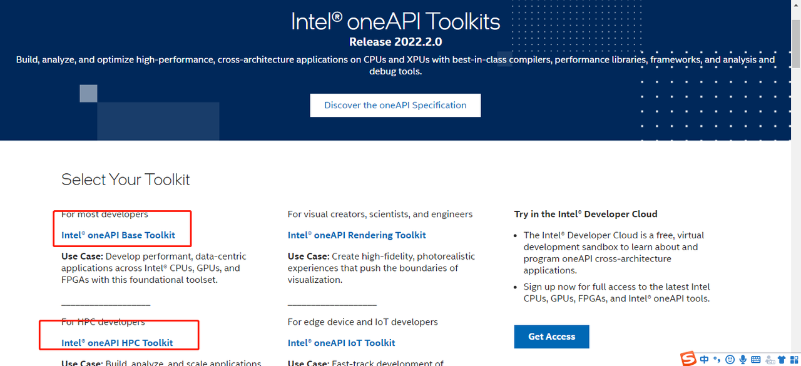
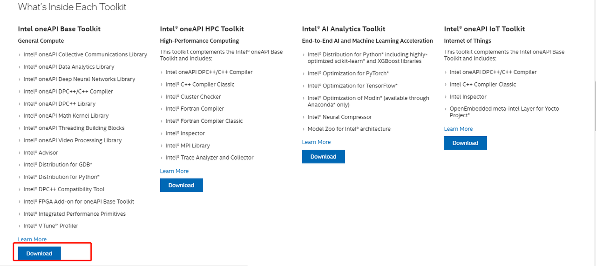
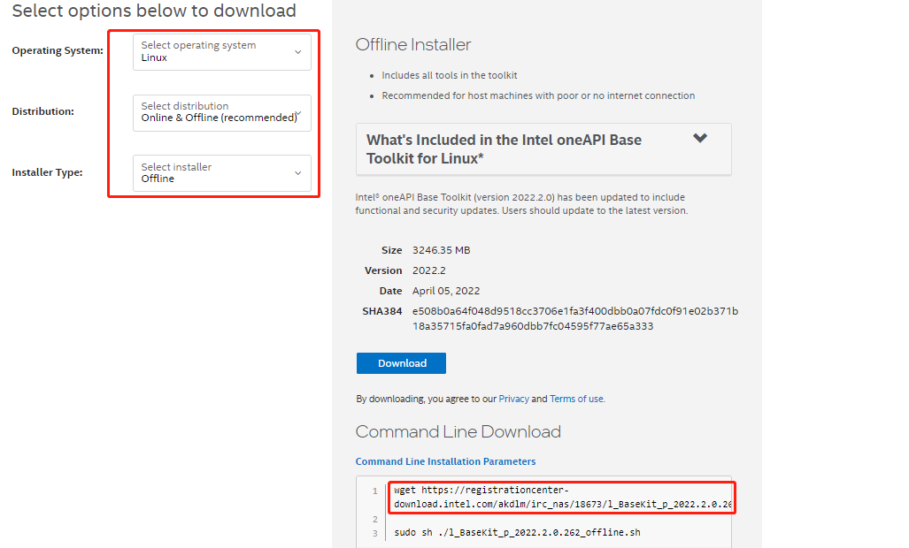
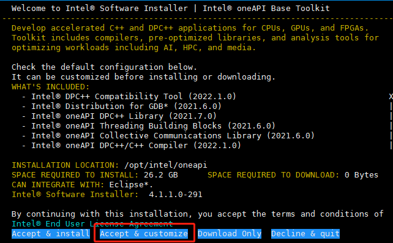
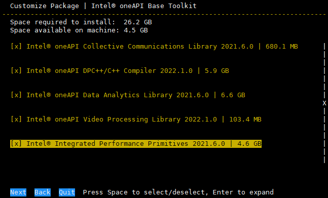
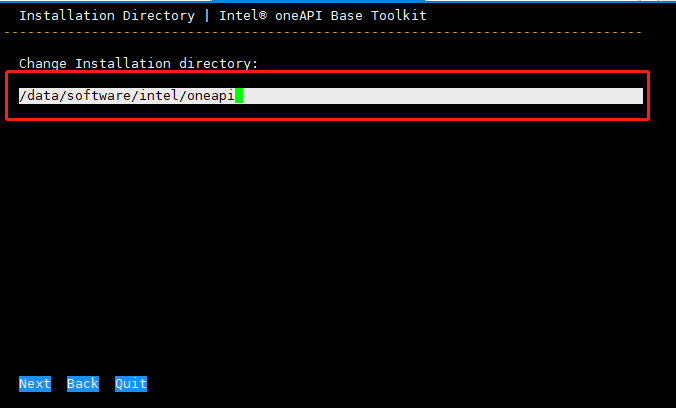
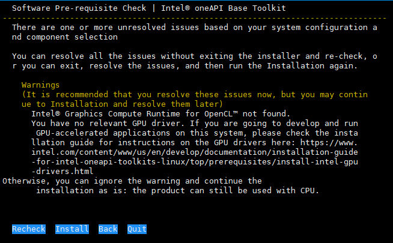
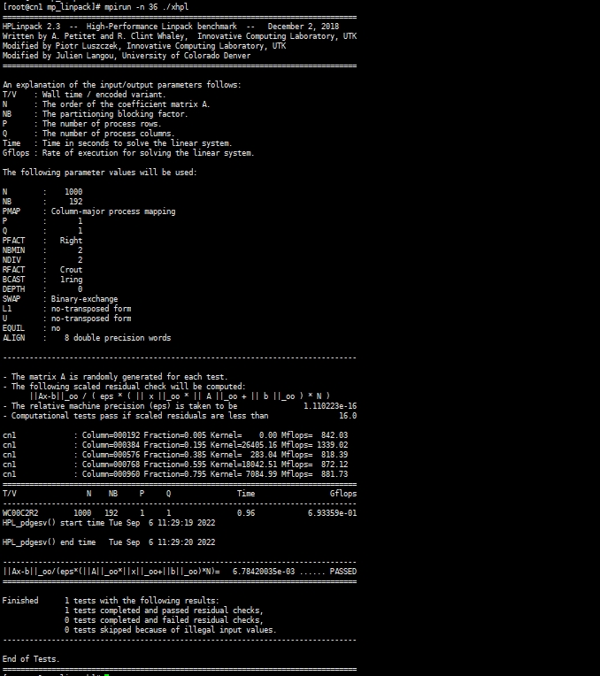

新版intel编译器不再是parallel_studio_xe_xxx_update4_cluster_edition，而改名为oneAPI。

[intel编译器安装包下载链接](https://www.intel.com/content/www/us/en/developer/tools/oneapi/toolkits.html#gs.zxmbdr)。

## 1. 获取安装包

本文档以Base Toolkit和HPC Toolkit为例。打开下载的地址：



以下载Base Toolkit为例，进入页面：



点击Download，选择如下信息：



在此页面不要点Download（它会让你注册账号），直接复制红框里的地址，在linux系统中直接wget，或者去掉前边wget，放在迅雷里下载即可(安装包比较大，3G多)。

同理，自行下载HPC的安装包。

## 2. 安装

以Base为例，创建安装目录：

:::tip

注意事项：

1. 为保证集群所有计算节点可用，安装在NFS共享存储文件目录下；
1. 安装需要大概30G左右空间，请确保此目录空间充足。

:::

```Shell
mkdir -p /data/software/intel/oneapi
```

执行安装脚本：

```Shell
sh l_BaseKit_p_2022.2.0.262_offline.sh
```

出现如下界面，选择自定义安装：



选择安装的包，下一步：



自定义安装目录，修改为之前准备好的目录：

:::tip

小提示：需要同时按下`Ctrl`+`Backspace` 才能删除原路径

:::



开始安装：



等待安装完成即可。

:::tip

HPC(包含ifort, icc, mpiifort等编译器)等其他工具包安装方法类似。

:::

## 3. **添加环境变量**

```Shell
source /data/software/intel/oneapi/setvars.sh
```

## 4. **Linkpack测试**

```PowerShell
# 设置环境变量
source /data/software/intel/oneapi/mpi/2021.6.0/env/vars.sh

# 生成xhpl
cd /data/software/intel/oneapi/mkl/2022.1.0/benchmarks/mp_linpack
./build.sh

# 执行计算
mpirun -n 36 ./xhpl

# 多节点
mpirun -hosts cn1,cn2,cn3,cn4 -np 36 -ppn 4 /data/software/intel/oneapi/mkl/2022.1.0/benchmarks/mp_linpack/xhpl
```

