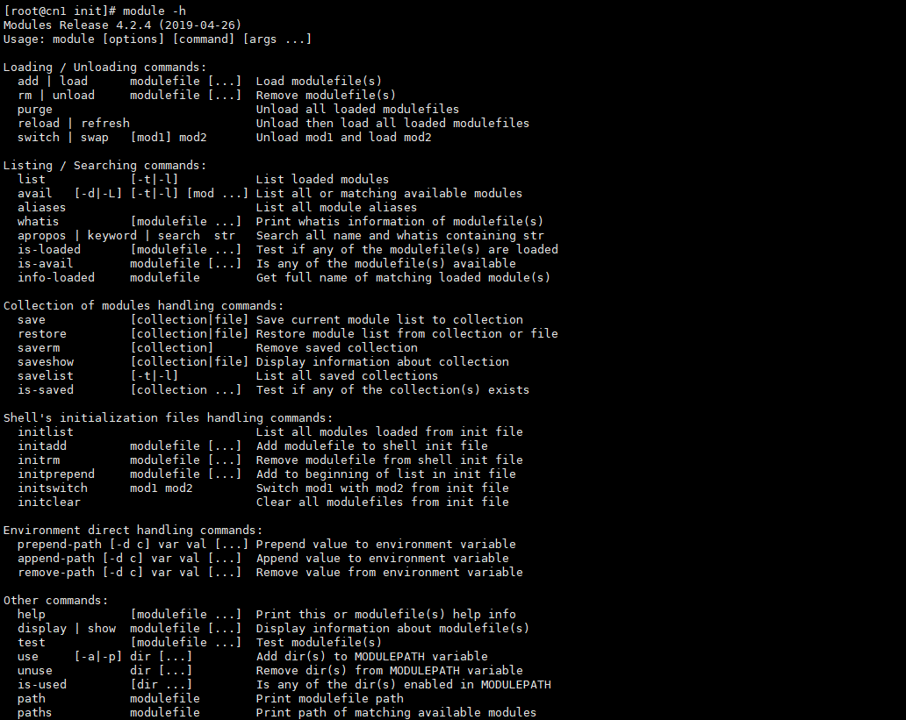

module是给集群所有节点使用，安装在nfs共享存储目录上。创建module安装目录：

```Shell
mkdir /data/software/module
```

## 1. tcl安装

module工具，依赖tcl工具，因此首先要安装tcl工具。

创建工具目录：

```Shell
mkdir -p /data/software/module/tools/tcl
```

下载、编译、安装：

```PowerShell
# 下载
wget https://cfhcable.dl.sourceforge.net/project/tcl/Tcl/8.5.9/tcl8.5.9-src.tar.gz

# 解压
tar -zxvf tcl8.5.9-src.tar.gz 
cd tcl8.5.9/unix 

# 编译 & 安装，注意修改此处目录
./configure --prefix=/data/software/module/tools/tcl 
make 
make install
```

## 2. module安装

创建工具目录：

```Shell
mkdir -p /data/software/module/tools/modules
```

下载、编译、安装：

```PowerShell
# 下载，此处可能需要科学上网
wget https://newcontinuum.dl.sourceforge.net/project/modules/Modules/modules-4.2.4/modules-4.2.4.tar.gz 

#解压
tar -zxvf modules-4.2.4.tar.gz 
cd modules-4.2.4 

# 编译 & 安装,注意修改路径
./configure --prefix=/data/software/module/tools/modules --with-tcl-lib=/data/software/module/tools/tcl/lib --with-tcl-inc=/data/software/module/tools/tcl/include  
make 
make install
```

## 3. 配置

安装完成之后，在`/data/software/module/tools/modules`目录下，就有`module`工具了。不过在`/usr/bin`目录下，是没有`module`这个命令的。

配置环境变量：

```PowerShell
 source /data/software/module/tools/modules/init/profile.sh
```

接下来就可以使用`module`命令了：

