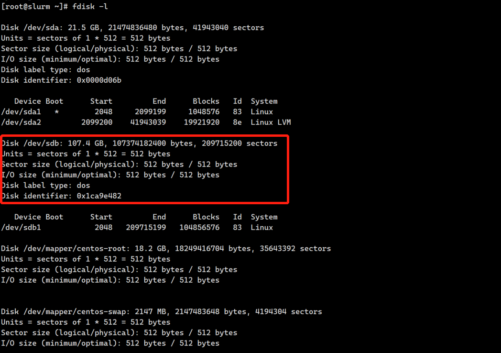
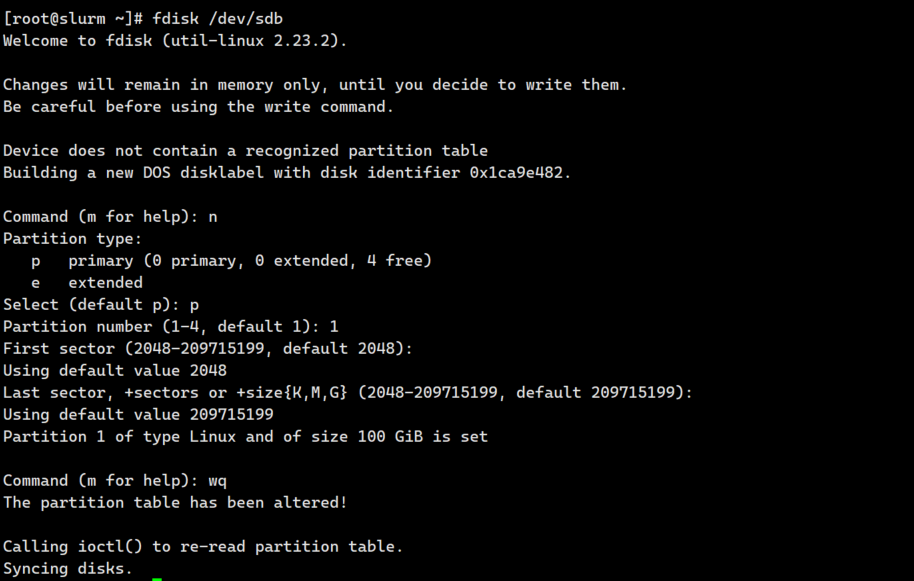
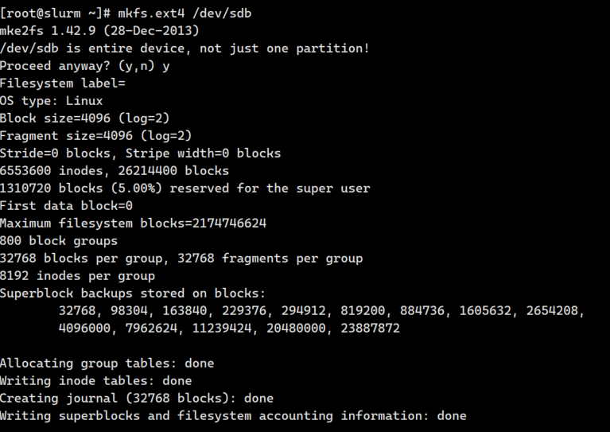

> 假设待挂载盘符为`/dev/sdb`，挂载目录为`/data`


查看准备的磁盘：

```
fdisk -l
```



创建磁盘分区：

`fdisk /dev/sdb` ，依次输入：n, p, 1, 两次回车, wq



格式化磁盘：

`mkfs.ext4 /dev/sdb`，输入：y



挂载磁盘：

```PowerShell
# 1. 建立挂载目录
 mkdir -p /data

# 2. 挂载硬盘
 mount /dev/sdb /data

# 3. 设置开机自动挂载
vim /etc/fstab
# 在文档末尾添加
/dev/sdb        /data   ext4    defaults        0       0    

# 4. 重启生效
reboot
```