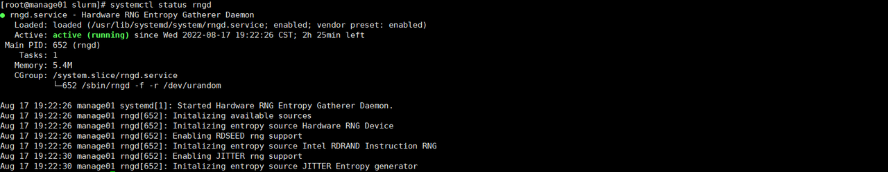
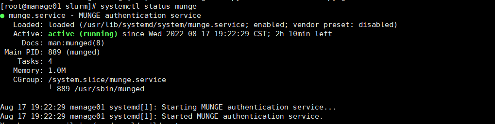
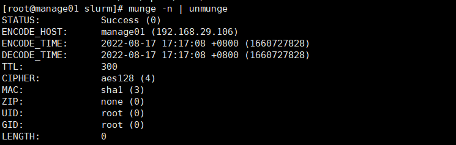
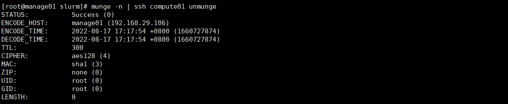
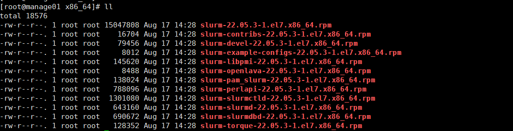

## 1. 安装Munge

### 1.1 创建Munge用户

Munge用户要确保管理节点和计算(登录)节点的UID和GID相同，所有节点都需要安装Munge。

```Bash
groupadd -g 1108 munge
useradd -m -c "Munge Uid 'N' Gid Emporium" -d /var/lib/munge -u 1108 -g munge -s /sbin/nologin munge
```

### **1.2 生成熵池**

在管理节点上执行

```Bash
yum install -y rng-tools
```

使用/dev/urandom来做熵源

```Bash
rngd -r /dev/urandom

# 修改service参数
vim /usr/lib/systemd/system/rngd.service
# 修改如下：
[service]
ExecStart=/sbin/rngd -f -r /dev/urandom
#退出报存
```

启动rngd

```Bash
systemctl daemon-reload
systemctl start rngd
systemctl enable rngd
```

查看服务状态`systemctl status rngd`



### **1.3 部署Munge**

Munge是认证服务，实现本地或者远程主机进程的UID、GID验证。

```Bash
yum install epel-release -y
yum install munge munge-libs munge-devel -y
```

创建全局密钥，在管理节点创建全局使用的密钥

```Bash
/usr/sbin/create-munge-key -r
dd if=/dev/urandom bs=1 count=1024 > /etc/munge/munge.key
```

密钥同步到所有其他节点：

```Bash
scp -p /etc/munge/munge.key root@login01:/etc/munge/
scp -p /etc/munge/munge.key root@compute01:/etc/munge/
scp -p /etc/munge/munge.key root@compute02:/etc/munge/

# 所有节点赋权
chown munge: /etc/munge/munge.key
chmod 400 /etc/munge/munge.key
```

所有节点都执行启动命令：

```Bash
systemctl start munge
systemctl enable munge
```

查看状态`systemctl status munge`



### **1.4 测试Munge服务**

每个节点与控制节点进行连接验证

本地查看凭据：

```Bash
munge -n
```


本地解码：

```Bash
munge -n | unmunge
```



验证远程解码：

```Bash
munge -n | ssh compute01 unmunge
```



munge凭证基准测试

```Bash
remunge
```


## **2. 安装slurm**

### 2.1 安装mariadb

安装mariadb，作为Slurm Accounting配置，在管理节点执行：

```PowerShell
yum -y install mariadb-server
systemctl start mariadb
systemctl enable mariadb
mysql

set password=password('81SLURM@@rabGTjN7');
create database slurm_acct_db;
quit
```

创建`slurm`用户，并为其赋予`slurm_acct_db`数据库的所有权限

```SQL
mysql -uroot -p'81SLURM@@rabGTjN7'
create user slurm;

grant all on slurm_acct_db.* TO 'slurm'@'localhost' identified by '123456' with grant option;

flush privileges;
```

### 2.2 创建slurm用户 

在所有节点执行：

```Bash
groupadd -g 1109 slurm
useradd -m -c "Slurm manager" -d /var/lib/slurm -u 1109 -g slurm -s /bin/bash slurm
```

### 2.3 安装slurm依赖

在所有节点执行：

```Bash
yum install gcc gcc-c++ readline-devel perl-ExtUtils-MakeMaker pam-devel rpm-build mysql-devel python3 -y
```

### 2.4 制作rpm包

> 以下操作在管理节点执行

下载slurm

```Bash
wget https://download.schedmd.com/slurm/slurm-22.05.3.tar.bz2
```

安装rpmbuild，编译slurm，rpmbuild制作rpm包

```Bash
yum install rpm-build -y

rpmbuild -ta --nodeps slurm-22.05.3.tar.bz2
```

编译制作完成后，可在目录`/root/rpmbuild/RPMS/x86_64`下得到如下rpm包



将编译好的rpm包拷贝到其他节点

```Bash
mkdir -p /root/rpmbuild/RPMS/
scp -r /root/rpmbuild/RPMS/x86_64 root@login01:/root/rpmbuild/RPMS/x86_64
scp -r /root/rpmbuild/RPMS/x86_64 root@compute01:/root/rpmbuild/RPMS/x86_64
scp -r /root/rpmbuild/RPMS/x86_64 root@compute02:/root/rpmbuild/RPMS/x86_64
```

### 2.5 安装与配置

所有节点安装slurm

```Bash
 cd /root/rpmbuild/RPMS/x86_64/
 yum localinstall slurm-*
```

配置控制节点slurm

```Bash
cp /etc/slurm/cgroup.conf.example /etc/slurm/cgroup.conf
cp /etc/slurm/slurm.conf.example /etc/slurm/slurm.conf
cp /etc/slurm/slurmdbd.conf.example /etc/slurm/slurmdbd.conf
```

- `cgroup.conf `使用了默认配置；

- slurm.conf 配置参见[附录1：slurm.conf 配置](../config/slurm.conf.md) ；

- slurmdbd.conf 配置参见[附录2：slurmdbd.conf 配置](../config/slurmdbd.conf.md) 。

复制配置文件到其他节点

```Bash
# slurmdbd.conf可不用复制
scp -r /etc/slurm/*.conf  root@login01:/etc/slurm/
scp -r /etc/slurm/*.conf  root@compute01:/etc/slurm/
scp -r /etc/slurm/*.conf  root@compute02:/etc/slurm/
```

设置各节点文件权限

```Bash
mkdir /var/spool/slurmd
chown slurm: /var/spool/slurmd
mkdir /var/log/slurm
chown slurm: /var/log/slurm

mkdir /var/spool/slurmctld
chown slurm: /var/spool/slurmctld
```

启动服务：

```Bash
# 服务节点
systemctl start slurmdbd
systemctl enable slurmdbd

systemctl start slurmctld
systemctl enable slurmctld

# 所有节点
systemctl start slurmd
systemctl enable slurmd

# 通过 systemctl status ××× 查看服务状态，并确保个服务状态正常
```

可能的报错：

```PowerShell
# 1. 启动slurmdbd时报错(一)：
slurmdbd: fatal: slurmdbd.conf file /etc/slurm/slurmdbd.conf should be 600 is 644 acc... others
#  解决方法
chmod 600 slurmdbd.conf
systemctl restart slurmdbd

# 2. 启动slurmdbd时报错(二)：
slurmdbd: fatal: slurmdbd.conf not owned by SlurmUser root!=slurm
#  解决方法
chown slurm: /etc/slurm/slurmdbd.conf
systemctl restart slurmdbd
```

查看配置

```Bash
scontrol show config
```

检查slurm集群

```Bash
sinfo
scontrol show partition
scontrol show node

# 提交作业
srun -N2 hostname
scontrol show jobs

# 查看作业
squeue -a
```

:::tip

slurm默认的qos只有一个qos: normal，在对接scow时，需要low、normal、high三个qos，手动创建low、high两个

:::

```Bash
# 查看已有的qos
sacctmgr show qos

# 创建low、high两个qos
sacctmgr create qos name=low
sacctmgr create qos name=high

# 给用户添加qos
sacctmgr modify user name={username} set qos=low,high,normal  defaultQOS=low
```

## 3. 初始化账户和用户(可选)

```Bash
# 初始化账户.例如账户为a_admin
sacctmgr add account name=a_admin 

# 初始化用户.例如用户demo_admin，指定账户为a_admin，分区为compute
sacctmgr add user name=demo_admin account=a_admin partition=compute qos=low,high,normal defaultQOS=low

# 查看用户信息
sacctmgr show ass format="Cluster,Account,User,Partition,QOS"
```