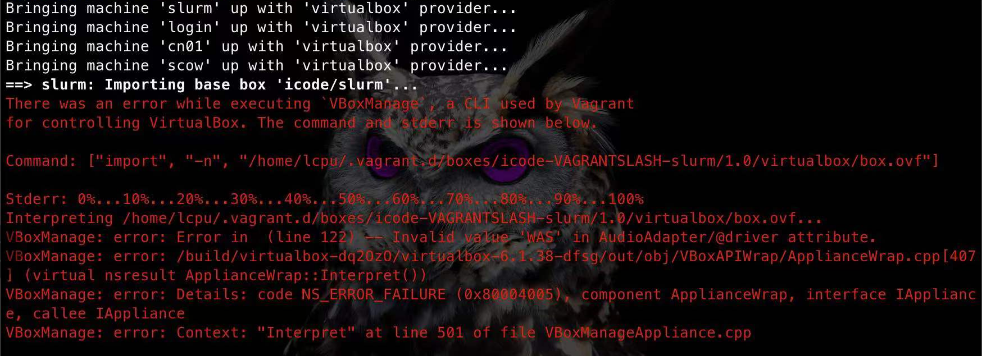

### 1.  Invalid value 'WAS' in AudioAdapter/@driver attribute

在vagrant up时出现如下报错：

**解决方法：**

进入vagrant的box目录，找到对应box的box.ovf配置文件(默认在`{userhome}/.vagrant.d/boxes/`下进入对应的box目录查找)，删除`AudioAdapter`配置。

### 2. 代码或docker镜像拉取过慢或者失败，如何修改仓库地址

代码和镜像托管在github，由于网络原因，可能导致下载失败，可将代码仓库和docker镜像仓库替换为国内地址。

- 北大镜像仓库已同步SCOW的docker镜像，仓库可修改为：`mirrors.pku.edu.cn/pkuhpc/scow`，对应文件为`deploy\vagrant\scow\scow-deployment\config.py`的`COMMON.IMAGE_BASE`。

- 可将scow-deployment和export-jobs项目代码同步至国内仓库，例如码云，对应文件为`deploy\vagrant\scripts\scow.sh`

