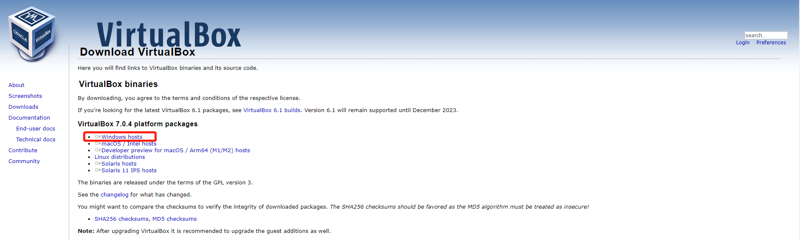

vagrant支持的provider包括virtualbox、hyperv、libvirt等。virtualbox支持windows、linux、macos的安装，因此本教程以virtualbox作为provider。

## 1. 安装virtualbox

点击进入[官网](https://www.virtualbox.org/wiki/Downloads)下载virtualbox



此处可选择操作系统版本，选择Windows版本下载、安装(其他操作系统类似)。

安装过程比较简单，跟着指引即可。

## 2. 安装vagrant

点击进入[官网](https://developer.hashicorp.com/vagrant/downloads)下载vagrant


这里选择Windows 64位版本，安装过程跟着指引即可。

## 3. vagrant基本操作

```Bash
# 新建虚拟机，以创建一个centos7虚拟机为例

# 1. 初始化
vagrant init centos/7

# 2. 启动，初次启动会比较慢，需要拉镜像
vagrant up

# 3. 查看状态
vagrant status

# 4. ssh到虚机
vagrant ssh
 
# 5. 停止虚机
vagrant halt
 
# 6. 暂停虚机
vagrant suspend
 
# 7. 恢复虚机
vagrant resume
 
# 8. 删除虚机
vagrant destroy
```


