# 1.  门户系统操作说明

## 1.1 登录门户系统首页（仪表盘）

用户打开门户系统首页（测试环境）：[https://hpc.pku.edu.cn/demo/scow](https://hpc.pku.edu.cn/demo/scow)，输入账号和密码即可登录门户系统，首页面展示如下，可查看相关数据和通知。最上方有仪表盘、作业、Shell、桌面、交互式应用、文件管理6大模块，页面右上角可以选择默认集群，还有管理系统链接和个人中心，可点击进入子模块进行相关操作。另外右下角有悬浮按钮可以切换页面风格是亮色还是暗色。

## 1.2 提交作业

用于用户填写作业信息并提交到超算系统计算，同时支持将作业信息保存为模板方便后续使用。

### 1.2.1 提交作业

如下图所示，在提交作业页面填写好信息后提交一个简单的名为test001的作业，使用CPU分区节点计算，并将该作业保存为模板方便下次提交，该作业运行hostname并延迟10000秒后结束：

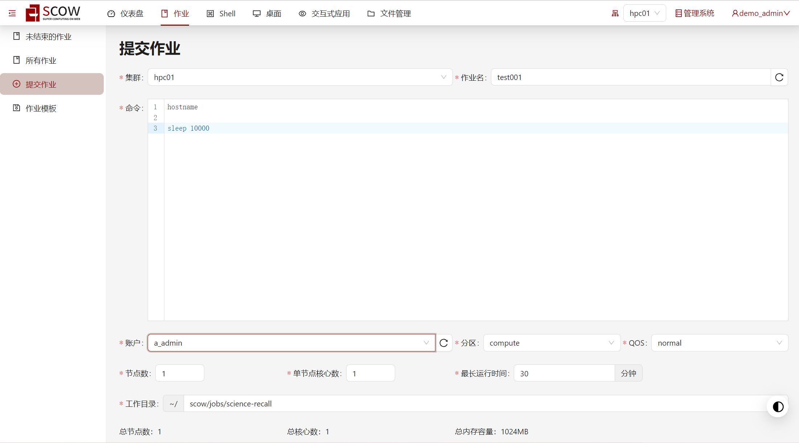

如果使用GPU分区的节点，有区别的选项如下图（分区可能为其它名字而非GPU）：

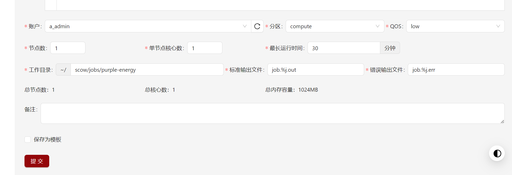

**主要参数说明：** 

| 参数         | 说明                                                                  | 计算规则 |  备注 |
| ----------- | ---------------------------------------------------------------------- |-------- |------ |
| 集群         | 指定本次作业在哪个集群上运行                                             |    -    | 选项由集群配置文件里指定  |
| 作业名       | 为本次作业命名                                                          |    -    |  -  |
| 命令         | 作业命令                                                               |    -    |  -  |
| 账户         | 指定本次作业的扣款账户                                                  |    -    |  选项为当前用户关联账户  |
| 分区         | 指定本次作业想要在哪个分区上计算，影响CPU/GPU参数                         |    -    | 选项在集群配置文件里指定 |
| QOS          | 选择作业的服务质量                                                      |    -    | 选项在集群配置文件里指定 |
| 节点数       | 申请的节点数                                                            |    -    | 上限为当前分区节点数 |
| 单节点核心数  | 每个节点上申请的CPU核心数                                               |CPU分区单节点核心数为输入值； GPU分区单节点核心数=节点总核心数 \*（单节点GPU卡数/单节点总GPU卡数）  | 如果选择的是GPU分区，此选项不展示，通过计算得到 |
| 单节点GPU卡数 | 每个节点上申请的GPU卡数                                                  |    -    |  仅GPU分区展示 |
| 最长运行时间  | 本次作业的最长计算时间                                                   |    -    |  -  |
| 工作目录      | 指定作业相关文件的存储路径                                               |    -    |  -  |
| 总节点数      | 申请的节点数                                                            | 总节点数=节点数   |  -  |
| 总核心数      | 申请的总核心数                                                          |   总核心数（CPU分区）=节点数 \* 单节点核心数；总核心数（GPU分区）=节点数 \* 单节点总核心数 \*（单节点GPU卡数/单节点总GPU卡数）    |  -  |
| 总卡数        | 申请的GPU卡总数                                                         |    总卡数 = 节点数 \* 单节点GPU卡数    | 仅GPU分区展示 |
| 总内存容量    | 申请的总内存容数                                                         | 总内存容量 = 节点数 \* 单节点核心数 \*（单节点内存数/单节点总核心数） |  -  |
| 备注          | 备注信息                                                                |    -    |  -  |
| 保存为模板    | 将本次作业保存为模板                                                     |    -    |  -  |

**生成的slurm调度器脚本中参数取值**：

**核心数** -c 取单节点核心数；

**内存** --mem 取总内存容量；

**GPU卡数** --gres=gpu: 取单节点GPU卡数。

※注意：上面的**计算**若未整除，皆**向下取整**。页面**没有暂存功能**，离开该页面后信息将全部清除，需要重新填写内容并提交，建议一次性填好后提交。

### 1.2.2 通过模板提交作业

为了减轻每次的填写工作量，用户也可以在作业模板页面选择相应的模板来提交作业。比如选择之前保存的test001模板再次提交作业。

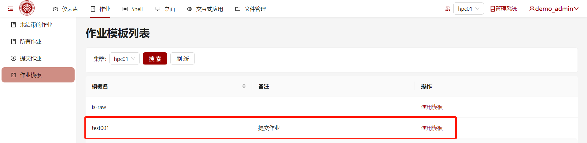

## 1.3 查看作业

### 1.3.1 查看未结束的的作业

用户提交作业后，可以在未结束的作业页面查询本用户已提交但是未完成计算的作业，如下图展示了当前用户在hpc01集群上的所有未完成作业信息，此时test001作业还在运行中，可以看到该作业状态是RUNNING。如果在该页面没看到之前提交的作业，则说明作业已经执行完成，需要在所有作业中查看。

在更多操作中，可以点击进入目录进入所选作业的工作目录查看文件，作业输出文件为以作业名命名的out文件，可以查看作业的输出信息，如果作业出现错误也可以通过该文件查看报错信息。

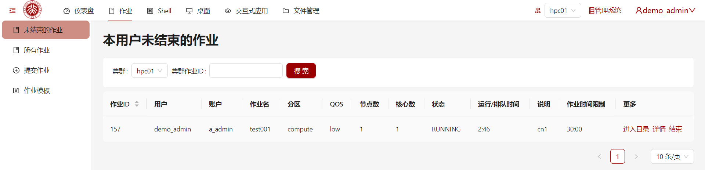

**主要字段说明**：

**状态**：展示作业的当前执行状态；

​	PENDING

​	RUNNNING

​	COMPLETED

​	TIMEOUT

​	CANCELLED by XX

 其余字段说明参考1.2.1章节。

### 1.3.2 查看所有作业

用户可以在所有作业页面查看到本用户的历史作业，支持通过时间和作业ID筛选。如下图展示了当前用户在hpc01集群上的所有历史作业。

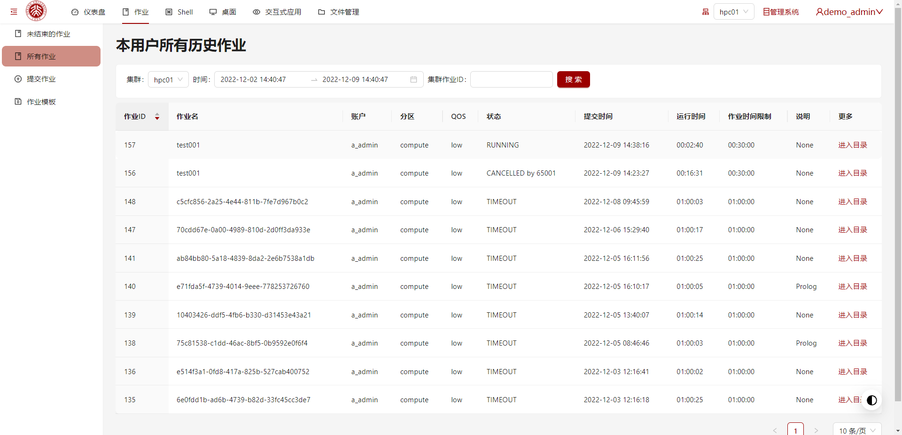

## 1.4 结束作业

在未结束的作业页面中，针对运行中的作业可以提前结束任务（通过点击更多操作中的结束按钮）。 比如将之前提交的test001作业结束，结束后的作业状态将变为CANCELLED by XX，需要在所有作业中才能查看。

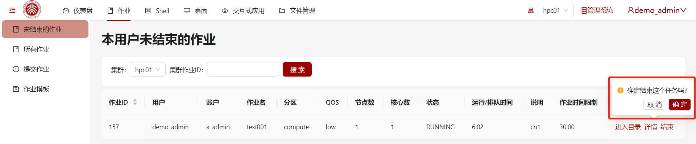

## 1.5 Shell终端功能

如果需要使用更高级的集群功能，用户可以通过点击Shell直接访问集群的终端。此时用户可以执行一系列操作，如下图是执行scontrol show partition查看分区状态的运行结果。

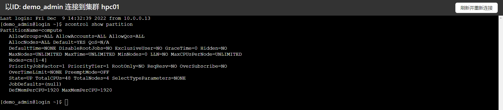

## 1.6 新建桌面环境

用户可以在指定集群上创建桌面，以新建KDE桌面为例，用户点击新建桌面，桌面选择KDE，如下所示：

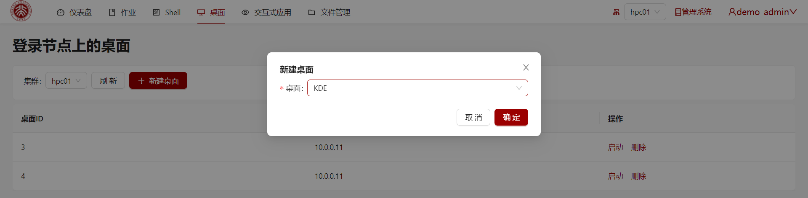

创建后即可进入KDE桌面环境，桌面展示如下，用户可以在该桌面环境进行其他操作：

## 1.7 启动和删除桌面环境

在桌面页面，页面展示了当前登陆节点上已创建的桌面信息，如下ID为1的桌面是刚刚创建的KDE桌面环境，点击右侧启动即可重新进入桌面，点击删除则会将该桌面删除。

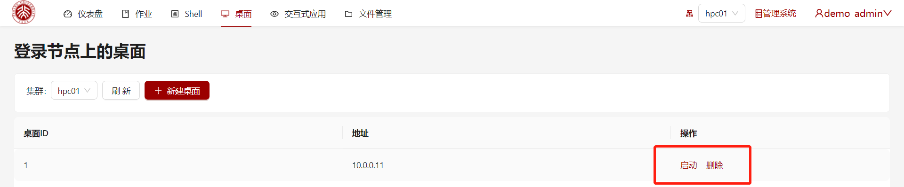

## 1.8 创建交互式应用

以创建VSCode应用为例，用户在左侧菜单栏选择VSCode，并填写相关信息后提交即可创建应用，创建后需要到已创建的应用页面查看并进入应用。参数说明可参考1.2提交作业章节。

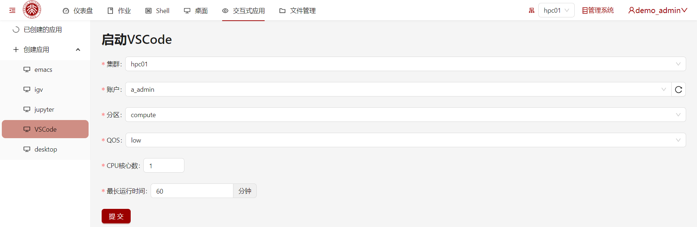

## 1.9 连接交互式应用

在已创建的应用页面展示所有应用列表，以刚刚创建的VSCode应用为例，点击连接即可进入应用。

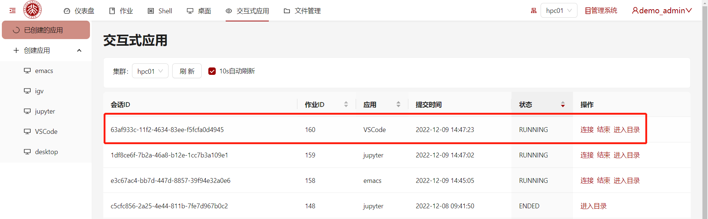

**应用状态**：展示应用当前状态

​	RUNNING—运行中，可以执行连接、结束、进入目录操作

​	COMPLETING—关闭中

​	ENDED—已结束 

进入VSCode应用后展示如下，用户可进行应用内各操作：

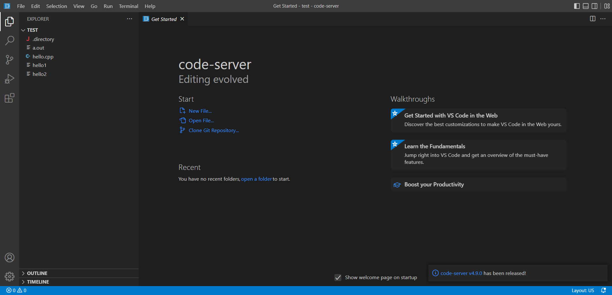

## 1.10 结束交互式应用

在已创建的应用页面中，针对运行中的应用可以结束任务（通过点击操作中的结束按钮）, 结束后的应用状态变为ENDED。如刚刚创建的ID为160的VSCode应用，点击右侧结束，处理完成后该应用就被结束。

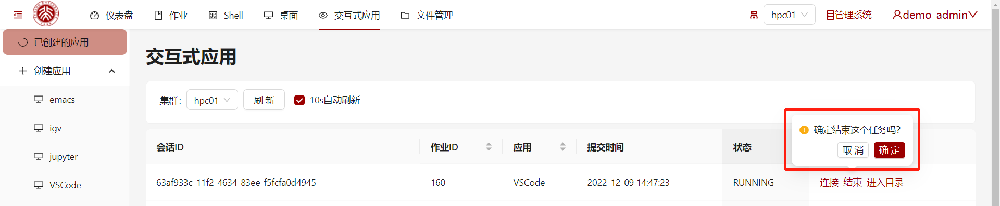

## 1.11 文件管理

### 1.11.1 查看文件或目录

进入文件管理页面后，展示以下字段：文件名、修改日期、大小、权限，以及可执行的操作（下载、重命名、删除）。用户可以在地址栏重新输入需访问的目录快速跳转到新目录，同时文件浏览支持前进、后退、返回上级目录、主页4个常用快捷操作。

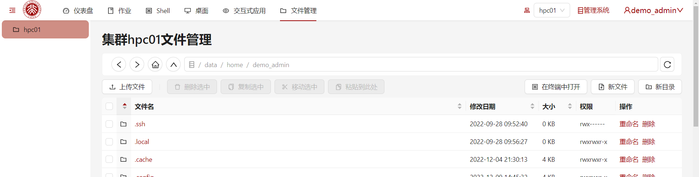

### 1.11.2 新建文件/目录

以新建文件为例，点击右上角的新文件，在弹窗中填写文件名为test，即可在当前目录下新建一个test文件，创建时系统会校验名称，不能和当前目录下已存在的文件或目录名重名。若要新建目录则点击新目录，与此类似。

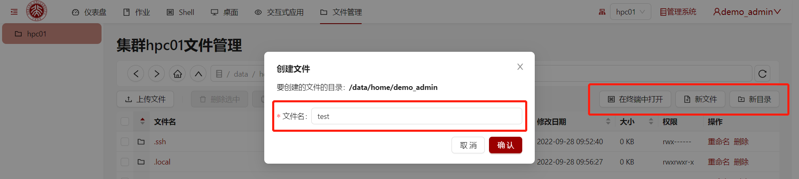

### 1.11.3 上传文件

点击上传文件，可在弹出框点击选择要上传的文件或者拖动文件至弹出框上传文件，系统支持批量上传多个文件。文件名重复时会提示是否覆盖原文件。

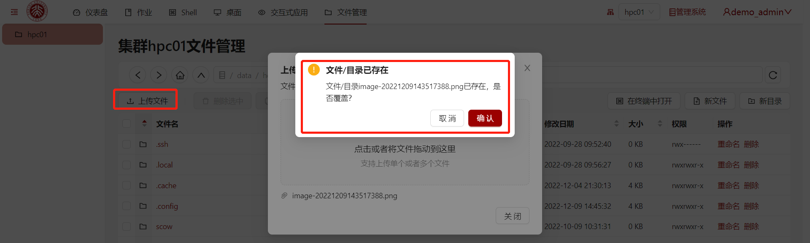

### 1.11.4 复制、移动和删除文件/目录

1) 勾选文件或者文件夹（可多选）；

2) 点击复制选中或者移动选中按钮选中需要操作的文件或文件夹，可点击取消按钮取消选中；

3.1) 进入想要将文件或文件夹移动或者复制到的目录， 点击粘贴到此处即可完成复制或移动操作；

3.2) 点击删除选中即可将所选文件或文件夹删除，也可以点击操作下的删除按钮单个删除。

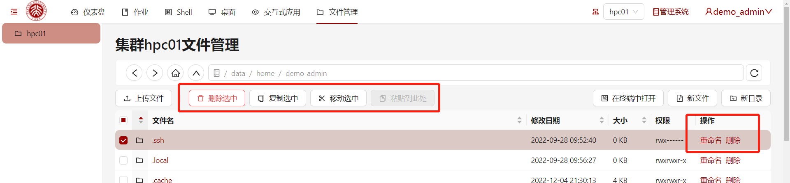

# 2. 管理系统操作说明

首先介绍SCOW系统的用户账户类型，系统使用租户、账户、用户三级用户模型，每个用户和账户属于且只属于一个租户，一个用户可以属于0个或者多个账户，每个用户在账户中的角色为**用户**(user)、**管理员**(admin)或者**拥有者**(owner)之一，可另为租户和整个平台的租户管理员和财务人员（也可以同时是两个角色）。一个账户只能有一个拥有者。在所使用的认证系统支持的情况下，账户管理员、租户管理员可以创建用户。各级关系如下图所示：

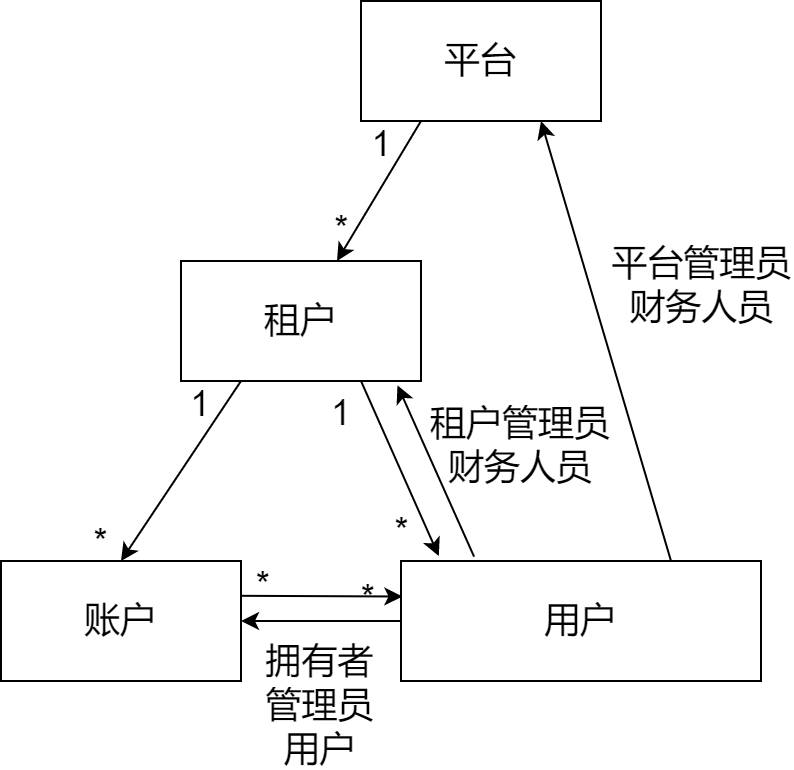

用户登录门户系统后，点击右上角的管理系统链接可进入管理系统。管理系统的页面和功能针对不同角色有不同的显示，接下来分别介绍，其中2.1-2.5是用户角色，2.6-2.10是账户管理员/拥有者，2.11-2.18是租户管理员，2.19-2.27是平台管理员。

## 2.1 登录管理系统首页（仪表盘）

demo_user是账户a_admin下的普通用户，我们以demo_user为例演示用户登录管理系统后的操作，如下图展示，demo_user登录后可以看到管理系统首页面最上方有仪表盘和用户空间2个模块，页面右上角有门户系统链接和个人中心，点击可以进入对应功能模块。界面显示了所在账户a_admin下的状态是正常，这表示demo_user可以正常提交作业，如果是封锁状态则无法提交作业。另外最下面还展示了本用户未结束的作业。

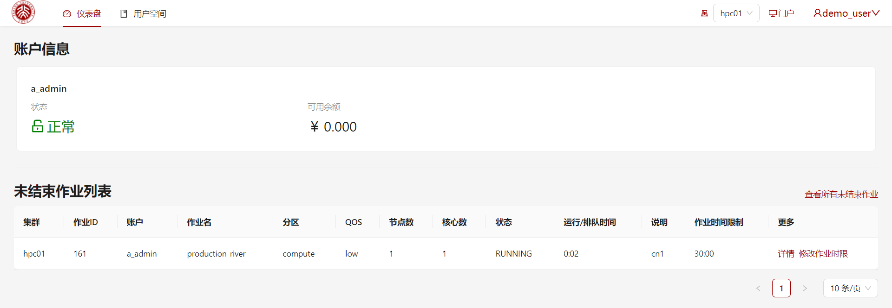

## 2.2 查看作业

在用户空间模块可以查看**本用户下所有账户**已结束或未结束的作业。

### 2.2.1 查看未结束的作业

如下图展示了demo_user用户下所有未结束的作业信息，可以看到ID为161的作业test001正在运行中，用户还可以根据账户信息批量查找或者根据作业ID精确查找对应的作业。

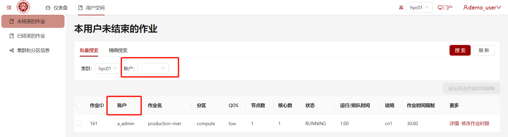

### 2.2.2 查看已结束的作业

如下图展示了demo_user用户下所有已结束的作业信息，用户也可以根据账户信息等查找作业。

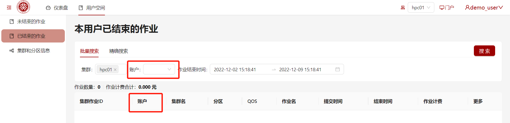

## 2.3 修改作业时限

在未结束的作业页面，用户可以修改作业时限。以ID为161的作业test001为例，如下图所示可以看到修改前test001的时间限制是30分钟，现在想要将该作业的时间限制调整为40分钟，那么在修改作业时限页面填写增加10分钟即可。

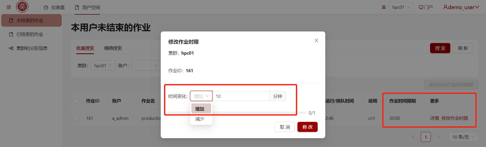

下图是修改完成后的作业情况，可以看到作业时间限制已经调整为40分钟。

用户也可以一次选择多条作业，点击延长所选作业时间限制按钮批量修改。

## 2.4 查询作业计费情况

在已结束的作业页面，用户可以查询已结束作业的详情计费情况。如下图所示，展示了用户的作业计费查询页面。

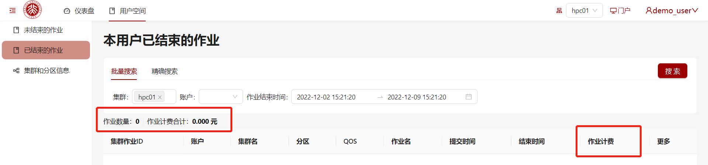

## 2.5 查看集群和分区信息

用户可在该页面查看分区的详细信息以及不同QOS的收费标准，展示如下。

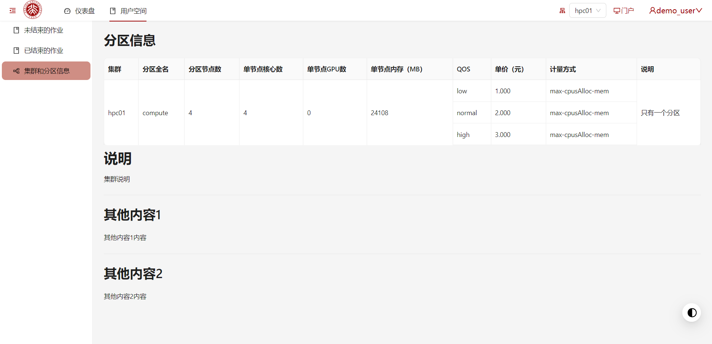

---

以上2.1-2.5部分内容就是所有用户在管理系统中都可以查看和操作的功能，账户管理员或拥有者除了可以进行上述操作外，还可以进行其他操作和管理，接下来演示账户管理员的相关操作。

## 2.6 查看账户相关信息

demo_admin是账户a_admin下的拥有者，我们以demo_admin为例演示账户管理员或拥有者登录管理系统后的操作，如下图展示，demo_admin登录后可以看到管理系统首页面最上方新增了账户管理模块，由于demo_admin同时还是租户拥有者，所以也能看到租户管理、平台管理2个模块。

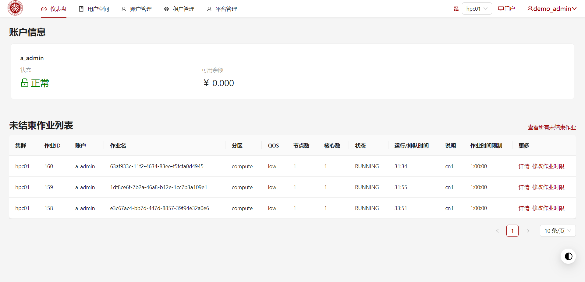

### 2.6.1  查看账户信息

如下图展示，账户a_admin的拥有者demo_admin登录系统后，可以在账户信息页面查看本用户所拥有的账户相关信息，如账户名、账户拥有着、账户状态、账户余额信息。

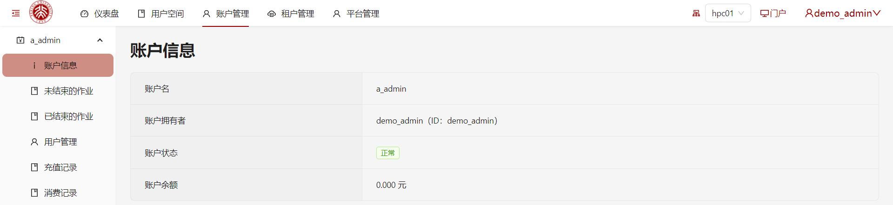

### 2.6.2 查看账户下用户信息

进入用户管理页面后，可以查看该账户下的所有用户清单以及信息，如用户ID、姓名、角色、状态等。

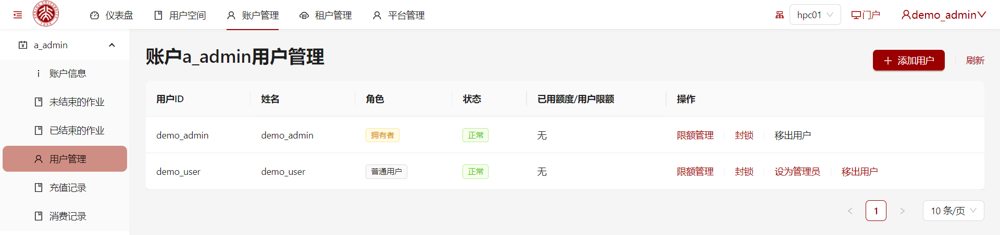

**角色**：展示用户的角色属性，有拥有者、管理员、普通用户3种角色。

**状态**：展示用户的状态，有正常、封锁2种状态，用户被封锁后将无法提交作业。

## 2.7 查看账户下作业

和用户空间模块内的功能相似（参考2.2章节），当账户管理员/拥有者登录后台后，还可以在账户管理模块查看**本账户下所有用户**已结束或未结束的作业，如下图展示了管理员demo_admin的未结束和已结束作业查询页面。

### 2.7.1 查看未结束的作业

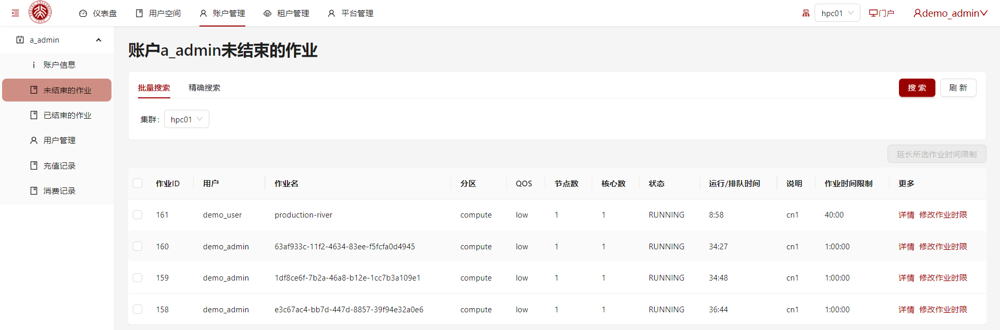

### 2.7.2 查看已结束的作业

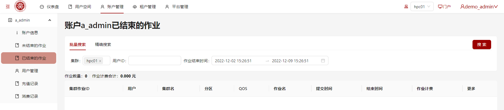

## 2.8 修改账户下作业时限

和用户空间模块内的功能相似（参考2.3章节），如下图所示，在未结束的作业页面，账户管理员/拥有者可以修改**本账户下所有用户**未完成作业的作业时限。

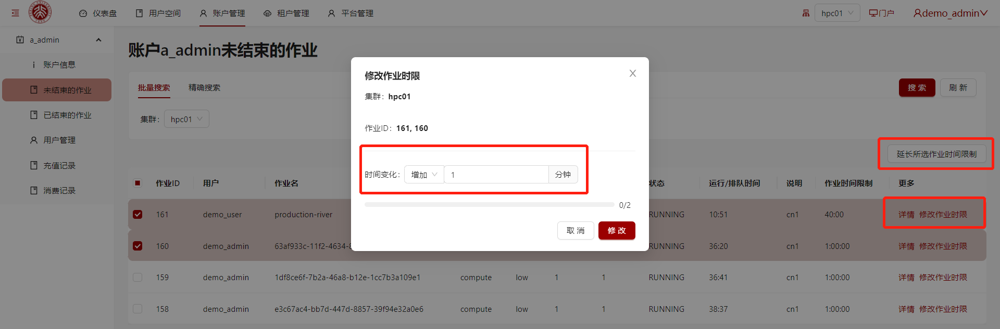

## 2.9 查看账户充值或消费记录

在左侧边栏有充值记录和消费记录菜单，如下图所示分别展示了本账户的充值和消费情况，用户可以通过时间区间来筛选。

### 2.9.1 充值记录

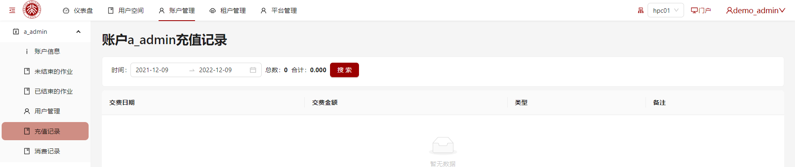

### 2.9.2 消费记录

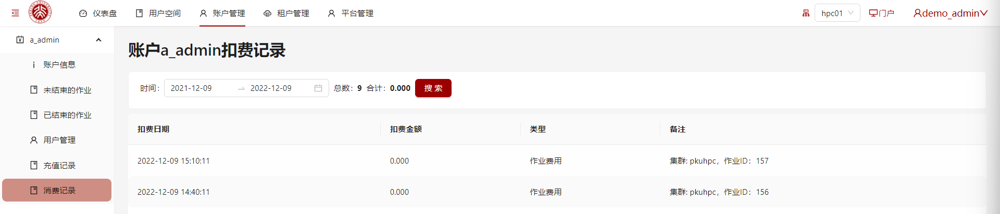

## 2.10 账户内用户管理

账户拥有者或者管理员登录后，可以在用户管理页面对该账户下的用户进行一系列操作，以用户test2为例，我们演示所有针对用户的管理操作。

### 2.10.1 创建用户

在用户管理界面点击右上角添加用户按钮，添加用户时填写一个不存在的用户ID，这时系统会弹窗提示创建用户，如下所示，这时填写正确的用户信息后即可创建test2用户。

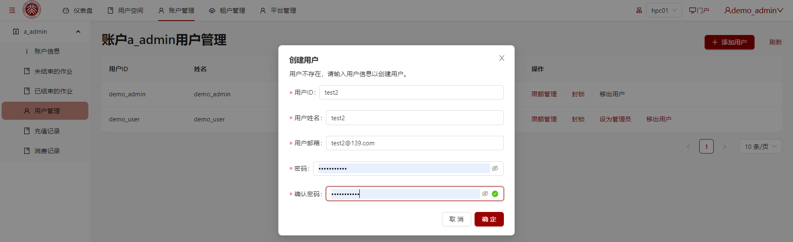

若用户同时是租户管理员，则还可以在租户管理模块中创建用户，如下图所示，填写用户信息后创建test2用户。

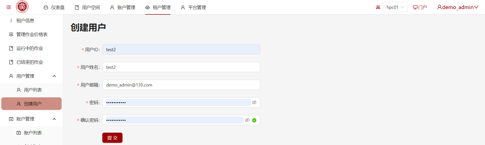

### 2.10.2 添加/移出用户

如下图所示，test2为创建的普通用户，点击添加用户按钮，在弹窗中输入test2账号信息，点击确定即可将用户test2添加到账户a_admin中。添加完成后即可在列表出查看到test2用户，若想要从账户a_admin中移出该用户点击移出用户即可。

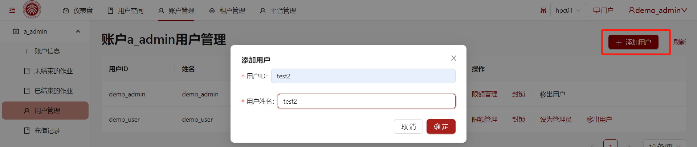

### 2.10.3 设置/取消管理员

如图选择test2用户，点击设为管理员，可以将test2设置为账户a_admin的管理员，再点击取消管理员权限则test2恢复为普通用户。

只有拥有者具有该操作权限。

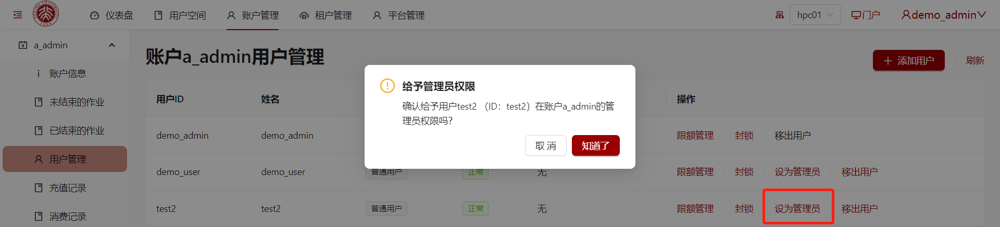

### 2.10.4 封锁/解除封锁

如图选择test2用户，点击封锁即可将test2用户封锁，再点击解除封锁即可恢复。

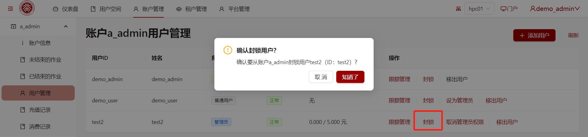

### 2.10.5 设置用户作业限额

如图选择test2用户，点击限额管理，在弹窗中限额值填写为5，即可设置test2用户的作业费用限额为5元。

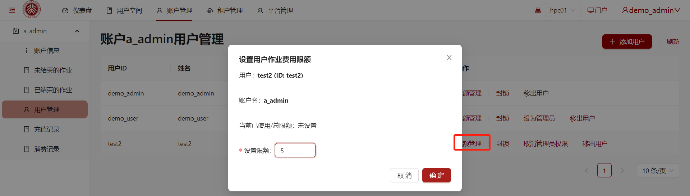

经过上述操作后，可以看到test2已经出现在账户a_admin的用户列表中，角色是管理员、状态是封锁、用户额度是5元，如下图所示。

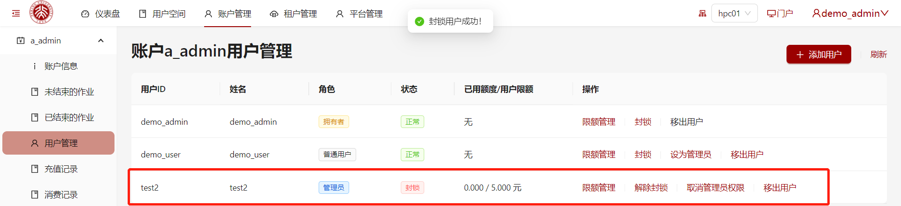

---

账户管理员或拥有者在管理系统中可以查看和操作的功能就是以上2.6-2.10部分内容，接下来演示租户管理员的其他操作。

## 2.11 查看租户相关信息

### 2.11.1 查看租户信息

demo_admin是租户default的管理员，我们继续以demo_admin为例演示租户管理员登录管理系统后的操作。如下图展示，登录系统后，可以在租户信息页面查看本用户所拥有的租户相关信息，如租户名、管理员、账户数量、用户数量、租户余额信息。

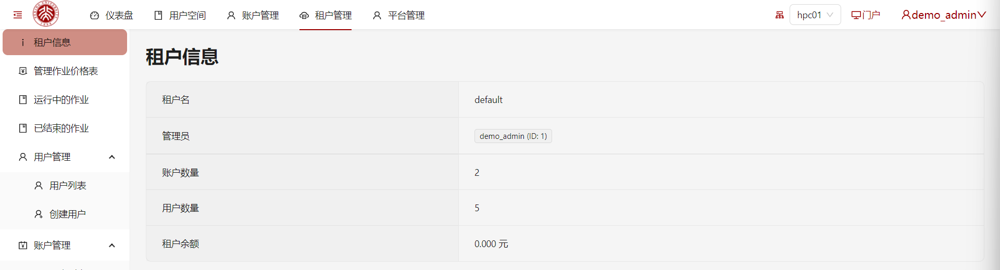

### 2.11.2 查看租户下用户信息

进入用户管理页面后，可以查看该租户下的所有用户清单以及信息，如用户ID、姓名、可用账户、是否是租户管理员等。

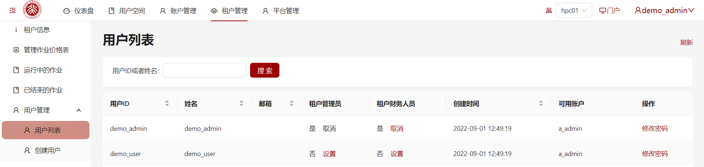

### 2.11.3 查看租户下账户信息

进入账户管理页面后，可以查看该账户下的所有账户清单以及信息，如账户名、拥有者、余额、状态等。

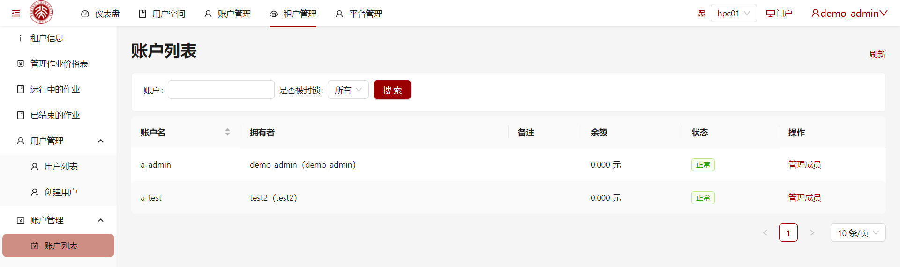

## 2.12 查看租户下作业

和用户空间模块内的功能相似（参考2.2章节），当租户管理员登录后台后，还可以在租户管理模块查看**本租户下所有账户和用户**运行中或已结束的作业。如下图展示了租户管理中的运行中和已结束作业查询页面。

### 2.12.1 查看运行中的作业

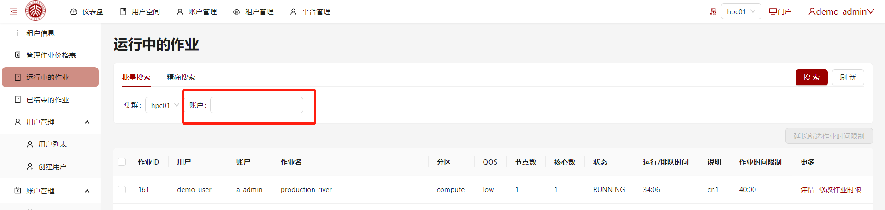

### 2.12.2 查看已结束的作业

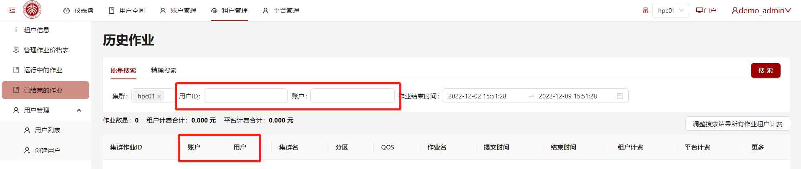

## 2.13 修改租户下作业时限

和用户空间模块内的功能相似（参考2.3章节），如下图所示，在运行中的作业页面，租户管理员可以修改**本租户下所有账户**未完成作业的作业时限。

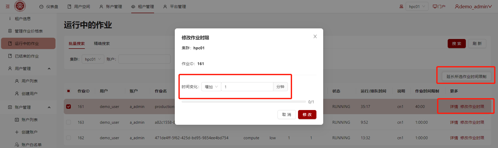

## 2.14 调整作业计费

在已结束的作业页面，租户管理员可以根据用户用户ID、账户筛选作业并重新调整计费，如下图所示。

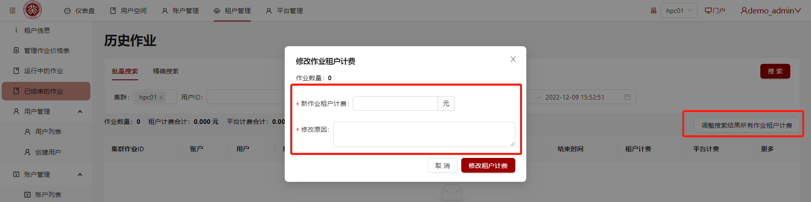

## 2.15 管理作业价格表

租户管理员可以在租户管理模块查看和设置本租户不同QOS的收费标准，如下图所示，在管理作业价格表页面，以QOS为low的计费项设置为例，点击设置在弹出框输入计费项ID，计费策略选择max-gpu-cpusAlloc（系统已配置好4种策略任选一种），价格设置为9元，点击确定生效后该租户下用户提交作业时如果QOS选择low，那就按照HPC09计费规则执行计费。

**计费策略**：

​	—max-cpusAlloc-mem

​	—max-gpu-cpusAlloc

​	—gpu

​	—cpusAlloc

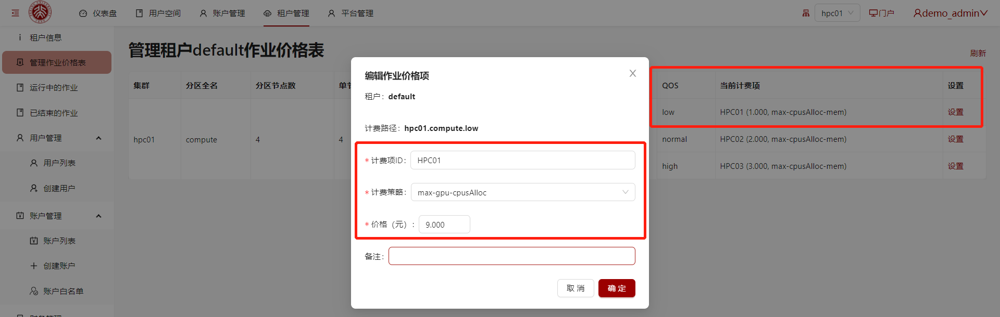

## 2.16 租户内用户管理

租户管理员登录后，可以在租户管理模块对该租户下的用户进行一系列操作，以用户test2为例，我们演示所有针对用户的管理操作。

### 2.16.1 创建用户

如下图所示，填写用户信息后创建test2用户。

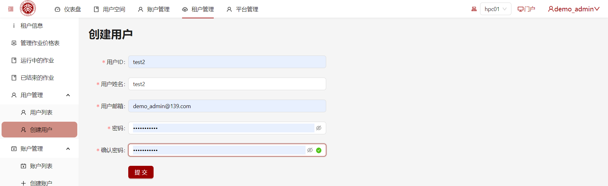

### 2.16.2 设置/取消租户管理员

如图选择test2用户，在租户管理员列下点击设置并确认即可将test2设置为本租户default的管理员，再点击取消则将test2恢复为普通用户。

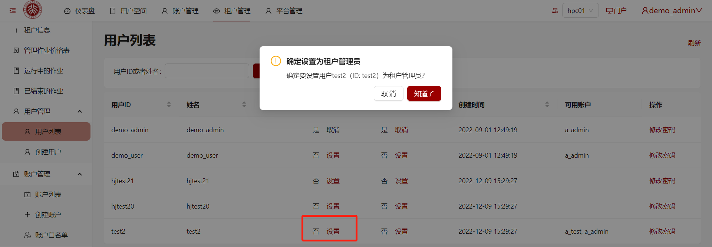

### 2.16.3 设置/取消租户财务人员

如图选择test2用户，在租户财务人员列下点击设置并确认即可将test2设置为本租户default的财务人员，再点击取消则将test2恢复为普通用户。

只有租户财务人员拥有财务管理权限，对账户充值或查看充值记录。

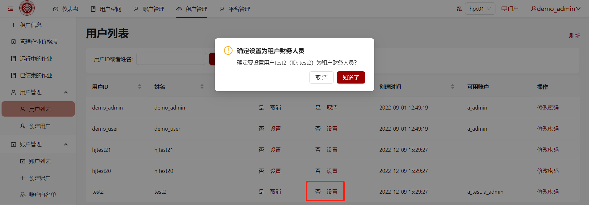

### 2.16.4 修改密码

如图选择test2用户，在操作列下点击修改密码，输入原密码和新密码后即可修改test2用户的密码。

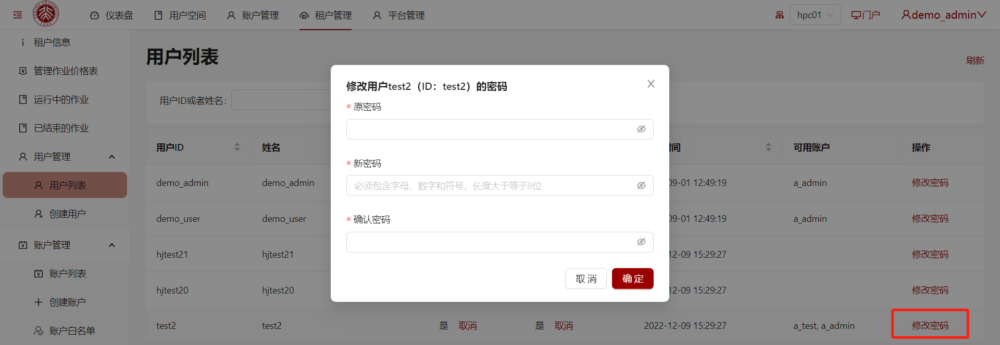

## 2.17 租户内账户管理

租户管理员登录后，可以在租户管理模块对该租户下的账户进行一系列操作，以账户a_test为例，我们演示所有针对账户的管理操作。

### 2.17.1 创建账户

如下图所示，在创建页面填写账户名为a_test，拥有者信息填写用户test2的信息，信息提交后即可创建账户a_test，该账户的拥有者为test2。

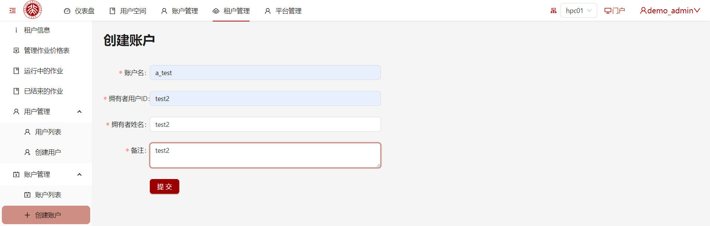

创建完成后可以前往账户列表查看账户信息，此时a_test是封锁状态。

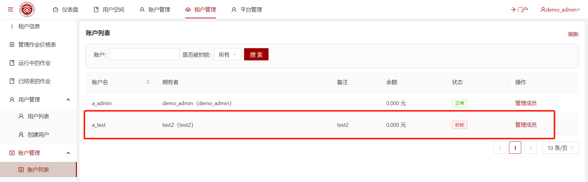

### 2.17.2 管理账户成员

在账户列表页面，点击操作列的管理成员，可进入用户管理页面，对本账户的用户进行限额管理、封锁等操作，详细操作说明可参考2.10章节。

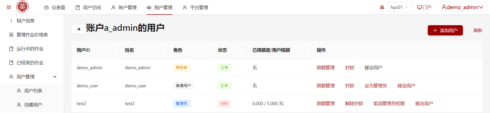

### 2.17.3 添加/去除账户白名单

在账户白名单页面，点击添加白名单账户，输入a_test，确认操作后该账户的状态变为正常。点击从白名单中去除又可以从白名单中移除该账户。

当账户被添加到白名单之后，这个账户就不会被封锁。

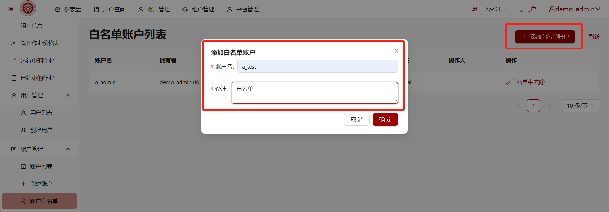

## 2.18 租户内财务管理

当用户被设置为租户财务人员角色后，可以看到财务管理菜单，租户财务人员可以为本租户下的所有账户充值。以demo_admin为例演示为账户a_admin充值1元。

### 2.18.1 账户充值

点击账户充值后，账户输入a_admin，金额填写1元，如下所示提交后即可发起充值。

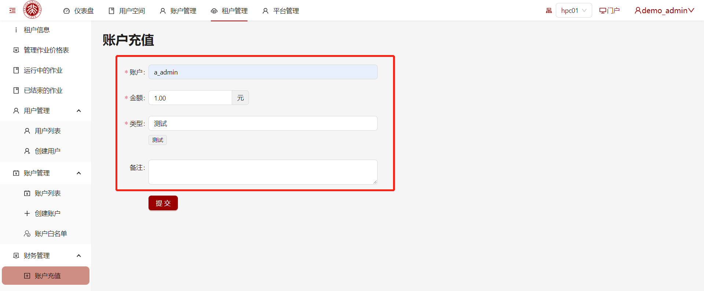

### 2.18.2 查看充值记录

如下图展示，充值成功后可以在充值记录中查看到这笔充值订单，也可以在账户管理中的充值记录中查看（详见2.9章节）。

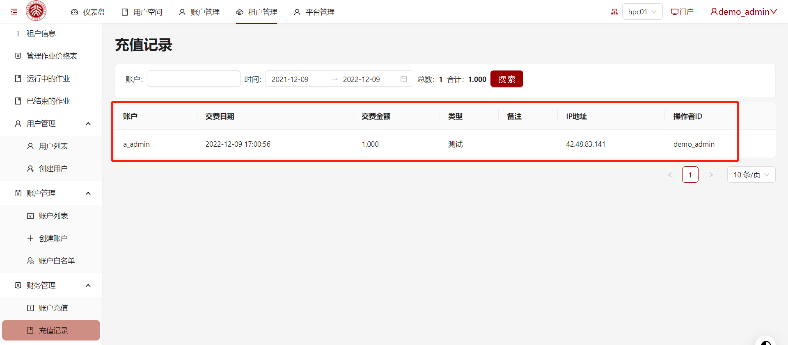

---

租户管理员在管理系统中可以查看和操作的功能就是以上2.10-2.18部分内容，接下来演示平台管理员的其他操作。

## 2.19 获取作业

demo_admin是平台管理员，我们继续以demo_admin为例演示平台管理员登录管理系统后的操作。平台管理员登陆后，可以在平台管理模块配置打开/关闭周期性获取作业状态，也可以手动立刻获取作业，如下图所示。

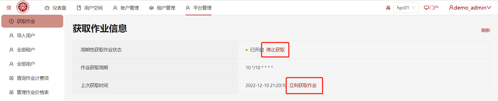

## 2.20 导入用户

如下图所示，在用户tab页面可以看到已经在系统中的用户demo_admin和demo_user，以及不在系统中的用户hjtest21等。在账户tab可以看到系统中的账户a_admin以及不在系统中的账户a_test。填写好用户的姓名以及账户的拥有者之后提交就可以将这批用户和账户导入到系统中。系统支持在导入时将账户同步加入白名单。导入完成后这些账号便可以正常登录SCOW系统。

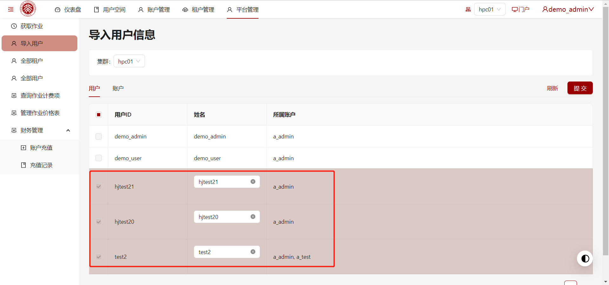

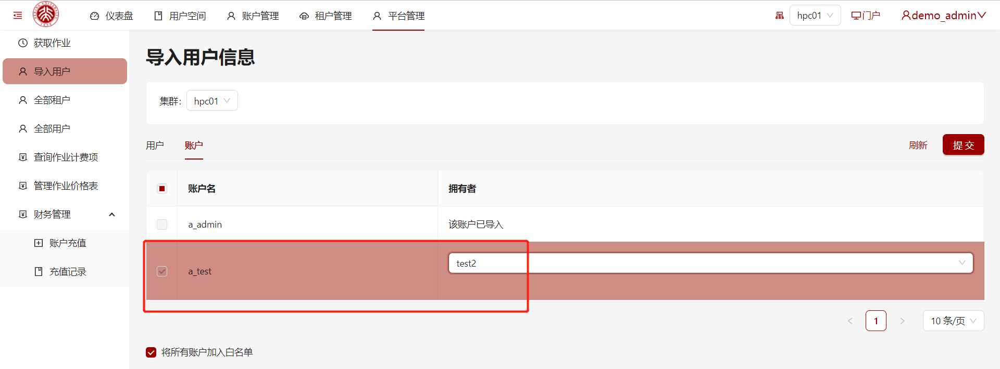

## 2.21 查看全部租户

如下图展示，在全部租户页面可以查看平台下所有租户清单以及信息，如租户名称、用户数量、账户数量、余额等。

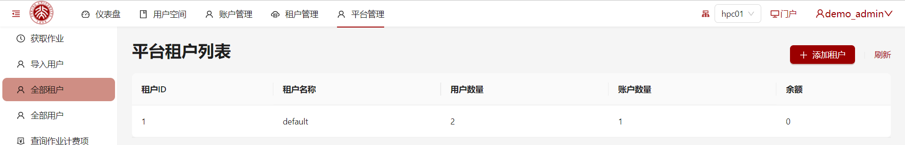

## 2.22 查看全部用户

如下图展示，在全部用户页面可以查看平台下所有用户清单以及信息，如用户ID、姓名、是否是平台管理员、平台财务人员等。

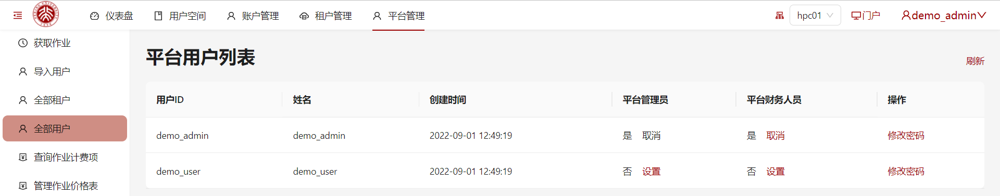

## 2.23 添加租户

在全部租户页面，点击右上角添加租户按钮，在弹窗中填写租户名称default2，点击确定就可以创建一个新的租户default2，

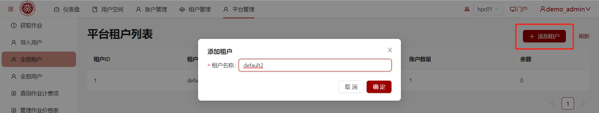

## 2.24 平台内用户管理

和租户管理模块中用户管理功能类似（参考2.16章节），平台管理员登录后，还可以对该平台下的用户进行一系列操作，如设置平台管理员等。

### 2.24.1 设置/取消平台管理员

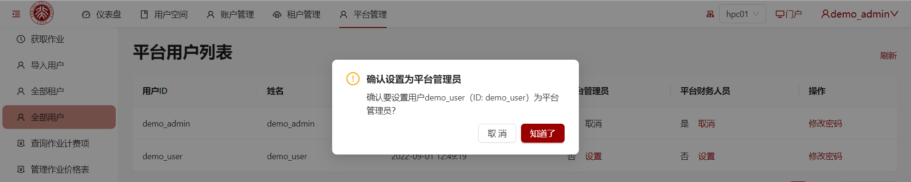

### 2.24.2 设置/取消平台财务人员

### 2.24.3 修改密码

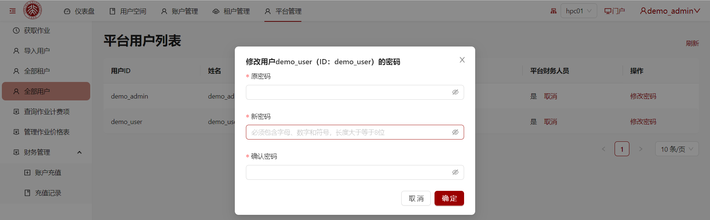

## 2.25 查询作业计费项

平台管理员还可以查看平台所有租户的计费项，如下图展示了default租户的所有计费项。点击查看此租户价格表后可以查看并设置作业价格表。

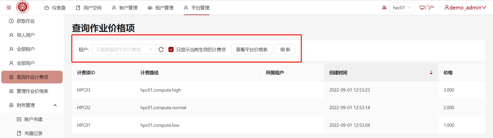

## 2.26 管理作业价格表

和租户管理模块内的功能相似（参考2.15章节），平台管理员也可以在平台管理模块查看和设置不同租户的收费规则，如下图展示了价格设置页面。

!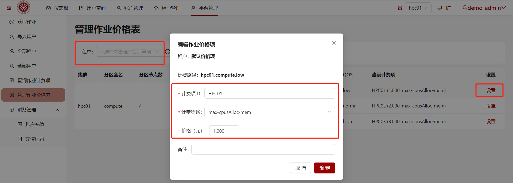

## 2.27 平台内财务管理

和租户管理模块中财务管理功能类似，平台财务人员登录后可以为本平台下的所有租户充值。以demo_admin为例演示为租户default充值1元。

### 2.27.1 账户充值

点击账户充值后，租户输入default，金额填写1元，如下所示提交后即可发起充值。

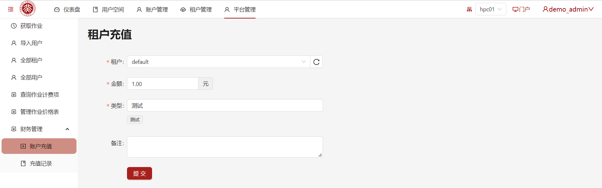

### 2.27.2 查看充值记录

如下图展示，充值成功后可以在充值记录中查看到这笔充值订单，也可以在账户管理中的充值记录中查看。

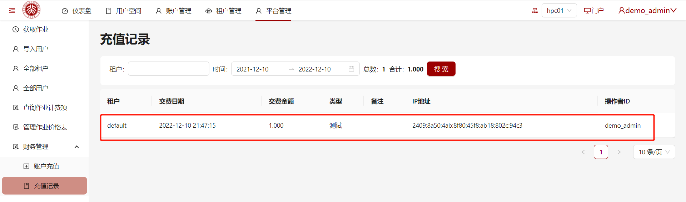

平台管理员在管理系统中可以查看和操作的功能就是以上2.19-2.27部分内容，至此SCOW系统所有功能均介绍完毕。

