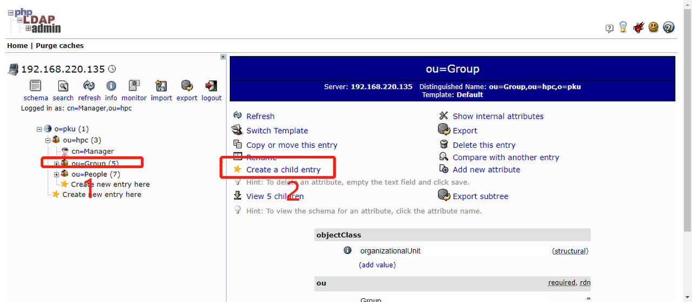
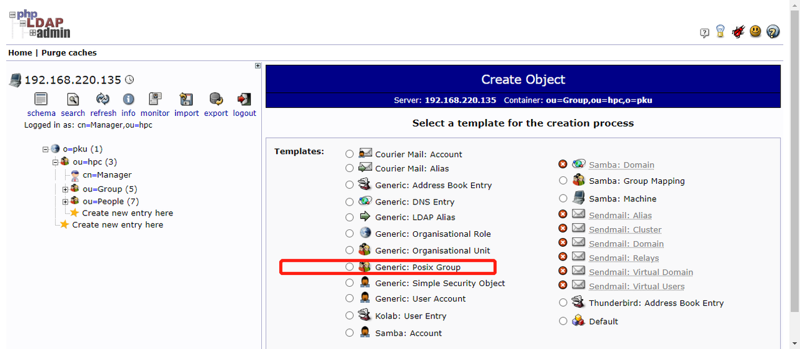
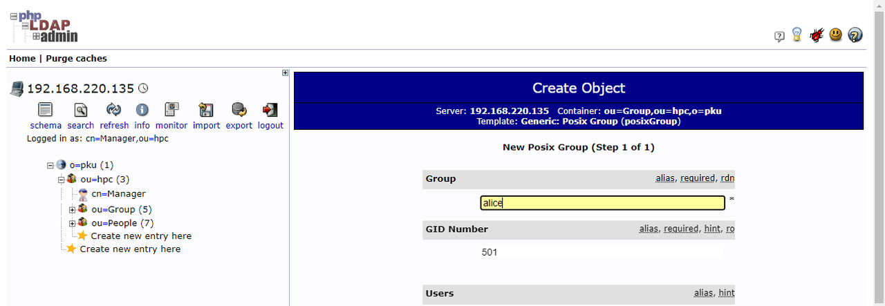
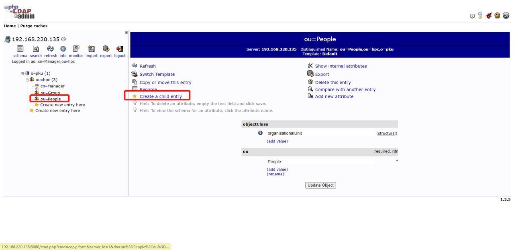
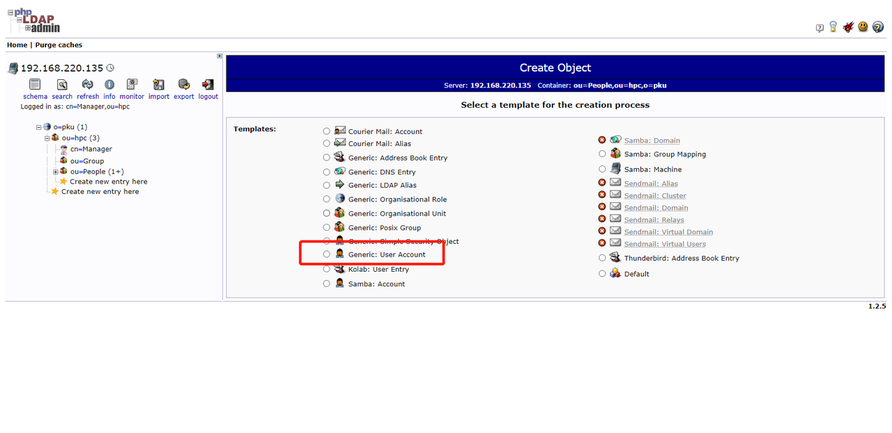
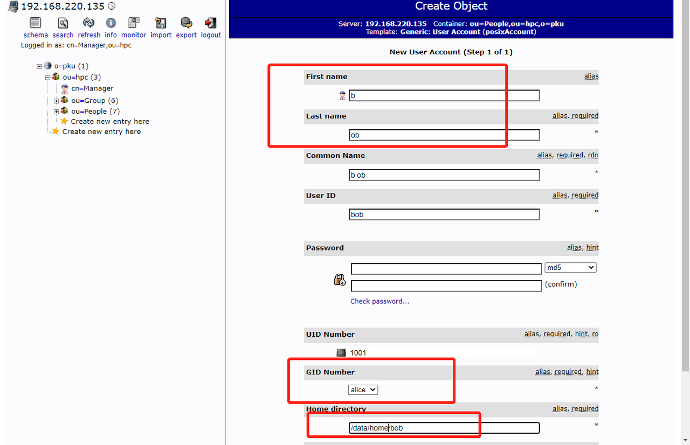
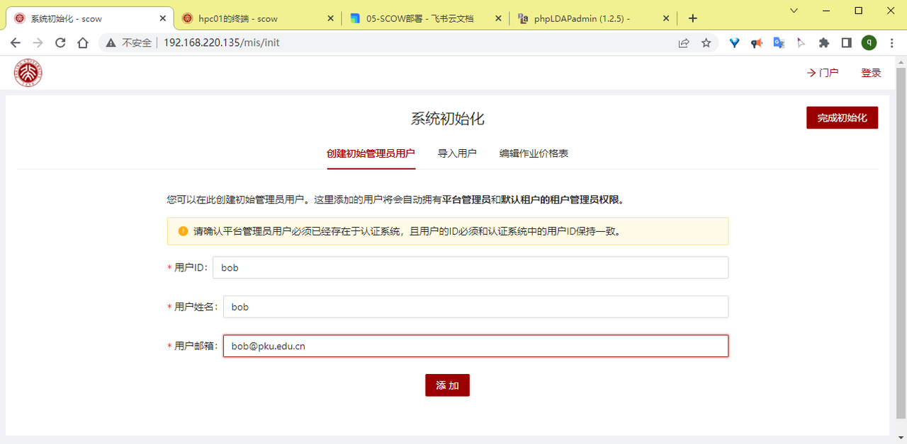
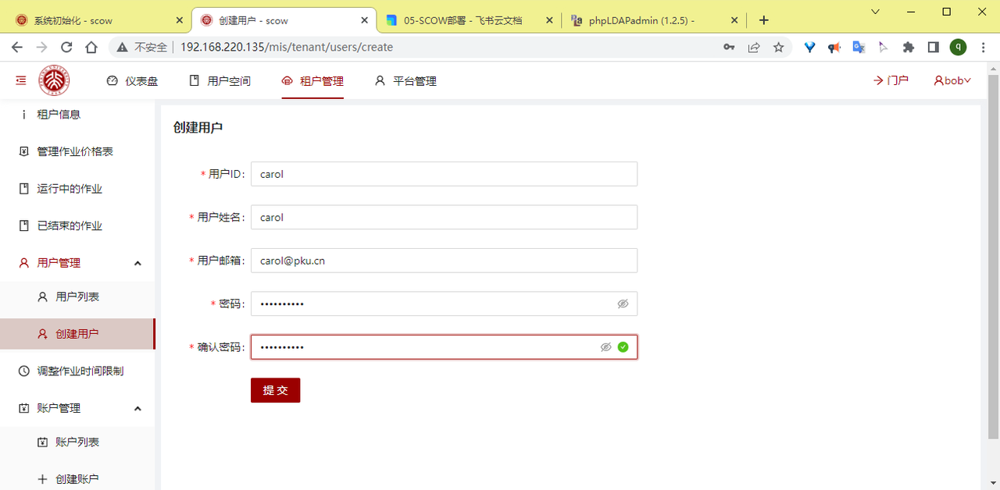
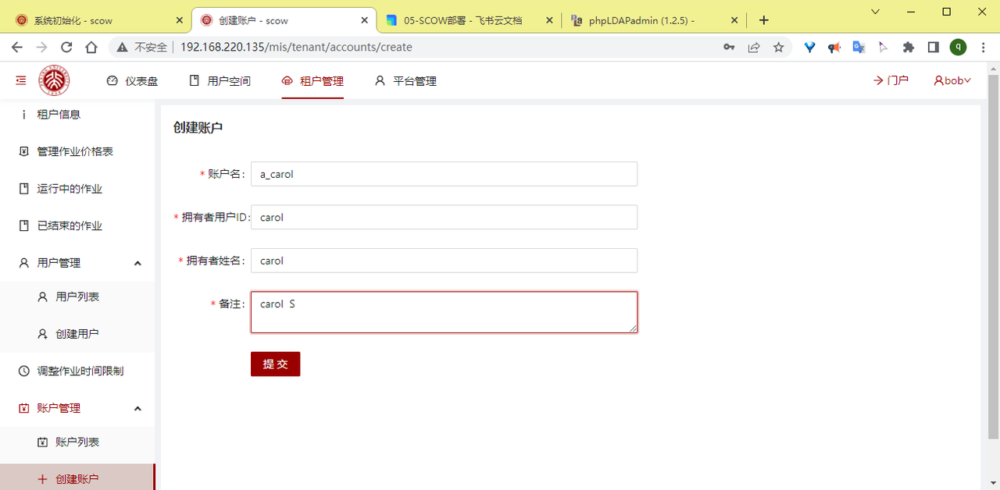

部署LDAP后台管理后，访问http://{LDAP服务节点ip}:8080/ ，登录DN: cn=Manager,ou=hpc,o=pku Password: LDAP服务端安装脚本adminPasswd的值。

## 1. 界面添加LDAP用户

部署LDAP后台管理后，访问http://{LDAP服务节点ip}:8080/ ，登录DN: cn=Manager,ou=hpc,o=pku Password: LDAP服务端安装脚本adminPasswd的值。

登录成功后，新建Group：



选择 generic：posix group



填写group名字



点击create，然后点击commit，创建成功。

点击people新建用户



选择generic：user account



填写fist name，last name，设置密码。




GID选择刚刚设置的组。

home directory需要设置为NFS的目录，按照教程的配置，应该为 /data/home/用户名

点击create，然后点击commit，创建成功。

系统初始化时，访问部署路径的mis/init路径下，将管理员设置为刚刚创建的用户。



以该身份登录管理系统，点击租户管理-用户管理-创建用户，可以创建别的用户。



点击租户管理-账户管理-创建账户，账户的拥有者ID选择刚刚在管理系统创建的新用户。



## 2. 命令添加LDAP用户

> ldap服务节点操作

```
vim demo_admin.ldif
dn: uid=demo_admin,ou=People,ou=hpc,o=pku
objectClass: inetOrgPerson
objectClass: posixAccount
objectClass: shadowAccount
cn: demo_admin
sn: demo_admin
uidNumber: 65001
gidNumber: 65001
homeDirectory: /data/home/demo_admin
loginShell: /bin/bash
userPassword: {SSHA}emlfzzuvWxe54LgoP5uCO7S63vIfK7jY

dn: cn=demo_admin,ou=Group,ou=hpc,o=pku
objectClass: posixGroup
gidNumber: 65001
memberUid: demo_admin
# 添加
 ldapadd -x -D cn=Manager,ou=hpc,o=pku -W -f demo_admin.ldif
#查找
ldapsearch -x -D cn=Manager,ou=hpc,o=pku -W "uid=demo_admin,ou=People,ou=hpc,o=pku"
# 删除
ldapdelete -x -D cn=Manager,ou=hpc,o=pku -W "uid=demo_admin,ou=People,ou=hpc,o=pku"
# 密码SSHA(可选择MD5等其他加密方式)加密
slappasswd -h {SSHA} -s "password"
```