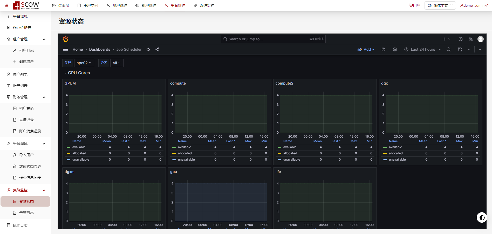
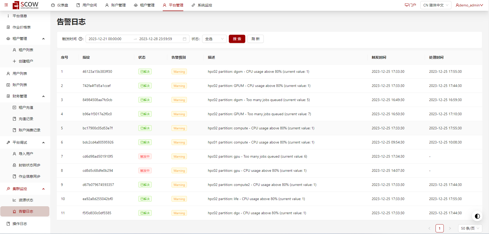

# 部署集群监控

配置该功能可以让管理员在管理系统中查看集群资源信息和告警日志，需要配置 Prometheus、Grafana、Alertmanager、alertsnitch、MySQL 安装

**集群资源信息**


**告警日志**


## 一、环境准备

本监控方案通过 docker-compose 安装，需要安装 docker 和 docker-compose：

1. 安装 docker

```bash
# 安装所需的包
yum install -y yum-utils \
  device-mapper-persistent-data \
  lvm2
  
# 设置稳定存储库
yum-config-manager \
    --add-repo \
    https://download.docker.com/linux/centos/docker-ce.repo
    
**# **安装Docker CE**
**yum install docker-ce -y

# 安装指定版本Docker CE
yum list docker-ce --showduplicates | sort -r
yum install docker-ce-23.0.6 -y

**# **启动Docker CE并设置开机启动
systemctl start docker
systemctl enable docker

**# **验证Docker环境**
**docker run hello-world
```

2. 安装 docker-compose

```bash
**# **下载安装**
**curl -L "https://github.com/docker/compose/releases/download/v2.7.0/docker-compose-$(uname -s)-$(uname -m)" -o /usr/local/bin/docker-compose
mv docker-compose-linux-x86_64 /usr/local/bin/docker-compose
**# **赋权**
**chmod +x /usr/local/bin/docker-compose

**# **验证安装成功**
**docker-compose --version
```

3. 创建持久化配置目录

```bash
# 创建存放配置的目录
mkdir -p /root/monitor
mkdir -p /root/monitor/alertmanager
mkdir -p /root/monitor/alertmanager/template
mkdir -p /root/monitor/grafana
mkdir -p /root/monitor/grafana/provisioning
mkdir -p /root/monitor/grafana/provisioning/dashboards
mkdir -p /root/monitor/grafana/provisioning/dashboards/tmp
mkdir -p /root/monitor/grafana/provisioning/datasources
mkdir -p /root/monitor/prometheus
mkdir -p /root/monitor/prometheus/rules
```

## 二、创建配置文件

:::note

注意：配置文件中各主机名、主机 IP 以及集群信息按实际情况进行修改！

:::

### 配置 Grafana

#### 编辑 grafana 配置文件：`/root/monitor/grafana/grafana.ini`

此处需要修改 [server] 下的 root_url，将 `your_scow_mis_path` 修改为 OpenSCOW 管理系统的路径

此处配置了 root_url 和 allow_embedding，将允许 grafana 通过 iframe 被嵌入。并通过 OpenSCOW 代理，将请求转发到 grafana。

```bash
[paths]
# Path to where grafana can store temp files, sessions, and the sqlite3 db (if that is used)
data = /var/lib/grafana
# folder that contains provisioning config files that grafana will apply on startup and while running.
provisioning = /etc/grafana/provisioning
[auth.anonymous]     
# enable anonymous access
enabled = true
# specify role for unauthenticated users
org_role = Viewer
[server]
# Root URL for specifying the Grafana instance
# for example
# root_url=http://localhost:5003/api/admin/monitor/getResourceStatus
root_url=[your_scow_mis_path]/api/admin/monitor/getResourceStatus
[security]
# Allows embedding Grafana dashboards into iframes in other websites
allow_embedding = true
```

#### 编辑 grafana 默认数据源

`/root/monitor/grafana/provisioning/datasources/prometheus.yaml`

```bash
apiVersion: 1
datasources:
  - name: Prometheus
    type: prometheus
    orgId: 1
    access: proxy
    url: http://prometheus:9090
    editable: true
    isDefault: true
    jsonData:
      timeInterval: 5s
```

#### 编辑 grafana Mysql 数据源

`/root/monitor/grafana/provisioning/datasources/mysql.yaml`

```bash
apiVersion: 1

datasources:
  - name: AlarmDB-MySQL
    type: mysql
    url: alert-db:3306
    user: alertsnitch
    jsonData:
      database: alertsnitch
      maxOpenConns: 100 # Grafana v5.4+
      maxIdleConns: 100 # Grafana v5.4+
      maxIdleConnsAuto: true # Grafana v9.5.1+
      connMaxLifetime: 14400 # Grafana v5.4+
    secureJsonData:
      password: alertsnitch
```

#### 编辑 grafana 面板配置

`/root/monitor/grafana/provisioning/dashboards/dashboard.yaml`

```bash
apiVersion: 1
providers:
  - name: 'default'
    orgId: 1
    folder: ''
    type: file
    disableDeletion: false
    updateIntervalSeconds: 10 #how often Grafana will scan for changed dashboards
    options:
      path: /etc/grafana/provisioning/dashboards/tmp
```

#### 编辑 grafana 面板模板文件

`/root/monitor/grafana/provisioning/dashboards/tmp/JobScheduler.json`

```json
{
  "annotations": {
    "list": [
      {
        "builtIn": 1,
        "datasource": {
          "type": "datasource",
          "uid": "grafana"
        },
        "enable": true,
        "hide": true,
        "iconColor": "rgba(0, 211, 255, 1)",
        "name": "Annotations & Alerts",
        "type": "dashboard"
      }
    ]
  },
  "editable": true,
  "fiscalYearStartMonth": 0,
  "graphTooltip": 0,
  "links": [],
  "liveNow": false,
  "panels": [
    {
      "collapsed": false,
      "datasource": {
        "type": "prometheus"
      },
      "gridPos": {
        "h": 1,
        "w": 24,
        "x": 0,
        "y": 0
      },
      "id": 2,
      "panels": [],
      "targets": [
        {
          "datasource": {
            "type": "prometheus"
          },
          "refId": "A"
        }
      ],
      "title": "CPU Cores",
      "type": "row"
    },
    {
      "datasource": {
        "type": "prometheus"
      },
      "fieldConfig": {
        "defaults": {
          "color": {
            "mode": "palette-classic"
          },
          "custom": {
            "axisBorderShow": false,
            "axisCenteredZero": false,
            "axisColorMode": "text",
            "axisLabel": "",
            "axisPlacement": "auto",
            "barAlignment": 0,
            "drawStyle": "line",
            "fillOpacity": 10,
            "gradientMode": "none",
            "hideFrom": {
              "legend": false,
              "tooltip": false,
              "viz": false
            },
            "insertNulls": false,
            "lineInterpolation": "linear",
            "lineWidth": 1,
            "pointSize": 5,
            "scaleDistribution": {
              "type": "linear"
            },
            "showPoints": "never",
            "spanNulls": false,
            "stacking": {
              "group": "A",
              "mode": "none"
            },
            "thresholdsStyle": {
              "mode": "off"
            }
          },
          "mappings": [],
          "thresholds": {
            "mode": "absolute",
            "steps": [
              {
                "color": "green",
                "value": null
              },
              {
                "color": "red",
                "value": 80
              }
            ]
          },
          "unit": "short"
        },
        "overrides": []
      },
      "gridPos": {
        "h": 9,
        "w": 8,
        "x": 0,
        "y": 1
      },
      "id": 4,
      "options": {
        "legend": {
          "calcs": [
            "mean",
            "lastNotNull",
            "max",
            "min"
          ],
          "displayMode": "table",
          "placement": "bottom",
          "showLegend": true
        },
        "tooltip": {
          "mode": "multi",
          "sort": "none"
        }
      },
      "pluginVersion": "10.2.2",
      "repeat": "partition",
      "targets": [
        {
          "datasource": {
            "type": "prometheus"
          },
          "editorMode": "code",
          "expr": "slurm_partition_cpus_idle{clustername=\"$cluster\", partition=\"$partition\"}",
          "interval": "",
          "legendFormat": "available",
          "range": true,
          "refId": "A"
        },
        {
          "datasource": {
            "type": "prometheus"
          },
          "editorMode": "code",
          "expr": "slurm_partition_cpus_allocated{clustername=\"$cluster\", partition=\"$partition\"}",
          "interval": "",
          "legendFormat": "allocated",
          "range": true,
          "refId": "B"
        },
        {
          "datasource": {
            "type": "prometheus"
          },
          "editorMode": "code",
          "expr": "slurm_partition_cpus_other{clustername=\"$cluster\", partition=\"$partition\"}",
          "interval": "",
          "legendFormat": "unavailable",
          "range": true,
          "refId": "C"
        }
      ],
      "title": "${partition}",
      "type": "timeseries"
    },
    {
      "collapsed": true,
      "datasource": {
        "type": "prometheus"
      },
      "gridPos": {
        "h": 1,
        "w": 24,
        "x": 0,
        "y": 10
      },
      "id": 8,
      "panels": [],
      "targets": [
        {
          "datasource": {
            "type": "prometheus"
          },
          "refId": "A"
        }
      ],
      "title": "Job Count",
      "type": "row"
    },
    {
      "datasource": {
        "type": "prometheus"
      },
      "fieldConfig": {
        "defaults": {
          "color": {
            "mode": "palette-classic"
          },
          "custom": {
            "axisBorderShow": false,
            "axisCenteredZero": false,
            "axisColorMode": "text",
            "axisLabel": "",
            "axisPlacement": "auto",
            "barAlignment": 0,
            "drawStyle": "line",
            "fillOpacity": 10,
            "gradientMode": "none",
            "hideFrom": {
              "legend": false,
              "tooltip": false,
              "viz": false
            },
            "insertNulls": false,
            "lineInterpolation": "linear",
            "lineWidth": 1,
            "pointSize": 5,
            "scaleDistribution": {
              "type": "linear"
            },
            "showPoints": "never",
            "spanNulls": false,
            "stacking": {
              "group": "A",
              "mode": "none"
            },
            "thresholdsStyle": {
              "mode": "off"
            }
          },
          "mappings": [],
          "thresholds": {
            "mode": "absolute",
            "steps": [
              {
                "color": "green",
                "value": null
              },
              {
                "color": "red",
                "value": 80
              }
            ]
          },
          "unit": "short"
        },
        "overrides": []
      },
      "gridPos": {
        "h": 12,
        "w": 8,
        "x": 0,
        "y": 11
      },
      "id": 12,
      "options": {
        "legend": {
          "calcs": [
            "mean",
            "lastNotNull",
            "max",
            "min"
          ],
          "displayMode": "table",
          "placement": "bottom",
          "showLegend": true
        },
        "tooltip": {
          "mode": "multi",
          "sort": "none"
        }
      },
      "pluginVersion": "10.2.2",
      "repeat": "partition",
      "targets": [
        {
          "datasource": {
            "type": "prometheus"
          },
          "editorMode": "code",
          "expr": "slurm_partition_jobs_running{clustername=\"$cluster\", partition=\"$partition\"}",
          "interval": "",
          "legendFormat": "RUNNING",
          "range": true,
          "refId": "A"
        },
        {
          "datasource": {
            "type": "prometheus"
          },
          "editorMode": "code",
          "expr": "slurm_partition_jobs_pending{clustername=\"$cluster\", partition=\"$partition\"}",
          "interval": "",
          "legendFormat": "PENDING",
          "range": true,
          "refId": "B"
        },
        {
          "datasource": {
            "type": "prometheus"
          },
          "editorMode": "code",
          "expr": "slurm_partition_jobs_suspended{clustername=\"$cluster\", partition=\"$partition\"}",
          "interval": "",
          "legendFormat": "SUSPENDED",
          "range": true,
          "refId": "C"
        },
        {
          "datasource": {
            "type": "prometheus"
          },
          "editorMode": "code",
          "expr": "slurm_partition_jobs_completing{clustername=\"$cluster\", partition=\"$partition\"}",
          "interval": "",
          "legendFormat": "COMPLETING",
          "range": true,
          "refId": "D"
        }
      ],
      "title": "$partition",
      "type": "timeseries"
    }
  ],
  "refresh": "",
  "schemaVersion": 38,
  "tags": [],
  "templating": {
    "list": [
      {
        "current": {
          "selected": false,
          "text": "hpc01",
          "value": "hpc01"
        },
        "datasource": {
          "type": "prometheus"
        },
        "definition": "label_values(clustername)",
        "hide": 0,
        "includeAll": false,
        "label": "集群",
        "multi": false,
        "name": "cluster",
        "options": [],
        "query": "label_values(clustername)",
        "refresh": 2,
        "regex": "",
        "skipUrlSync": false,
        "sort": 0,
        "tagValuesQuery": "",
        "tagsQuery": "",
        "type": "query",
        "useTags": false
      },
      {
        "current": {
          "selected": true,
          "text": [
            "All"
          ],
          "value": [
            "$__all"
          ]
        },
        "datasource": {
          "type": "prometheus"
        },
        "definition": "label_values(slurm_partition_cpus_total{clustername=\"$cluster\"}, partition)",
        "hide": 0,
        "includeAll": true,
        "label": "分区",
        "multi": true,
        "name": "partition",
        "options": [],
        "query": "label_values(slurm_partition_cpus_total{clustername=\"$cluster\"}, partition)",
        "refresh": 2,
        "regex": "",
        "skipUrlSync": false,
        "sort": 0,
        "tagValuesQuery": "",
        "tagsQuery": "",
        "type": "query",
        "useTags": false
      }
    ]
  },
  "time": {
    "from": "now-24h",
    "to": "now"
  },
  "timepicker": {
    "refresh_intervals": [
      "10s",
      "30s",
      "1m",
      "5m",
      "15m",
      "30m",
      "1h",
      "2h",
      "1d"
    ]
  },
  "timezone": "",
  "title": "Job Scheduler",
  "uid": "shZOtO4Sk",
  "version": 1,
  "weekStart": ""
}
```

### 配置 Prometheus

#### 配置 Prometheus 配置文件

`/root/monitor/prometheus/prometheus.yml`

注意：scrape_configs 下 slurm_exporter 中 slurmctlIP 需要替换成 slurm 管理节点实际的 IP 地址

如果有多个 slurm 管理节点则在 `scrape_configs` 下 slurm_exporter 中的 `static_configs` 里面配置更多。

```bash
global:
  scrape_interval:   60s # Set the scrape interval to every 15 seconds. Default is every 1 minute.
  evaluation_interval: 60s # Evaluate rules every 15 seconds. The default is every 1 minute.

# Alertmanager configuration
alerting:
  alertmanagers:
  - static_configs:
    - targets: ["alertmanager:9093"]

# Load rules once and periodically evaluate them according to the global 'evaluation_interval'.
rule_files:
  - "rules/rules.yml"

scrape_configs:
  - job_name: 'slurm_exporter'
    scrape_interval:  30s
    scrape_timeout:   30s
    static_configs:
      - targets: ['[slurmctlIP]:9341']
        labels:
          appname: 'hpc01' #添加的标签
          clustername: 'hpc01' #添加的标签
  - job_name: 'prometheus'
    static_configs:
      - targets: [ 'prometheus:9090']
        labels:
          appname: 'prometheus'
```

#### 配置 Prometheus 告警规则

`/root/monitor/prometheus/rules/rules.yml`

```bash
# slurmAlert
groups:
- name: slurmAlert
  rules:
  - alert: SlurmPartitionCPUUsage
    expr: (slurm_partition_cpus_total - slurm_partition_cpus_idle)/slurm_partition_cpus_total > 0.80
    for: 1m
    labels:
      severity: "Warning"
    annotations:
      summary: "SLURM partition CPU usgae high"
      description: "{{ $labels.clustername }} partition: {{ $labels.partition }} - CPU usage above 80% (current value: {{ $value }})"
  - alert: SlurmPendingJob
    expr: slurm_partition_jobs_pending >= 5
    for: 1m
    labels:
      severity: "Warning"
    annotations:
      summary: "Too many jobs queued"
      description: "{{ $labels.clustername }} partition: {{ $labels.partition }} - Too many jobs queued (current value: {{ $value }})"
```

### 配置 Alertmanager

#### 配置 Alertmanager 配置文件

`/root/monitor/alertmanager/alertmanager.yml`

```bash
global:
  smtp_smarthost: 'smtp.163.com:25'
  smtp_from: 'xxxxxxx@163.com'
  smtp_auth_username: 'xxxxxxx@163.com'
  smtp_auth_password: 'XXXXXXXXXXXXXXXX'
  smtp_require_tls: false

templates:
  - '/etc/alertmanager/template/*.tmpl'

route:
  group_by: ['alertname','cluster','service']
  group_wait: 30s
  group_interval: 10s
  repeat_interval: 10m
  receiver: 'default-receiver'
  routes:
  - receiver: 'alertsnitch'
    continue: true

receivers:
  - name: 'default-receiver'
    email_configs:
    - to: 'xxxxxxx@qq.com'
      html: '{{ template "email.default.html" . }}'
      headers: { Subject: "Prometheus 告警测试邮件" }
  - name: 'alertsnitch'
    webhook_configs:
    - send_resolved: true
      http_config:
        follow_redirects: true
      url: http://alertsnitch:9567/webhook
```

#### 配置 Alertmanager 告警模板

`/root/monitor/alertmanager/template/default.tmpl`

```bash
{{ define "__alertmanager" }}Alertmanager{{ end }}
{{ define "__alertmanagerURL" }}{{ .ExternalURL }}/#/alerts?receiver={{ .Receiver | urlquery }}{{ end }}

{{ define "__subject" }}[{{ .Status | toUpper }}{{ if eq .Status "firing" }}:{{ .Alerts.Firing | len }}{{ end }}] {{ .GroupLabels.SortedPairs.Values | join " " }} {{ if gt (len .CommonLabels) (len .GroupLabels) }}({{ with .CommonLabels.Remove .GroupLabels.Names }}{{ .Values | join " " }}{{ end }}){{ end }}{{ end }}
{{ define "__description" }}{{ end }}

{{ define "__text_alert_list" }}{{ range . }}Labels:
{{ range .Labels.SortedPairs }} - {{ .Name }} = {{ .Value }}
{{ end }}Annotations:
{{ range .Annotations.SortedPairs }} - {{ .Name }} = {{ .Value }}
{{ end }}Source: {{ .GeneratorURL }}
{{ end }}{{ end }}

{{ define "__text_alert_list_markdown" }}{{ range . }}
Labels:
{{ range .Labels.SortedPairs }}  - {{ .Name }} = {{ .Value }}
{{ end }}
Annotations:
{{ range .Annotations.SortedPairs }}  - {{ .Name }} = {{ .Value }}
{{ end }}
Source: {{ .GeneratorURL }}
{{ end }}
{{ end }}

{{ define "slack.default.title" }}{{ template "__subject" . }}{{ end }}
{{ define "slack.default.username" }}{{ template "__alertmanager" . }}{{ end }}
{{ define "slack.default.fallback" }}{{ template "slack.default.title" . }} | {{ template "slack.default.titlelink" . }}{{ end }}
{{ define "slack.default.callbackid" }}{{ end }}
{{ define "slack.default.pretext" }}{{ end }}
{{ define "slack.default.titlelink" }}{{ template "__alertmanagerURL" . }}{{ end }}
{{ define "slack.default.iconemoji" }}{{ end }}
{{ define "slack.default.iconurl" }}{{ end }}
{{ define "slack.default.text" }}{{ end }}
{{ define "slack.default.footer" }}{{ end }}


{{ define "pagerduty.default.description" }}{{ template "__subject" . }}{{ end }}
{{ define "pagerduty.default.client" }}{{ template "__alertmanager" . }}{{ end }}
{{ define "pagerduty.default.clientURL" }}{{ template "__alertmanagerURL" . }}{{ end }}
{{ define "pagerduty.default.instances" }}{{ template "__text_alert_list" . }}{{ end }}


{{ define "opsgenie.default.message" }}{{ template "__subject" . }}{{ end }}
{{ define "opsgenie.default.description" }}{{ .CommonAnnotations.SortedPairs.Values | join " " }}
{{ if gt (len .Alerts.Firing) 0 -}}
Alerts Firing:
{{ template "__text_alert_list" .Alerts.Firing }}
{{- end }}
{{ if gt (len .Alerts.Resolved) 0 -}}
Alerts Resolved:
{{ template "__text_alert_list" .Alerts.Resolved }}
{{- end }}
{{- end }}
{{ define "opsgenie.default.source" }}{{ template "__alertmanagerURL" . }}{{ end }}


{{ define "wechat.default.message" }}{{ template "__subject" . }}
{{ .CommonAnnotations.SortedPairs.Values | join " " }}
{{ if gt (len .Alerts.Firing) 0 -}}
Alerts Firing:
{{ template "__text_alert_list" .Alerts.Firing }}
{{- end }}
{{ if gt (len .Alerts.Resolved) 0 -}}
Alerts Resolved:
{{ template "__text_alert_list" .Alerts.Resolved }}
{{- end }} 
AlertmanagerUrl:
{{ template "__alertmanagerURL" . }}
{{- end }}
{{ define "wechat.default.to_user" }}{{ end }}
{{ define "wechat.default.to_party" }}{{ end }}
{{ define "wechat.default.to_tag" }}{{ end }}
{{ define "wechat.default.agent_id" }}{{ end }}


{{ define "victorops.default.state_message" }}{{ .CommonAnnotations.SortedPairs.Values | join " " }}
{{ if gt (len .Alerts.Firing) 0 -}} 
Alerts Firing:
{{ template "__text_alert_list" .Alerts.Firing }}
{{- end }}
{{ if gt (len .Alerts.Resolved) 0 -}}
Alerts Resolved:
{{ template "__text_alert_list" .Alerts.Resolved }}
{{- end }}
{{- end }}
{{ define "victorops.default.entity_display_name" }}{{ template "__subject" . }}{{ end }}
{{ define "victorops.default.monitoring_tool" }}{{ template "__alertmanager" . }}{{ end }}

{{ define "pushover.default.title" }}{{ template "__subject" . }}{{ end }}
{{ define "pushover.default.message" }}{{ .CommonAnnotations.SortedPairs.Values | join " " }}
{{ if gt (len .Alerts.Firing) 0 }}
Alerts Firing:
{{ template "__text_alert_list" .Alerts.Firing }}
{{ end }}
{{ if gt (len .Alerts.Resolved) 0 }}
Alerts Resolved:
{{ template "__text_alert_list" .Alerts.Resolved }}
{{ end }} 
{{ end }}
{{ define "pushover.default.url" }}{{ template "__alertmanagerURL" . }}{{ end }}

{{ define "sns.default.subject" }}{{ template "__subject" . }}{{ end }}
{{ define "sns.default.message" }}{{ .CommonAnnotations.SortedPairs.Values | join " " }}
{{ if gt (len .Alerts.Firing) 0 }}
Alerts Firing:
{{ template "__text_alert_list" .Alerts.Firing }}
{{ end }}
{{ if gt (len .Alerts.Resolved) 0 }}
Alerts Resolved:
{{ template "__text_alert_list" .Alerts.Resolved }}
{{ end }}
{{ end }}

{{ define "telegram.default.message" }} 
{{ if gt (len .Alerts.Firing) 0 }}
Alerts Firing:
{{ template "__text_alert_list" .Alerts.Firing }}
{{ end }}
{{ if gt (len .Alerts.Resolved) 0 }}
Alerts Resolved:
{{ template "__text_alert_list" .Alerts.Resolved }}
{{ end }}
{{ end }}

{{ define "discord.default.title" }}{{ template "__subject" . }}{{ end }}
{{ define "discord.default.message" }}
{{ if gt (len .Alerts.Firing) 0 }}
Alerts Firing:
{{ template "__text_alert_list" .Alerts.Firing }}
{{ end }}
{{ if gt (len .Alerts.Resolved) 0 }}
Alerts Resolved:
{{ template "__text_alert_list" .Alerts.Resolved }}
{{ end }} 
{{ end }} 

{{ define "webex.default.message" }}{{ .CommonAnnotations.SortedPairs.Values | join " " }}
{{ if gt (len .Alerts.Firing) 0 }}
Alerts Firing:
{{ template "__text_alert_list" .Alerts.Firing }}
{{ end }}
{{ if gt (len .Alerts.Resolved) 0 }}
Alerts Resolved:
{{ template "__text_alert_list" .Alerts.Resolved }}
{{ end }} 
{{ end }}

{{ define "msteams.default.title" }}{{ template "__subject" . }}{{ end }}
{{ define "msteams.default.text" }}
{{ if gt (len .Alerts.Firing) 0 }}
# Alerts Firing:
{{ template "__text_alert_list_markdown" .Alerts.Firing }}
{{ end }}
{{ if gt (len .Alerts.Resolved) 0 }}
# Alerts Resolved:
{{ template "__text_alert_list_markdown" .Alerts.Resolved }}
{{ end }}
{{ end }}
```

## 三、启动服务

### 编辑集群监控的 docker compose 配置文件

`/root/monitor/monitor.yaml`

如果需要修改 `alert-db` 密码，则在对应容器配置下修改即可。如果修改 mysql 用户 `alertsnitch` 的密码，需要在配置 grafana 的 mysql 数据源处同步修改密码

```bash
version: "3.1"
services:
  grafana:
    container_name: grafana
    image: grafana/grafana:10.2.2
    user: root
    ports:
      - "4000:3000"
    volumes:
      - /root/monitor/grafana:/etc/grafana
      - grafana_data:/var/lib/grafana
    restart: unless-stopped
  prometheus:
    container_name: prometheus
    image: prom/prometheus
    user: root
    ports:
      - "9090:9090"
    volumes:
      - /root/monitor/prometheus:/etc/prometheus
      - prometheus_data:/prometheus
    restart: unless-stopped
  alertmanager:
    container_name: alertmanager
    image: prom/alertmanager
    user: root
    ports:
      - 9093:9093
    volumes:
      - /root/monitor/alertmanager:/etc/alertmanager
      - alertmanager_data:/alertmanager
    command:
      - "--config.file=/etc/alertmanager/alertmanager.yml"
      - "--storage.path=/alertmanager"
    restart: unless-stopped
  alert-db:
    container_name: alert-db
    image: mysql:5.7
    command: --default-authentication-plugin=mysql_native_password
    environment:
      MYSQL_DATABASE: alertsnitch
      MYSQL_USER: "alertsnitch"
      MYSQL_PASSWORD: "alertsnitch"
      MYSQL_ROOT_PASSWORD: "root"
    volumes:
      - alert_db_data:/var/lib/mysql
    restart: unless-stopped
  alertsnitch:
    container_name: alertsnitch
    image: registry.gitlab.com/yakshaving.art/alertsnitch
    ports:
      - 9567:9567
    environment:
      ALERTSNITCH_BACKEND: "mysql"
      ALERTSNITCH_DSN: "alertsnitch:alertsnitch@tcp(alert-db)/alertsnitch"
    restart: unless-stopped
    depends_on:
      - alert-db
volumes:
  prometheus_data: {}
  grafana_data: {}
  alertmanager_data: {}
  alert_db_data: {}
```

### 启动集群监控服务相关容器

启动后 alertsnitch 容器会不断重启，需要完成初始化 alert-db 步骤后再重启整个集群监控服务

```bash
cd /root/monitor
docker-compose -f monitor.yaml up -d
```

### 初始化 alert-db

#### 编辑 `/root/monitor/bootstrap.sql`

```sql
DROP PROCEDURE IF EXISTS bootstrap;

DELIMITER //
CREATE PROCEDURE bootstrap()
BEGIN
  SET @exists := (SELECT 1 FROM information_schema.tables I WHERE I.table_name = "Model" AND I.table_schema = database());
  IF @exists IS NULL THEN

    CREATE TABLE `Model` (
      `ID` enum('1') NOT NULL,
      `version` VARCHAR(20) NOT NULL,
      PRIMARY KEY (`ID`)
    ) ENGINE=InnoDB DEFAULT CHARSET=utf8;

    INSERT INTO `Model` (`version`) VALUES ("0.0.1");

  ELSE
    SIGNAL SQLSTATE '42000' SET MESSAGE_TEXT='Model Table Exists, quitting...';
  END IF;
END;
//
DELIMITER ;

-- Execute the procedure
CALL bootstrap();

-- Drop the procedure
DROP PROCEDURE bootstrap;

-- Create the rest of the tables
CREATE TABLE `AlertGroup` (
        `ID` INT NOT NULL AUTO_INCREMENT,
        `time` TIMESTAMP NOT NULL,
        `receiver` VARCHAR(100) NOT NULL,
        `status` VARCHAR(50) NOT NULL,
        `externalURL` TEXT NOT NULL,
        `groupKey` VARCHAR(255) NOT NULL,
        KEY `idx_time` (`time`) USING BTREE,
    KEY `idx_status_ts` (`status`, `time`) USING BTREE,
        PRIMARY KEY (`ID`)
) ENGINE=InnoDB DEFAULT CHARSET=utf8;

CREATE TABLE `GroupLabel` (
        `ID` INT NOT NULL AUTO_INCREMENT,
    `AlertGroupID` INT NOT NULL,
    `GroupLabel` VARCHAR(100) NOT NULL,
    `Value` VARCHAR(1000) NOT NULL,
    FOREIGN KEY (AlertGroupID) REFERENCES AlertGroup (ID) ON DELETE CASCADE,
        PRIMARY KEY (`ID`)
) ENGINE=InnoDB DEFAULT CHARSET=utf8;

CREATE TABLE `CommonLabel` (
        `ID` INT NOT NULL AUTO_INCREMENT,
    `AlertGroupID` INT NOT NULL,
    `Label` VARCHAR(100) NOT NULL,
    `Value` VARCHAR(1000) NOT NULL,
    FOREIGN KEY (AlertGroupID) REFERENCES AlertGroup (ID) ON DELETE CASCADE,
        PRIMARY KEY (`ID`)
) ENGINE=InnoDB DEFAULT CHARSET=utf8;

CREATE TABLE `CommonAnnotation` (
        `ID` INT NOT NULL AUTO_INCREMENT,
    `AlertGroupID` INT NOT NULL,
    `Annotation` VARCHAR(100) NOT NULL,
    `Value` VARCHAR(1000) NOT NULL,
    FOREIGN KEY (AlertGroupID) REFERENCES AlertGroup (ID) ON DELETE CASCADE,
        PRIMARY KEY (`ID`)
) ENGINE=InnoDB DEFAULT CHARSET=utf8;

CREATE TABLE `Alert` (
        `ID` INT NOT NULL AUTO_INCREMENT,
    `alertGroupID` INT NOT NULL,
        `status` VARCHAR(50) NOT NULL,
    `startsAt` DATETIME NOT NULL,
    `endsAt` DATETIME DEFAULT NULL,
        `generatorURL` TEXT NOT NULL,
    FOREIGN KEY (alertGroupID) REFERENCES AlertGroup (ID) ON DELETE CASCADE,
        PRIMARY KEY (`ID`)
) ENGINE=InnoDB DEFAULT CHARSET=utf8;

CREATE TABLE `AlertLabel` (
        `ID` INT NOT NULL AUTO_INCREMENT,
    `AlertID` INT NOT NULL,
    `Label` VARCHAR(100) NOT NULL,
    `Value` VARCHAR(1000) NOT NULL,
    FOREIGN KEY (AlertID) REFERENCES Alert (ID) ON DELETE CASCADE,
        PRIMARY KEY (`ID`)
) ENGINE=InnoDB DEFAULT CHARSET=utf8;

CREATE TABLE `AlertAnnotation` (
        `ID` INT NOT NULL AUTO_INCREMENT,
    `AlertID` INT NOT NULL,
    `Annotation` VARCHAR(100) NOT NULL,
    `Value` VARCHAR(1000) NOT NULL,
    FOREIGN KEY (AlertID) REFERENCES Alert (ID) ON DELETE CASCADE,
        PRIMARY KEY (`ID`)
) ENGINE=InnoDB DEFAULT CHARSET=utf8;
```

#### 编辑 `/root/monitor/fingerprint.sql`

```sql
# db.d/mysql/0.1.0-fingerprint.sql
ALTER TABLE Alert
    ADD `fingerprint` TEXT NOT NULL;

UPDATE `Model`  SET `version`="0.1.0";
```

#### 初始化

```bash
# 将上两步的 sql 文件分别拷贝到 alert-db 容器
# container_id 通过查询 alert-db 容器 id 获取
docker cp /root/monitor/bootstrap.sql container_id:/root
docker cp /root/monitor/fingerprint.sql container_id:/root

# 进入容器
docker exec -it container_id /bin/sh

# 进入容器后
cd /root
# 使用root登录数据库，密码是root
mysql -uroot -p

切到alertsnitch数据库
use alertsnitch

执行sql文件
source bootstrap.sql
source fingerprint.sql
```

### 重启集群监控服务

退出 alert-db 容器，然后重启服务

```bash
docker-compose -f monitor.yaml restart
# 检查服务是否启动成功
docker ps
```

## 四、启动 exporter 服务

以下操作均在 slurm 管理节点上进行

### 安装 golang

```bash
# 下载go语言安装包，安装gocd download/
wget https://golang.google.cn/dl/go1.19.7.linux-amd64.tar.gz
tar -C /usr/local -xzf go1.19.7.linux-amd64.tar.gz

# 在/etc/profile中设置环境变量
export GOROOT=/usr/local/go
export GOPATH=/usr/local/gopath
export PATH=$PATH:/$GOROOT/bin:$GOPATH/bin

# source环境变量
source /etc/profile

# 验证
go version

# 设置代理
go env -w GOPROXY=https://goproxy.cn,direct

# 开启go mod管理
go env -w GO111MODULE=on
```

### 编译安装 exporter

```bash
# 下载代码
git clone https://github.com/PKUHPC/prometheus-slurm-exporter.git
cd prometheus-slurm-exporter
// 编译
make
# 安装
cp bin/prometheus-slurm-exporter /usr/bin/prometheus-slurm-exporter
cp lib/systemd/prometheus-slurm-exporter.service /usr/lib/systemd/system
# 启动exporter服务
systemctl start prometheus-slurm-exporter.service
# 查看服务状态
systemctl status prometheus-slurm-exporter.service
# 启用开机启动exporter服务
systemctl enable prometheus-slurm-exporter.service
```

## 五、OpenSCOW 配置开启集群监控功能

在 `mis.yaml` 文件中增加如下配置。

```yaml
# 集群监控配置
clusterMonitor:
  # 协议 + ip/域名 + 端口，默认为 http://127.0.0.1:4000
  grafanaUrl: "[your-grafana-url]"
  # 资源状态相关配置
  resourceStatus:
    # 是否开启资源状态，默认不开启
    enabled: true
    # 是否使用代理的方式
    proxy: true
    # 默认面板 id,默认设置为 shZOtO4Sk
    dashboardUid: "shZOtO4Sk"
  # 告警日志配置
  alarmLogs:
    # 是否开启告警日志，默认不开启
    enabled: true
```