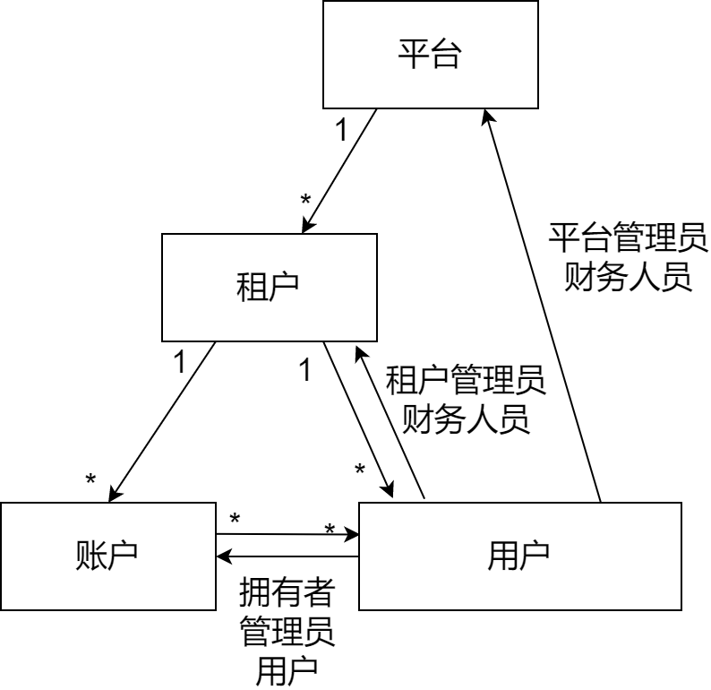
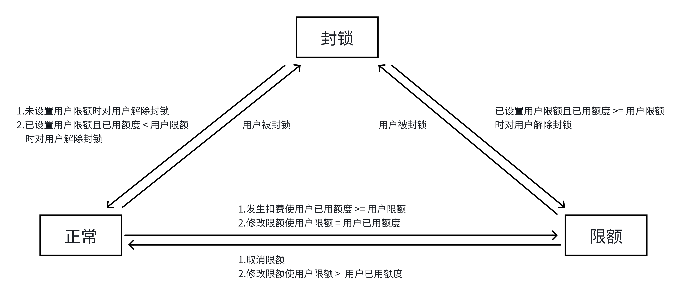

# 用户模型

## 用户模型

系统使用三级的用户模型：**租户(tenant)**、**账户(account)**、**用户(user)**。各级之间的关系如下图所示：

每个用户和账户属于且只属于一个租户，一个用户可以属于0个或者多个账户，每个用户在账户中的角色为**用户**、**管理员**或者**拥有者**之一，可另为租户和整个平台的**租户管理员**和**财务人员**（可均为）。

每个用户的用户名和账户名在**整个平台的范围**（注意，并非租户）中唯一。在所使用的认证系统支持的情况下，账户管理员、租户管理员可以创建用户。

## 用户在账户中的状态

当前系统中页面展示的用户在账户中的状态有：**正常**、**封锁**、**限额**。

| 状态定义                 | 解释                                                                                              | 用户在集群中的状态         |
| ------------------------| ------------------------------------------------------------------------------------------------- |---------------------------|
| 正常                    | 用户未被封锁时，1.未设置用户作业费用限额； 2.已设置用户作业费用限额，且用户已用额度 **小于** 用户限额 | 正常(账户在集群中未封锁) |
| 封锁                    | 用户已被账户管理员或账户拥有者封锁                                                                   | 封锁                    |
| 限额                    | 用户未被封锁，但已设置用户作业费用限额，且用户已用额度 **大于等于** 用户限额                            | 封锁                    |
 

**各状态间的转换条件如下：**

### 1.用户在账户中处于正常状态时：

  + 未设置用户作业费用限额时，即使发生作业扣费，用户在账户中的状态也不发生变化，仍为正常

  + 已设置用户作业费用限额，发生扣费使用户已用额度 **小于** 用户限额，状态仍然为正常；发生扣费使用户已用额度 **大于等于** 用户限额，用户在账户中的状态变更为限额

  + 已设置用户作业费用限额，修改限额使用户限额 **大于** 用户已用额度，状态仍然为正常；修改限额使用户限额 **等于** 用户已用额度，用户在账户中的状态变更为限额

  + 封锁用户时，用户在账户中的状态变更为封锁

### 3.用户在账户中处于封锁状态时：

  + 未设置用户作业费用限额时，账户管理员或拥有者主动解封用户后，用户在账户中的状态变更为正常
  
  + 已设置用户作业费用限额，账户管理员或拥有者主动解封用户，判断限额，用户已用额度 **小于** 用户限额时，用户在账户中的状态变更为限额

  + 已设置用户作业费用限额，账户管理员或拥有者主动解封用户，判断限额，用户已用额度 **大于等于** 用户限额时，用户在账户中的状态变更为正常

  + 设置用户作业费用限额或修改作业费用限额时，不发生状态改变，状态仍为封锁

### 2.用户在账户中处于限额状态时：

  + 账户管理员或拥有者主动封锁用户时，用户在账户中的状态变更为正常

  + 修改用户作业费用限额，使用户限额 **等于** 已用额度时，用户在账户中的状态仍为限额

  + 修改用户作业费用限额，使用户限额 **大于** 已用额度时，用户在账户中的状态变更为正常

  + 取消限额时，用户在账户中的状态变更为正常