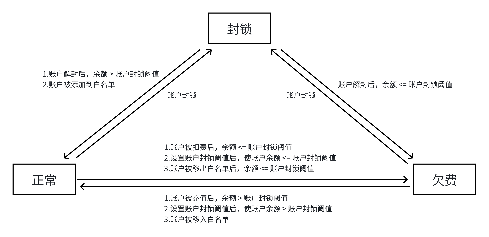

# 用户模型

## 用户模型

系统使用三级的用户模型：**租户(tenant)**、**账户(account)**、**用户(user)**。各级之间的关系如下图所示：

每个用户和账户属于且只属于一个租户，一个用户可以属于0个或者多个账户，每个用户在账户中的角色为**用户**、**管理员**或者**拥有者**之一，可另为租户和整个平台的**租户管理员**和**财务人员**（可均为）。

每个用户的用户名和账户名在**整个平台的范围**（注意，并非租户）中唯一。在所使用的认证系统支持的情况下，账户管理员、租户管理员可以创建用户。

## 账户状态

当前系统中页面展示的账户状态有：**正常**、**封锁**、**欠费**。

| 状态定义                   | 解释                                                                            | 账户在集群中的状态                            |
| --------------------------| ------------------------------------------------------------------------------- |--------------------------------------------- |
| 正常                      | 账户未被封锁或冻结，且账户余额 **大于** 账户封锁阈值； 或者账户已存在于账户白名单 |   正常                                       |
| 封锁                      | 账户已被租户管理员或平台管理员封锁                                                |   封锁                                       |
| 欠费                      | 账户未被封锁或冻结，且账户余额 **小于等于** 账户封锁阈值                            |   封锁                                        |

**各状态间的转换条件如下：**

### 1.账户处于正常状态时：

（1）. 账户在白名单中：

  + 不可进行封锁或解封操作

  + 移出白名单时，判断账户余额，余额 **大于** 账户封锁阈值，状态变仍为正常；

  + 移出白名单时，判断账户余额，余额 **小于等于** 账户封锁阈值，状态变更为欠费；

（2）. 账户不在白名单中：

  + 添加白名单：状态仍为正常；
  
  + 使用扣费或者修改账户封锁阈值后，判断账户余额，余额 **小于等于** 账户封锁阈值，状态变更为欠费；

  + 租户管理员或平台管理员主动封锁账户，状态变更为封锁；

### 2.账户处于欠费状态时：

  + 添加白名单：状态变为正常；
  
  + 对帐户充值或者修改账户封锁阈值后，余额 **大于** 账户封锁阈值，状态变更为正常；

  + 租户管理员或平台管理员主动封锁账户，状态变更为封锁；

### 3.账户处于封锁状态时：

  + 添加白名单：状态变为正常；

  + 租户管理员或平台管理员主动解封账户后，判断账户余额，余额 **大于** 账户封锁阈值，状态变更为正常；
  
  + 租户管理员或平台管理员主动解封账户后，判断账户余额，余额 **小于等于** 账户封锁阈值，状态变更为欠费；

 