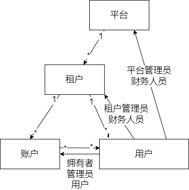

# 用户模型

系统使用三级的用户模型：**租户(tenant)**、**账户(account)**、**用户(user)**。各级之间的关系如下图所示：

每个用户和账户属于且只属于一个租户，一个用户可以属于0个或者多个账户，每个用户在账户中的角色为**用户**、**管理员**或者**拥有者**之一，可另为租户和整个平台的**租户管理员**和**财务人员**（可均为）。

每个用户的用户名和账户名在**整个平台的范围**（注意，并非租户）中唯一。在所使用的认证系统支持的情况下，账户管理员、租户管理员可以创建用户。

