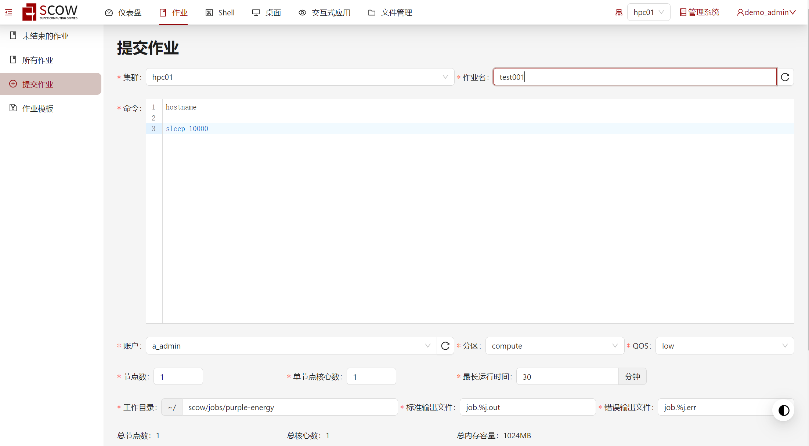
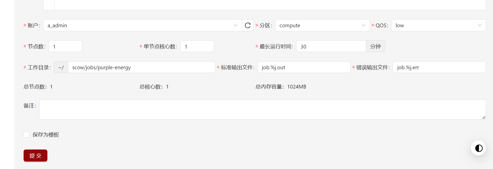

# 作业

借助作业功能，您可以直接在浏览器上点击**提交作业**来使用超算集群，提交成功后，可以在**未结束作业**中看到该作业的运行状态等详细信息，并在**所有作业**中看到作业的执行结果。

## 分区（队列）

作业需在特定分区（队列）中运行，一般不同分区（队列）允许的资源不一样，比如单作业核数等。

我们将集群分区分为两类：**CPU分区**和**GPU分区**。

**CPU分区**是指仅提供CPU资源的分区；

**GPU分区**是同时提供GPU资源和CPU资源的分区，其CPU核数根据GPU卡数按比例分配。

系统同时支持两种分区。您只需要在初始化系统时增加对应的配置，就可以让用户在浏览器提交作业时根据自己的需求选择不同的分区提交作业。分区与集群的配置详见[集群配置文件](../../deploy/config/cluster-config.md)。

## 提交作业

用于用户填写作业信息并提交到超算系统计算，同时支持将作业信息保存为模板方便后续使用。如下图所示，分别在CPU分区和GPU分区上提交作业作业。

如果使用GPU分区的节点，有区别的选项如下图（分区可能为其它名字而非GPU）：

**主要参数说明：** 

**集群**：指定本次作业在哪个集群上运行；

**作业名**：为本次作业命名；

**命令**：作业命令；

**账户**：指定本次作业的扣款账户；

**分区**：指定本次作业想要在哪个分区上计算，若分区中仅有CPU资源，下面的选项中展示单节点核心数，若分区中有GPU资源，选项将变为单节点GPU卡数，同时统计项中多一个总卡数；

**QOS**：选择作业的服务质量；

​	**Low**—

​	**Normal**—

​	**High**—

**节点数**：申请的节点数；

**单节点核心数**：每个节点上申请的CPU核心数，如果选择的是GPU分区，此选项不展示，通过计算得到，计算规则：单节点核心数=单节点总核心数*（单节点GPU卡数/单节点总GPU卡数）；

**单节点GPU卡数**：每个节点上申请的GPU卡数，仅GPU分区展示；

**最长运行时间**：本次作业的最长计算时间；

**工作目录**：指定作业相关文件的存储路径；

**总节点数**：申请的节点数；

**总核心数**：申请的总核心数，计算规则：总核心数（CPU分区）= 节点数 * 单节点核心数，总核心数（GPU分区）=节点数 * 单节点总核心数 *（单节点GPU卡数/单节点总GPU卡数）；

**总卡数**：申请的GPU卡总数，仅GPU分区展示，计算规则：总卡数 = 节点数 * 单节点GPU卡数；

**总内存容量**：申请的总内存容数，计算规则：总内存容量 = 节点数 * 单节点核心数 *（单节点内存数/单节点总核心数）；

**备注**：备注信息；

**保存为模板**：将本次作业保存为模板。

**生成的脚本中参数取值**：

**核心数** -c 取单节点核心数；

**内存** --mem 取总内存容量；

**GPU卡数** --gres=gpu: 取单节点GPU卡数。

※注意：上面的**计算**若未整除，结果皆**向下取整**。

