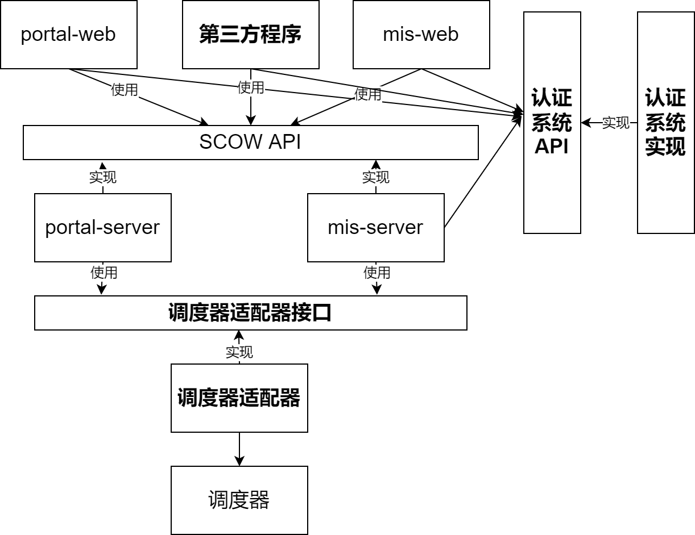

# 与SCOW集成

您可以通过以下方式将您自己的工具和系统与SCOW系统集成：

- 自定义认证系统
  - [使用自定义认证系统](./auth/use.md)
  - [实现自定义认证系统](./auth/impl.md)
- [SCOW API](./scow-api-hook/api.md)：通过编程调用SCOW的功能
- [SCOW Hook](./scow-api-hook/hook.md)：监听SCOW的事件