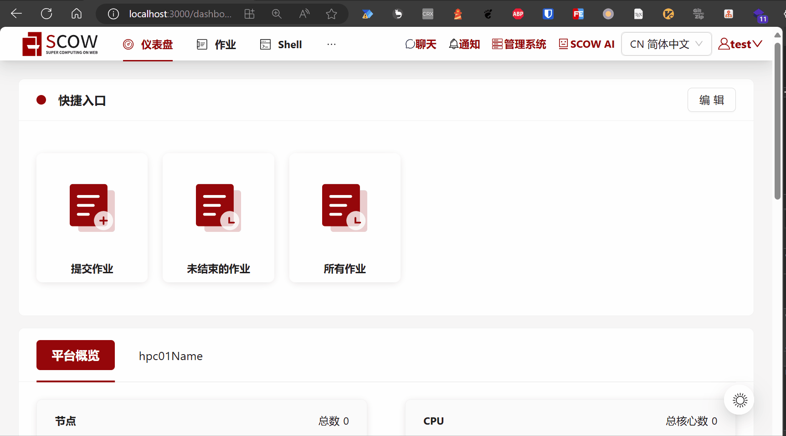

# UI扩展 (Beta)

:::caution

实验性功能！

:::

如果您需要在OpenSCOW的界面中增加更多的页面，您可以开发自己的UI，并通过**UI扩展**功能将您的UI集成进OpenSCOW的UI中。这样，您的用户在访问您自己的页面时，也可以获得与访问OpenSCOW的功能一致的体验。

下图为一个UI扩展演示。演示中的UI扩展增加了一个顶级导航项，并在下面增加了两个二级导航项。

- 第一个二级导航项显示了一个登录界面，其获取了OpenSCOW的登录用户的token，并与OpenSCOW的国际化和黑暗模式相同步。此导航项的图标也是由UI扩展自己提供。
- 第二个二级导航项是一个至[GitHub](http://github.com)的链接



## 开发UI扩展

请参考[开发UI扩展](./develop.md)。

## 配置OpenSCOW使用UI扩展

当您的扩展站开发并部署完成后，请在`config/portal.yaml`和/或`config/mis.yaml`中增加以下内容，以开启OpenSCOW UI扩展。

如果您在门户系统或者管理系统中仅使用一个UI扩展，可使用以下配置。您将可以使用`{OpenSCOW URL}/extensions`访问到此UI扩展。

```yaml title="config/{portal,mis}.yaml"
uiExtension:
  # 您的UI扩展页部署URL。
  url: http://localhost:16566/basepath
```

如果您在门户系统或者管理系统中需使用多个UI扩展，请使用以下配置。您将可以使用`{OpenSCOW URL}/extensions/{name}`访问到对应名称的UI扩展。同一份配置文件中的多个UI扩展名称之间的名称不可重复。

```yaml title="config/{portal,mis}.yaml"
uiExtension:
  - # 这个UI扩展的名称
    name: extension1
    # 您的此UI扩展页部署URL 
    url: http://localhost:16566/basepath

  - # 这个UI扩展的名称
    name: extension2
    # 您的此UI扩展页部署URL 
    url: http://localhost:16567/basepath
```
