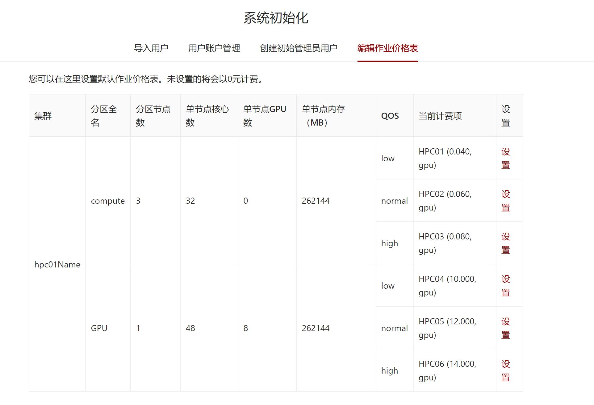

# 管理系统初始化

当管理系统部署完成后，访问部署路径的`/init`路径下，即可进行管理系统的初始化页面。

## 初始化平台管理员用户

在第一个选项卡里，您可以添加系统的平台管理员用户。注意，这里添加的用户的用户ID必须和认证系统里的用户ID相同。

## 导入已有用户信息

在第二个选项卡里，您可以导入已有用户信息。根据所使用的调度器不同，获取用户信息的方式也有所不同。

- [slurm](../schedulers/slurm.md#导入已有用户信息)

## 编辑作业价格表

在第三个选项卡中，您可以设置作业价格表。请参考[计费收费模型](../business/billing.mdx#从网页编辑作业价格表)文档了解系统计费收费模型以及如何修改作业价格表。

## 完成初始化

当您完成系统的初始化后，请一定点击并确认**完成初始化**按钮。

:::danger

未完成初始化的系统将会允许任何用户执行上述三个操作，所以请一定要确认初始化！

:::

